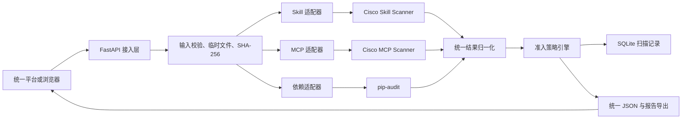
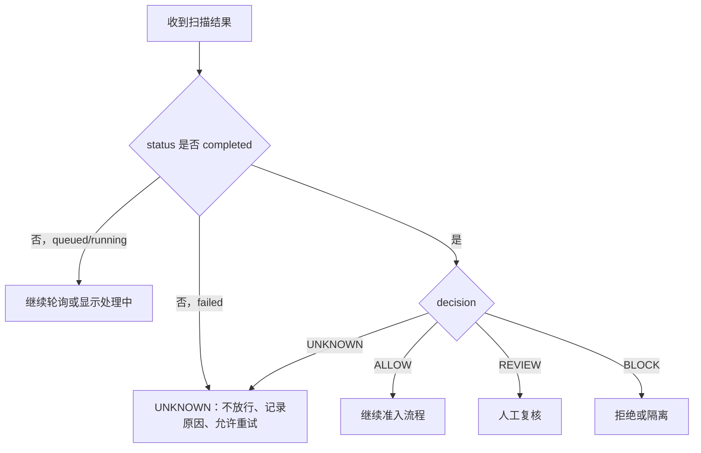
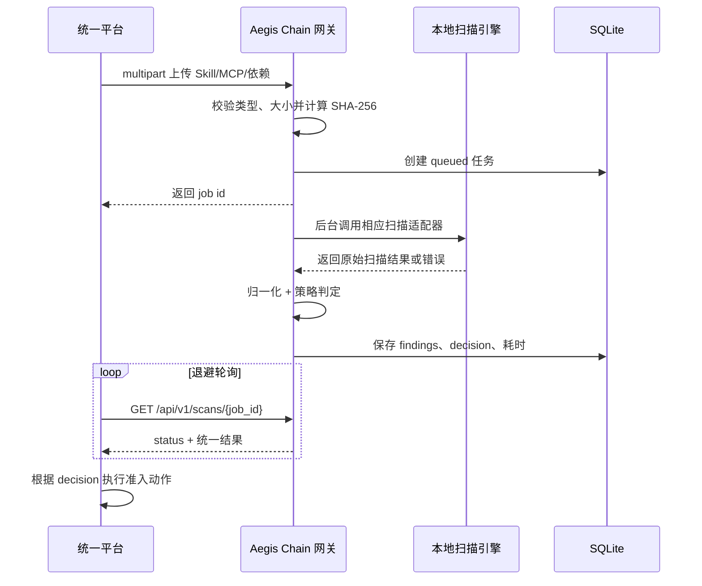

# Aegis Chain 供应链安全模块对接与开发说明

> 本文保留架构和对接背景；当前完成度、测试数和发布判断以 [`../../CURRENT_STATUS.md`](../../CURRENT_STATUS.md) 为准，API 字段以 [`API_V1_CONTRACT.md`](API_V1_CONTRACT.md) 为准。

> 适用赛题：XA-202620 面向政企场景的大模型智能体安全关键技术研究  
> 模块范围：第三部分——智能体供应链安全  
> 文档版本：v0.9  
> 更新日期：2026-08-15  
> 当前阶段：M1.3 工程接口与 SkillTrustBench 全量 5,520 条 Cisco 静态评测已完成，进入自研增量与最小动态验证阶段  
> 目标节点：2026-08-31 完成开发，2026-09-01 起进入最终材料准备

---

## 1. 文档目的

本文档同时服务于两类场景：

1. **项目汇报**：说明供应链安全模块解决什么问题、目前已经完成什么、验证结果如何、后续怎样形成完整作品。
2. **技术对接**：说明统一平台如何调用本模块、接口和数据格式是什么、不同判定应如何处理、当前限制有哪些。

文档中的工作状态分为三类：

| 状态 | 含义 |
|---|---|
| **已完成并验证** | 已有代码，并通过测试或真实扫描回归验证 |
| **已设计，待实现** | 方案与验收条件已经明确，但尚未完成代码实现 |
| **候选方案，待验证** | 需要进一步确认数据许可、工具效果、安全边界或工程成本 |

除明确标为“已完成并验证”的内容外，均不得在答辩材料中表述为已有成果。

---

## 2. 一页结论

### 2.1 模块定位

Aegis Chain 是一个面向智能体组件准入场景的供应链安全网关原型。它在 Skill、MCP 配置或 Python 依赖进入政企智能体平台前执行静态安全检查，将不同扫描器的原始结果转换为统一证据格式，并输出 `ALLOW`、`REVIEW`、`BLOCK` 或 `UNKNOWN` 四种准入建议。

当前原型的核心价值不是重复实现 Cisco 扫描器，而是完成以下工程闭环：

- 统一接收 Skill、MCP 和依赖清单三类对象；
- 隔离调用 Cisco Skill Scanner、Cisco MCP Scanner 和 `pip-audit`；
- 将厂商工具的不同输出归一为统一 JSON；
- 根据本地策略给出可解释的准入结论；
- 保存扫描记录、文件哈希、风险证据与修复建议；
- 为后续统一平台接入、标准数据集评测和动态验证保留稳定边界。

### 2.2 当前完成度

| 能力 | 状态 | 当前结论 |
|---|---|---|
| Cisco Skill Scanner 本地复现 | 已完成并验证 | 固定版本、提交号和运行环境，能够完成本地静态扫描 |
| Cisco MCP Scanner 本地复现 | 已完成并验证 | 固定版本、提交号和运行环境，能够扫描 MCP 工具描述等对象 |
| Python 依赖漏洞扫描 | 已完成并验证 | 使用 `pip-audit` 检查 `requirements.txt` |
| 统一结果模型 | 已完成并验证 | 三类扫描结果均转换为统一 `ScanJob` / `Finding` 结构 |
| 统一决策策略 | 已完成并验证 | 已实现 `ALLOW` / `REVIEW` / `BLOCK` / `UNKNOWN` |
| 扫描器适配层 | 已完成并验证 | 命令构造、超时、退出码、输出校验均已从 Web 层分离 |
| Web 原型与历史记录 | 已完成并验证 | FastAPI、React/Vite、SQLite，可展示记录并导出报告 |
| 稳定 `/api/v1` 对接接口 | 已完成并验证 | 9 个路径，支持上传、202 异步创建、查询、机器错误码与 JSON/Markdown 导出 |
| YAML 严重度策略 | 已完成并验证 | 默认阈值、策略 ID/版本和失败闭锁已配置化；敏感能力与允许域名尚待实现 |
| 策略命中追踪 | 已完成并验证 | 新任务记录命中规则、原因、严重度和 Finding ID，Markdown 报告同步导出 |
| 稳定版 `/api/v1` | 已完成并验证 | 9 个 v1 路径、统一成功/错误 envelope、HTTP 202 和 OpenAPI 契约已完成 |
| 前端 v1 与策略证据 | 已完成并验证 | 页面展示 202/queued/running、策略版本、命中规则、Finding 引用和机器错误码；7 项客户端测试通过 |
| 权威数据集评测 | 已完成首轮基线 | SkillTrustBench 90 条已运行：coverage 98.89%、macro F1 0.5114、malicious recall 80%、normal FPR 33.33% |
| 自研增量检测规则 | 已设计，待实现 | 针对现有静态扫描漏报进行补充 |
| 隔离动态验证 | 已设计，待实现 | 当前没有 Docker 环境，尚未实现，不应对外宣称已具备 |
| 统一平台正式接入 | 待协调 | 当前建议先作为独立本地 HTTP 服务接入 |

### 2.3 对接建议

当前阶段建议将本模块部署为**独立的本地安全服务**，统一平台通过 HTTP 调用。不要把 Cisco 两个扫描器及其 Python 环境直接嵌入主平台进程，以免依赖冲突、扫描失败或工具升级影响主系统稳定性。

统一平台只依赖 Aegis Chain 的统一结果模型，不依赖 Cisco 原始输出。后续替换扫描器或增加动态检测时，主平台接口无需随之变化。

---

## 3. 需求边界与威胁模型

### 3.1 当前保护对象

| 对象 | 当前输入形式 | 主要检查内容 |
|---|---|---|
| Agent Skill | ZIP 压缩包，包含唯一 `SKILL.md` | 提示注入、未声明能力、可疑命令、网络/文件操作、描述与实现风险等 |
| MCP 描述 | JSON，可附带 `requirements.txt` | 工具投毒、描述风险、敏感行为、依赖漏洞等 |
| Python 依赖 | `requirements.txt` | 已公开依赖漏洞及其严重等级 |

### 3.2 当前已覆盖的安全问题

- 智能体组件进入平台前缺少统一准入检查；
- 不同扫描器输出格式不一致，难以被平台消费；
- 高风险发现与人工复核对象无法形成统一决策；
- 扫描失败容易被错误理解为“未发现风险”；
- 缺少文件哈希、证据位置、修复建议和历史记录；
- 扫描器升级或替换容易侵入业务代码。

### 3.3 当前未覆盖的范围

以下能力不属于当前已完成成果：

- 上传代码执行后的真实运行时行为证明；
- 完整的容器、虚拟机或云端恶意样本沙箱；
- 多租户、RBAC、TLS、审计员身份和生产级密钥管理；
- 全语言 SBOM 与通用杀毒能力；
- Cisco AI Defense 云服务、VirusTotal 或 LLM 分析器效果；
- 对所有未知攻击的检测保证。

静态检查只能回答“代码、配置或描述中是否存在可识别的风险迹象”，不能单独证明组件在运行时绝对安全。

---

## 4. 当前系统架构



当前实现采用“接入层—适配层—归一化—策略—存储”分层结构：

- **接入层**负责 HTTP、文件类型与大小检查、任务创建和查询；
- **适配层**负责安全地构造并运行扫描命令，不让 Web 层感知厂商命令细节；
- **归一化层**把不同工具的结果转换为统一 Finding；
- **策略层**只根据统一严重等级和策略生成准入决策；
- **存储层**保存任务、哈希、发现项、耗时和错误状态；
- **展示层**只依赖统一接口，可与扫描器解耦。

---

## 5. 已完成工作

### 5.1 M0：第三方工具复现与基线固化

已固定并验证以下版本：

| 工具 | 仓库 | 固定版本/提交 | 环境 |
|---|---|---|---|
| Cisco Skill Scanner | [cisco-ai-defense/skill-scanner](https://github.com/cisco-ai-defense/skill-scanner) | `2.0.13.dev3+g4dee90371` / `4dee90371890ff23e1b21ea974e02847eacaa464` | Python 3.11 |
| Cisco MCP Scanner | [cisco-ai-defense/mcp-scanner](https://github.com/cisco-ai-defense/mcp-scanner) | `4.8.2` / `51966cce214ae057e69c3a672307911f5026e255` | Python 3.13.14 |
| pip-audit | 本地 Python 工具 | 由当前依赖环境固定 | 用于依赖漏洞检查 |

基线清单位于 `baseline/cisco_static_baseline.json`，其 SHA-256 为：

```text
588B2F2C0F0E3F274304ECB8225478D207A5643FBF7F166BC36D14F0BE42418D
```

这一阶段完成了“环境能运行”到“版本可追溯、输入可重跑、结果可核对”的转变。

### 5.2 M1.1：统一数据契约与准入策略

已完成统一 Pydantic 模型，核心对象包括：

- `ScanJob`：一次扫描任务及其完整生命周期；
- `Finding`：统一风险发现项；
- `FindingLocation`：文件、行号、MCP 对象等证据位置；
- `ScanSummary`：各严重等级数量；
- `Severity`：`SAFE`、`INFO`、`LOW`、`MEDIUM`、`HIGH`、`CRITICAL`、`UNKNOWN`；
- `Decision`：`ALLOW`、`REVIEW`、`BLOCK`、`UNKNOWN`。

新任务的数据契约版本为 `1.1`，新增 `policy_trace`。持久化记录在读取时会重新校验；旧 `1.0` 记录保持原版本并补齐兼容字段，缺失策略信息时明确标为 `unresolved`，不会假装由新策略评估过。

### 5.3 M1.2：扫描器适配层重构

已将三类扫描器从 Web 入口代码中分离到独立适配器：

- 命令参数只能以列表形式传入；
- 显式使用 `shell=False`，降低命令注入风险；
- 设置 150 秒超时；
- 统一 UTF-8 输出；
- 控制扫描进程使用的 `PATH` 和本地缓存；
- 校验退出码、输出文件和 JSON 结构；
- 运行失败时统一进入 `failed + UNKNOWN`，禁止误判为 `ALLOW`。

FastAPI 启动逻辑已经迁移到 lifespan，旧的扫描命令、归一化函数和策略函数不再堆积于 `backend/app.py`。

### 5.4 Web 原型与本地存储

当前原型包含：

- FastAPI 后端；
- React/Vite 前端；
- SQLite 扫描历史；
- 预置样例扫描；
- 文件上传扫描；
- 扫描状态轮询；
- 风险详情、证据、修复建议；
- JSON 和 Markdown 结果导出。

上传的原始文件只在临时目录中供扫描使用，任务结束后删除；SQLite 保存结构化结果、文件 SHA-256、分析器、耗时与错误信息。

### 5.5 测试与真实回归

当前自动化测试结果：

```text
67 passed, 0 warnings
```

覆盖文件包括：

- `backend/tests/test_app.py`
- `backend/tests/test_contract.py`
- `backend/tests/test_adapters.py`
- `backend/tests/test_policy.py`
- `backend/tests/test_skilltrustbench_intake.py`

M1.2 完成后执行了三类真实回归：

| 类型 | 任务 ID | 状态 | 决策 | 发现项 | 耗时 | 文件 SHA-256 |
|---|---|---:|---:|---:|---:|---|
| Skill | `2b32451815a74c5e8aac22c973454608` | completed | BLOCK | 4 | 3994 ms | `b7a2bba0825aa01a733368530af8096b7668a57f11b3df8533df3a8dd5510dce` |
| MCP | `6d450df9a9314e5680bab15de2d9eb54` | completed | BLOCK | 7 | 3384 ms | `b168d186048b827dfc0e2394312c3e2bea3f66af29c8b9035743e6fdce590216` |
| 依赖 | `0f7eda7d4b2940f98e9dfc4eebace083` | completed | BLOCK | 14 | 3464 ms | `b8c314c7486c4d0c830eca3dd1c99f8ee16b04fff314186f52539d0b7ed1360c` |

上述结果用于证明真实引擎在重构后仍可被调用，不能代替正式数据集上的性能评测。

早期 Smoke Test 的正确解释如下：

- Skill 小样本共 9 个，在 `HIGH/CRITICAL` 阈值下得到 `TP=2、TN=1、FP=1、FN=5`，F1 为 `0.40`；它暴露了明显漏报问题，是后续补充规则和数据集评测的依据。
- MCP 静态小样本共 6 个，本次得到 6/6 正确；样本量过小且构造方式单一，不能表述为“准确率 100%”。
- 依赖样例检出 14 个高风险发现，证明链路可用，不代表对全部生态漏洞完整覆盖。

### 5.6 M1.3：YAML 策略与可审计判定

已将默认严重度门禁迁移到 `config/admission_policy.yaml`，策略为 `aegis-chain-local-default@1.0.0`。加载器会拒绝严重度集合重叠、覆盖不完整、把 `UNKNOWN` 放入普通集合，以及 `fail_closed: false` 的配置。

每个新任务增加 `policy_trace`，记录策略 ID、版本、命中规则、判定原因、命中严重度、Finding ID 和失败闭锁状态。扫描超时、配置错误和扫描器异常分别使用 `SCAN_TIMEOUT`、`POLICY_CONFIGURATION_ERROR` 和 `SCAN_EXECUTION_FAILED`，均返回 `failed + UNKNOWN`。

当前源码上的三类最终回归：

| 类型 | 任务 ID | 结果 | Finding ID | 策略规则 |
|---|---|---|---:|---|
| Skill | `0925421dc4e14011b8c07899c131dab6` | BLOCK；4 findings；1 CRITICAL | 4/4 唯一 | `POLICY_BLOCK_SEVERITY` |
| MCP | `31122f58c01b407ab53da1b8a7155836` | BLOCK；7 HIGH | 7/7 唯一 | `POLICY_BLOCK_SEVERITY` |
| 依赖 | `47788213766a4901abb233ccea5cddfd` | BLOCK；14 HIGH | 14/14 唯一 | `POLICY_BLOCK_SEVERITY` |

三类制品哈希、风险数量和决策与 M1.2 相同。该结果证明策略迁移保持了默认行为，并不表示检测准确率提高。

### 5.7 M1.3：API v1 对接契约

已新增 9 个 `/api/v1` 路径。普通成功响应统一为 `{api_version, data}`，错误响应统一为 `{api_version, error: {code, message, details}}`，创建扫描任务返回 HTTP 202。旧 `/api` 的数据和 `{detail}` 错误格式继续保留，两组接口共享同一套扫描函数和 SQLite。

API 路由与异常处理位于 `backend/api_v1.py`，契约模型和 13 个稳定错误码位于 `backend/api_contract.py`。OpenAPI 当前包含 18 个业务路径：旧版 9 个、v1 9 个，重复 operation ID 为 0。未知 API 路径会返回 JSON 404，不再被 React 单页应用兜底为 HTML 200。

最终真实双路回归：

| 路径 | 创建状态 | 任务 ID | 结果 |
|---|---:|---|---|
| 旧 Skill | 200 | `4d70fd7d4dce4d66afb12b05ceea609d` | BLOCK；4 findings；1 CRITICAL |
| v1 Skill | 202 | `b5ef8d0bb2d14d3a9144c8c0082bfbf8` | BLOCK；4 findings；1 CRITICAL |
| v1 MCP | 202 | `0cc318d2db7b45caacec12c829d49eb7` | BLOCK；7 HIGH |
| v1 依赖 | 202 | `faed907972ec400b8848bacc4918fef3` | BLOCK；14 HIGH |

旧 Skill 与 v1 Skill 的制品哈希、决策、Finding 数量和策略规则完全一致。

### 5.8 M2：SkillTrustBench 数据入口与 pilot 基线

已核验腾讯朱雀项目页、官方发布文章、Hugging Face 数据仓库、审计刷新提交和官方结果仓库。数据固定为 `cuhk-zhuque/SkillTrustBench` 的 revision `762d5388b3a047b26df9679582af868a0e5b2c8f`，许可为 `CC BY-NC-SA 4.0`。

审计发现两项必须说明的上游差异：官网仍显示首次发布的标签数，而 audited refresh 已将 310 条 `suspicious` 升级为 `malicious`；当前 README 校验表也仍是刷新前哈希。因此本项目以固定 revision 的 Git blob/LFS 对象标识和字节数校验下载，不使用过期 README 哈希。

导入器 `tools/datasets/prepare_skilltrustbench.py` 已完成：

- 验证 4 个官方对象和本地 SHA-256；
- 拒绝 ZIP 路径穿越、符号链接、超限成员和 Windows 非法路径；
- 复核全量 5,520 条真值与 37,721 个 ZIP 成员；
- 确定性抽取 90 条 pilot，三类各 30 条且覆盖 T01–T09；
- 只解压 90 个 case，共 628 个文件，并将文件设为只读；
- 重复运行时复核源对象、ID 和 case tree hash，不重新抽样；
- 工作区根 `.gitignore` 已加入原始数据目录排除规则；当前尚无有效 Git 仓库可实际验证。全程没有安装、导入、执行或上传样本。

case ID 清单 SHA-256 为 `59dd01a97225b9efef24fa0a7a7a0213fd7e36614b71f5adb7522d16fa518800`。数据入口状态为 `comparison_ready / accepted_with_caveats`。

### 5.9 M2：Cisco 静态 pilot90 主基线

使用固定 Cisco Skill Scanner `2.0.13.dev3+g4dee90371`、策略 `aegis-chain-local-default@1.0.0` 和预先冻结的标签映射运行全部 90 条。先完成 5 条 smoke，再顺序执行主运行；全过程不修改检测规则、样本或真值。

| 指标 | 结果 |
|---|---:|
| coverage / failure rate | 98.89% / 1.11% |
| strict macro F1 | 0.5114 |
| malicious recall / FNR | 80.00% / 20.00% |
| non-normal recall | 78.33% |
| normal FPR | 33.33% |
| latency median / P95 | 3935 / 4226 ms |

混淆矩阵显示：30 个 normal 中 10 个被误报；30 个 malicious 中 6 个未判为 malicious；30 个 suspicious 只有 5 个精确判为 suspicious，15 个被判为 malicious，9 个被判为 normal，1 个解析失败并以 abstain 计错。总分类错误 41 个。

唯一失败 `case_02187` 来自 Cisco `python-frontmatter` 严格解析兼容性；未使用 `--lenient` 覆盖主结果。90 条样本 hash 全部不变，只观察到 `static_analyzer/bytecode/pipeline`。主基线以 `accepted_with_caveats` 接受，当前后端测试为 `67 passed`。

---

## 6. 本地运行与验证

以下命令均在目录 `supply_chain_reproduction/demo_web` 中执行。

### 6.1 启动服务

```powershell
powershell.exe -NoProfile -ExecutionPolicy Bypass -File ".\start_demo.ps1"
```

不自动打开浏览器：

```powershell
powershell.exe -NoProfile -ExecutionPolicy Bypass -File ".\start_demo.ps1" -NoBrowser
```

默认地址：

- 前端与 API：`http://127.0.0.1:8000`
- v1 健康检查：`http://127.0.0.1:8000/api/v1/health`
- Swagger UI：`http://127.0.0.1:8000/docs`

### 6.2 运行测试

```powershell
powershell.exe -NoProfile -ExecutionPolicy Bypass -File ".\run_tests.ps1"
```

### 6.3 停止服务

```powershell
powershell.exe -NoProfile -ExecutionPolicy Bypass -File ".\stop_demo.ps1"
```

### 6.4 当前运行限制

- 单个上传文件最大 15 MB；
- Skill ZIP 最多 500 个成员；
- Skill ZIP 必须且只能包含一个 `SKILL.md`；
- ZIP 解压会检查目录穿越与单成员大小；
- 扫描超时为 150 秒；
- 当前模式为 `LOCAL_STATIC_ONLY`；
- 当前无需云服务器，也不依赖 Docker。

---

## 7. 当前 API 对接说明

### 7.1 重要约定

统一平台新接入应使用：

```text
/api/v1
```

原有 `/api` 继续保留，用于兼容当前网页和旧脚本。v1 普通成功响应使用 `{api_version, data}`，错误响应使用 `{api_version, error}`；导出成功时直接返回文件。完整错误码和迁移规则见 `docs/API_V1_CONTRACT.md`。

扫描任务采用异步模式：v1 上传接口以 HTTP 202 返回初始任务，后台继续扫描；调用方从 `data.id` 读取任务 ID，并轮询查询接口中的 `data`，直到 `status` 变为 `completed` 或 `failed`。

### 7.2 接口清单

| 方法 | 路径 | 作用 | 状态 |
|---|---|---|---|
| GET | `/api/v1/health` | 查询服务、策略和扫描引擎状态 | 已实现 |
| GET | `/api/v1/presets` | 获取内置演示样例 | 已实现 |
| POST | `/api/v1/scans/preset/{preset_id}` | 运行预置样例 | 已实现，202 |
| POST | `/api/v1/scans/skill` | 上传 Skill ZIP | 已实现，202 |
| POST | `/api/v1/scans/mcp` | 上传 MCP JSON，可附依赖清单 | 已实现，202 |
| POST | `/api/v1/scans/dependency` | 上传 `requirements.txt` | 已实现，202 |
| GET | `/api/v1/scans?limit=20` | 查询最近任务，`limit` 严格限制为 1–100 | 已实现 |
| GET | `/api/v1/scans/{job_id}` | 查询任务状态和结果 | 已实现 |
| GET | `/api/v1/scans/{job_id}/export?format=json|md` | 导出结果文件 | 已实现 |

当前预置样例 ID：

- `skill-safe`
- `skill-risky`
- `mcp-mixed`
- `dependency-risky`

### 7.3 上传 Skill

请求类型：`multipart/form-data`

字段：

| 字段 | 类型 | 必填 | 说明 |
|---|---|---:|---|
| `file` | ZIP 文件 | 是 | 包含唯一 `SKILL.md` 的 Skill 包 |

示例：

```powershell
curl.exe -X POST "http://127.0.0.1:8000/api/v1/scans/skill" `
  -F "file=@C:\samples\example-skill.zip"
```

### 7.4 上传 MCP 描述

请求类型：`multipart/form-data`

字段：

| 字段 | 类型 | 必填 | 说明 |
|---|---|---:|---|
| `mcp_json` | JSON 文件 | 是 | 顶层可包含 `tools`、`prompts`、`resources`、`contents` |
| `requirements` | 文本文件 | 否 | 可选 Python 依赖清单 |

示例：

```powershell
curl.exe -X POST "http://127.0.0.1:8000/api/v1/scans/mcp" `
  -F "mcp_json=@C:\samples\mcp.json" `
  -F "requirements=@C:\samples\requirements.txt"
```

### 7.5 上传依赖清单

请求类型：`multipart/form-data`

字段：

| 字段 | 类型 | 必填 | 说明 |
|---|---|---:|---|
| `requirements` | 文本文件 | 是 | Python `requirements.txt` |

示例：

```powershell
curl.exe -X POST "http://127.0.0.1:8000/api/v1/scans/dependency" `
  -F "requirements=@C:\samples\requirements.txt"
```

### 7.6 查询任务

```powershell
curl.exe "http://127.0.0.1:8000/api/v1/scans/{job_id}"
```

建议调用方采用退避轮询，例如第 1、2、4、6、8 秒查询一次；v1 结果位于响应的 `data` 字段。达到平台设置的总等待时间后，前端可提示“扫描仍在进行”，但不得把未完成任务当作通过。

---

## 8. 统一 JSON 数据契约

v1 普通响应的最外层为 `{"api_version":"v1","data":{...}}`。以下展示 `data` 中的 ScanJob 删减示例；字段形态来自真实结果，但文件名和部分证据已简化：

```json
{
  "schema_version": "1.3",
  "id": "2b32451815a74c5e8aac22c973454608",
  "created_at": "2026-08-07T10:00:00+08:00",
  "updated_at": "2026-08-07T10:00:04+08:00",
  "status": "completed",
  "target_kind": "skill",
  "source_kind": "upload",
  "display_name": "example-skill.zip",
  "artifact_sha256": "b7a2bba0825aa01a733368530af8096b7668a57f11b3df8533df3a8dd5510dce",
  "decision": "BLOCK",
  "policy_trace": {
    "policy_id": "aegis-chain-local-default",
    "policy_version": "1.1.0",
    "rule_id": "POLICY_BLOCK_SEVERITY",
    "reason": "命中阻断严重度：CRITICAL 1 条。",
    "matched_severities": ["CRITICAL"],
    "matched_finding_ids": ["DATA_EXFIL_HTTP_POST_example"],
    "fail_closed": true
  },
  "summary": {
    "total_findings": 4,
    "critical": 1,
    "high": 0,
    "medium": 3,
    "low": 0,
    "info": 0,
    "unknown": 0
  },
  "findings": [
    {
      "id": "TOOL_MISMATCH_NETWORK_example",
      "title": "Undeclared network usage",
      "category": "unauthorized_tool_use",
      "severity": "MEDIUM",
      "analyzer": "static",
      "location": {
        "file": "scripts/format.py",
        "line": 12,
        "object": null,
        "type": "file"
      },
      "evidence": "undeclared network usage",
      "description": "The implementation uses a network capability not declared by the Skill.",
      "remediation": "Declare the network capability or remove the related call.",
      "rule_id": "TOOL_MISMATCH_NETWORK"
    }
  ],
  "analyzers": ["static"],
  "duration_ms": 3994,
  "error": null,
  "logs": []
}
```

### 8.1 调用方应稳定依赖的字段

统一平台首先依赖以下字段即可：

- `schema_version`：结果契约版本；
- `id`：任务唯一标识；
- `status`：任务生命周期；
- `target_kind`：扫描对象类型；
- `artifact_sha256`：输入对象完整性标识；
- `decision`：准入建议；
- `policy_trace`：实际策略版本、命中规则、原因及证据引用；
- `summary`：风险数量摘要；
- `findings`：证据与修复建议；
- `error`：扫描失败原因。

不要依赖厂商原始字段或扫描命令输出文本。扫描器更换、升级或增加后，适配层会继续输出上述统一结构。

### 8.2 Finding 字段解释

| 字段 | 用途 |
|---|---|
| `id` | 单个发现项 ID，用于前端定位和审计 |
| `title` | 风险标题 |
| `category` | 归一化风险类别 |
| `severity` | 统一严重等级 |
| `analyzer` | 产生证据的分析器 |
| `location` | 文件、行号或 MCP 对象位置 |
| `evidence` | 支撑判断的最小必要证据 |
| `description` | 风险说明 |
| `remediation` | 修复建议 |
| `rule_id` | 可追溯规则编号 |

---

## 9. 准入决策与失败处置

### 9.1 当前默认策略

| 条件 | 决策 | 平台建议动作 |
|---|---|---|
| 存在 `CRITICAL` 或 `HIGH` | `BLOCK` | 拒绝准入或进入隔离区 |
| 最高为 `MEDIUM` 或 `LOW` | `REVIEW` | 进入人工复核，不自动投产 |
| 无 `LOW` 及以上风险且扫描成功 | `ALLOW` | 可以继续后续准入流程 |
| 扫描失败、超时、输出缺失/非法或严重等级未知 | `UNKNOWN` | 默认不放行，允许重试或转管理员处理 |

当已存在 `HIGH/CRITICAL` 时，`BLOCK` 优先于 `UNKNOWN`。原因是已有证据足以阻断，不必因为其他分析器状态未知而降低风险等级。

### 9.2 状态与决策不可混淆

- `status=queued/running`：任务未结束，不能进行最终准入；
- `status=completed`：扫描流程完成，再读取 `decision`；
- `status=failed`：扫描流程失败，决策应为 `UNKNOWN`；
- `UNKNOWN` 不等于安全，也不等于“零发现”。

### 9.3 建议的平台映射



---

## 10. 统一平台对接方案

### 10.1 推荐部署关系



### 10.2 统一平台职责

- 负责用户登录、项目身份、权限和业务流程；
- 在上传前做基础格式与大小提示；
- 保存平台业务对象与 Aegis Chain `job id` 的映射；
- 轮询任务状态，或在后续版本使用回调；
- 将 `ALLOW/REVIEW/BLOCK/UNKNOWN` 映射为平台动作；
- 展示结构化 Finding，不解析厂商原始日志；
- 对 `UNKNOWN` 采用默认不放行策略；
- 需要长期留档时保存 JSON 导出与文件 SHA-256。

### 10.3 Aegis Chain 职责

- 接收并校验扫描对象；
- 管理扫描临时文件；
- 调用各扫描器并限制超时；
- 校验退出码和输出；
- 统一风险类别、严重等级和证据字段；
- 应用本地准入策略；
- 持久化扫描历史；
- 提供查询和报告导出接口。

### 10.4 正式联调前必须确认的事项

| 事项 | 当前状态 | 需要团队给出的决定 |
|---|---|---|
| 部署地址和端口 | 未冻结 | 同机进程还是局域网独立主机 |
| 身份认证 | 当前无认证 | API Key、JWT 或由统一网关代理认证 |
| `/api/v1` 契约 | 已实现 | 联调时确认是否需要增加业务元数据和鉴权头 |
| 业务元数据 | 当前未接收 | 是否增加 `project_id`、`user_id`、`component_id` |
| 最大文件限制 | 当前 15 MB | 是否满足主平台对象大小 |
| 结果保留周期 | 当前本地长期保存 | 比赛演示和实际部署分别保留多久 |
| 查询方式 | 当前轮询 | 是否需要 webhook 回调 |
| 并发限制 | 当前原型级 | 平台最大并发任务数量 |
| 人工复核流程 | 待平台定义 | `REVIEW` 由谁审批、如何留痕 |
| 失败重试 | 待平台定义 | 自动重试次数和管理员告警方式 |

### 10.5 已实现的稳定版接口

以下路径已实现并进入契约测试：

```text
GET  /api/v1/health
GET  /api/v1/presets
POST /api/v1/scans/preset/{preset_id}
POST /api/v1/scans/skill
POST /api/v1/scans/mcp
POST /api/v1/scans/dependency
GET  /api/v1/scans?limit=20
GET  /api/v1/scans/{job_id}
GET  /api/v1/scans/{job_id}/export
```

已完成：

- 明确请求和响应模型；
- 统一错误码；
- 记录契约版本；
- 为兼容旧调用保留迁移说明；
- 编写接口自动化测试。

正式联调前仍需确认：

- 增加最小鉴权方案；
- 是否增加 `project_id`、`component_id` 等业务元数据；
- 是否保留轮询，或增加 webhook；
- 统一平台的超时、重试和人工复核流程。

完整契约见 `docs/API_V1_CONTRACT.md`。

---

## 11. 数据集与评测计划

### 11.1 为什么必须做标准化评测

当前 9 个 Skill、6 个 MCP 的 Smoke Test 只能检查链路和发现明显缺陷，无法证明系统在真实样本上的稳定性。比赛材料要获得认可，应提供可复现的数据来源、固定划分、明确指标和错误案例，而不能只展示几个成功截图。

### 11.2 数据集选择原则

- 优先公开论文或权威机构使用、可追溯的数据集；
- 明确许可证、标签含义和下载日期；
- 保留原始数据哈希，不修改测试标签；
- 训练/开发集与盲测集分离；
- 防止根据测试标签反复修改规则造成标签泄漏；
- 恶意样本只做静态解析，动态运行前必须进入隔离环境；
- 无法公开的数据只作为补充案例，不冒充公共基准。

### 11.3 分阶段方案

第一优先级为 SkillTrustBench：

1. 已确认仓库、许可、样本结构、标签定义和专门数据集论文缺失的证据边界；
2. 已编写安全导入器并固定 90 条 pilot；
3. 已冻结标签映射、abstain 和指标契约；
4. 下一步先用 3–5 条验证 Cisco 输入适配、失败闭锁和单样本耗时；
5. 适配通过后运行固定 90 条，输出指标和错误清单，再决定是否扩大。

以下仅作为后续候选，必须完成来源、许可和安全检查后才能纳入：

- Skill-Inject；
- MSB；
- MaliciousAgentSkillsBench；
- Cisco 官方评测样例。

Cisco 官方样例适合作为厂商回归集，不宜单独作为证明自研系统泛化能力的最终评测集。

### 11.4 计划输出指标

| 指标 | 说明 |
|---|---|
| Accuracy | 总体分类正确率，仅作辅助 |
| Precision | 被判危险的样本中实际危险比例 |
| Recall | 实际危险样本被检出的比例，安全场景重点关注 |
| F1 | Precision 与 Recall 的综合指标 |
| FPR | 安全样本被误拦截比例 |
| FNR | 危险样本被漏过比例，应重点展示 |
| Per-class Recall | 各攻击类别召回率，用于定位短板 |
| Failure Rate | 工具超时、崩溃、解析失败比例 |
| Latency | 单样本及不同分位耗时 |

最终评测应输出：

- 固定 `manifest.json`；
- 原始逐样本结果 JSON/CSV；
- 汇总指标；
- FP/FN 明细；
- 典型失败案例分析；
- 环境、工具版本、策略版本和数据哈希。

---

## 12. 动态验证计划

### 12.1 建设原则

动态验证用于补充“静态代码看起来可疑，但是否真的产生危险行为”的证据，不追求在有限时间内实现完整商业沙箱。

首版只对 `REVIEW` 或 `BLOCK` 对象提供可选的隔离验证，避免所有对象都执行导致资源消耗和风险扩大。

### 12.2 最小可行动态能力

计划记录以下行为证据：

- 启动的进程及命令行；
- 创建、修改和删除的文件；
- 环境变量读取或修改；
- 网络连接目标；
- 标准输出、标准错误和退出码；
- 超时和资源限制触发情况。

动态结果继续归一为同一 Finding 结构，`analyzer` 标识具体动态分析器，避免前端出现第二套结果模型。

### 12.3 隔离要求

- 不在宿主机直接运行未知或恶意 Skill；
- 默认禁网，确需联网时使用受控允许列表；
- 只挂载一次性目录，不挂载用户目录和项目源码；
- 设置 CPU、内存、进程数和运行时间限制；
- 运行后销毁环境；
- 保存必要证据，不保存敏感凭据；
- 动态能力未完成隔离验收前，不进入公开演示。

当前计算机尚未建立 Docker 环境，因此动态沙箱处于“已设计，待实现”状态。其他厂商的开源动态工具可以集成，但必须满足：许可证允许、Windows/本地环境可运行、输出可归一、安全边界清楚、维护成本能在截止日期内承担。

---

## 13. 后续开发计划

### 13.1 总体时间表

| 阶段 | 日期 | 主要目标 | 可验收交付物 |
|---|---|---|---|
| M1.3 | 08-08 至 08-12 | 政企策略配置、接口冻结准备、存储层继续解耦 | YAML 策略、策略追踪、API 模型与错误码测试 |
| M2 | 08-13 至 08-18 | 标准数据集适配与正式指标 | 数据 manifest、逐样本结果、指标、FP/FN 清单 |
| M3 | 08-19 至 08-24 | 自研增量规则和最小动态验证 | 新规则、消融对比、隔离证据或明确降级方案 |
| M4 | 08-25 至 08-31 | 统一平台联调、演示闭环、版本冻结 | `/api/v1`、10 分钟演示、回归结果、发布标签 |
| 材料阶段 | 09-01 至 09-15 | 报告、视频、复现实验与提交 | 技术报告、架构图、指标图、案例、离线备份 |

### 13.2 M1.3：策略配置与稳定接口

截至 08-10 已完成：

- 用 YAML 配置阻断、复核和允许严重度；
- 配置策略 ID、语义版本和强制失败闭锁；
- 每个新任务返回策略命中原因及 Finding 引用；
- 超时、策略错误和扫描器异常均有独立失败规则；
- schema 升级到 `1.1`，同时兼容旧 `1.0` 记录；
- `/api/v1` 成功/错误 envelope、13 个错误码和 HTTP 202 异步创建；
- 旧 `/api` 兼容层与 OpenAPI 契约测试；
- 自动化测试达到 58 项，旧/v1 双路真实扫描保持基线决策。

仍待完成：

- 配置敏感能力、允许网络域名和禁用行为；
- 继续拆分存储模块；
- 增加最小认证或预留认证头；
- 根据统一平台需求决定是否增加业务元数据与 webhook。

验收标准：相同输入和相同策略版本得到一致决策；任何分析器失败都不能转为 `ALLOW`；策略版本和命中规则可追溯。

### 13.3 M2：可复现评测

已完成：

- 固定 SkillTrustBench audited refresh 和 90 条 pilot；
- 保存数据对象标识、本地 SHA-256、许可和署名；
- 冻结四态到三分类映射、abstain 和指标契约；
- 验证重复导入及 90 个 case tree hash；
- 实现批量运行、脱敏 Finding、指标、FP/FN 和失败闭锁；
- 完成 5 条 smoke 与 90 条主基线；
- 固化混淆矩阵、错误清单、失败诊断和本地接受结论。

下一步：

- 分析 10 个 normal FP、6 个 malicious FN、suspicious 边界和 T09 漏检；
- 从错误家族选择 2–3 个自研增量方向；
- 在相同 90 条上进行配对比较，不改变 Cisco 只读基线；
- 后续再划分规则开发样本与最终盲测样本，避免标签泄漏。

验收标准：第三方能够根据 manifest 和命令复现相同样本集合与主要指标。

### 13.4 M3：增量检测与动态证据

优先从当前漏报中选择 2–3 类高价值问题，不追求规则数量：

- 下载后执行；
- 语义型提示注入；
- 描述与实际行为不一致；
- 持久化行为；
- Skill、MCP 与依赖之间的跨组件攻击链。

每项新增能力应提供“基线—增加规则—增加动态验证”的对比，证明增量来自自研方法，而不是简单叠加厂商工具。

若 08-20 前仍无法安全建立 Docker 或等价隔离环境，应主动降级为“动态验证设计 + 安全桩模拟 + 行为证据接口”，把时间留给数据集评测和统一平台闭环，不在宿主机冒险执行恶意样本。

### 13.5 M4：联调与作品冻结

计划完成：

- 冻结 `/api/v1`；
- 与统一平台完成 Skill、MCP、依赖三条链路；
- 前端展示证据位置、命中规则、修复建议和分析器状态；
- 制作安全、人工复核、阻断、未知四种演示案例；
- 在一台新的 Windows 机器上执行离线复现；
- 准备依赖包、启动脚本、故障降级说明；
- 08-31 后原则上停止增加新功能，只修复阻塞性问题。

---

## 14. 风险清单与应对

| 风险 | 影响 | 当前应对 |
|---|---|---|
| Skill 早期样本漏报较多 | 影响安全性和答辩可信度 | 优先标准数据集、错误分析和少量高价值自研规则 |
| 数据集来源或许可证不清 | 无法公开展示或复现 | 下载前核对论文、仓库、许可证和数据说明 |
| 动态执行污染宿主机 | 可能造成真实安全事故 | 未完成隔离前禁止运行未知恶意样本 |
| 扫描器环境相互冲突 | 服务不稳定 | 保持独立适配器和固定 Python 环境 |
| 扫描失败被当作安全 | 出现错误放行 | `failed + UNKNOWN`，平台默认不放行 |
| v1 尚未加入鉴权与业务元数据 | 直接公网暴露或联调字段不足 | 仅本机/受控局域网使用，联调前确认认证和扩展字段 |
| 无云服务器 | 难以公网部署 | 比赛阶段采用单机或局域网服务，不把公网部署作为关键路径 |
| 开发时间有限 | 功能过多导致主线未完成 | 以“静态准入闭环 + 可复现评测”为保底，动态能力控制为最小范围 |
| 只有一人负责供应链模块 | 知识和交付集中 | 持续维护本文档、运行脚本、工作日志和可复现 manifest |

---

## 15. 接下来立即执行的任务

按 2026-08-10 的状态，YAML 策略、接口契约和前端证据均已完成。下一步不应直接开始复杂动态沙箱，而应先冻结标准数据集来源、标签和试运行清单。

### 15.1 已完成：YAML 策略配置与追踪

- 默认策略 `aegis-chain-local-default@1.1.0` 已启用；孤立 Cisco Skill HIGH 候选进入 REVIEW，完整高危证据和故障状态继续阻断；
- 新任务使用 schema `1.1` 和完整 `policy_trace`；
- 无效或 fail-open 配置会被拒绝；
- 58 项测试与旧/v1 双路真实回归均通过；
- 证据位于 `artifacts/experiment/2026-08-10-m1-3-policy-config/`。

### 15.2 已完成：`/api/v1` 对接契约

- 已实现 9 个 v1 路径和 OpenAPI 3.1 契约；
- 已实现统一成功/错误 envelope 和 13 个错误码；
- 已实现 HTTP 202 异步创建及严格查询参数校验；
- 旧 `/api` 仍可用；
- 证据位于 `artifacts/experiment/2026-08-10-m1-3-api-v1-contract/`。

### 15.3 已完成：前端 v1 与策略证据

- 所有页面接口已迁移到 `/api/v1`，统一客户端负责 envelope 与导出 URL；
- 详情页已展示策略 ID、版本、命中规则、原因、严重度和 Finding 引用；
- 已识别并展示 `error.code`、HTTP 状态、`failed` 与 `UNKNOWN`；
- 已明确展示 HTTP 202、queued/running 及终态，并使用非重叠退避轮询；
- 7 项前端客户端测试、生产构建、58 项后端测试与真实 Skill 扫描均通过；
- 证据位于 `artifacts/experiment/2026-08-10-m1-3-frontend-v1/`。

### 15.4 已完成：SkillTrustBench 数据入口

- 已核验官方来源、许可、字段、标签修订和安全说明；
- 已保存固定 revision、对象标识、下载时间和本地 SHA-256；
- 已建立 90 条不可变 pilot manifest，三类各 30 条且覆盖 T01–T09；
- 已冻结指标契约并记录不能宣传的结论边界；
- 已验证第二次运行可复核缓存和 case tree hash；
- 证据位于 `baseline/skilltrustbench_v1_0/` 和 `docs/DATASET_AUDIT_SKILLTRUSTBENCH.md`。

### 15.5 已完成：批量静态基线

- 已编写逐样本批量运行器、指标和脱敏错误清单；
- 5 条 smoke 为 5/5 完成、0 failure；
- 90 条主运行得到 89 completed、1 abstain，耗时 362.3 秒；
- strict macro F1 0.5114、malicious recall 80%、normal FPR 33.33%；
- 90 条样本 hash 全部不变，实验目录不含原始 evidence/snippet；
- 证据位于 `artifacts/experiment/2026-08-10-skilltrustbench-pilot90-v1/`。

### 15.6 已完成：官方 556 条扩大样本复核

- 已锁定 SkillTrustBench-results 固定提交及 556 条官方 10% 清单；
- 已实现固定文件 SHA-256、逐案 ground truth/归档核对和安全只读导入；
- 已实现 `official10` 模式、统一策略层二分类指标、断点续扫和独立验收；
- 556/556 有终态：546 completed、7 RuntimeError、3 Defender 阻断；
- coverage 98.20%、strict macro F1 0.4977、malicious recall 72.28%、normal FPR 24.70%、策略层 loose F1 81.92%；
- 553 条可读样本 hash 无变化，8 个输出身份及重算指标全部通过，后端测试 `73 passed`；
- 证据位于 `artifacts/analysis/2026-08-14-skilltrustbench-official10pct-cisco-v1/` 和 `docs/M2_SKILLTRUSTBENCH_OFFICIAL_10PCT_REPORT.md`。

### 15.7 已完成：全量基线冻结与开发/回归边界

- 已将 5,520 条全量结果冻结为 `skilltrustbench-v1.0-full5520-cisco-static-v1`，固定运行产物、指标、策略、数据清单、代码和报告 SHA-256；
- 已建立 120 条开发集：60 条漏报、40 条正常误报、20 条正确对照；
- 已建立 600 条标签均衡回归集：normal/suspicious/malicious 各 200 条；
- 两个集合零重叠；回归抽样不使用父扫描结果，本轮没有打开回归样本正文；
- 已对开发集做只读文本分析，全部 case tree hash 前后一致且不保留原始正文；
- 建议路线为 39 条新增静态规则、41 条证据关联、9 条语义复核、8 条规则校准、2 条元数据策略分离、1 条动态验证和 20 条对照；
- 证据位于 `artifacts/analysis/2026-08-15-skilltrustbench-dev120-regression600-v1/`，报告为 `docs/M3_SKILLTRUSTBENCH_DEV_REGRESSION_AND_RULE_GAPS.md`。

### 15.8 下一步：第一批 Aegis 自研增量

- 新增下载—解码—执行、paste 服务载荷执行和 T06 持久化攻击链规则；
- 建立 `SKILL.md` 能力声明、敏感数据源和危险汇点的证据关联层；
- 对网络/文件/命令行为只在“未声明”或形成敏感攻击链时升级，不全局降低严重度；
- 对 9 条候选使用固定 JSON 契约做大模型语义复核，模型不能直接作自动阻断；
- 规则、阈值和提示词冻结后，一次性运行 600 条回归集，输出 Cisco 基线与 Aegis 增量配对指标。

每完成一天，至少更新：

- `docs/WORK_LOG.md`；
- 对应实验目录中的 `manifest.json`；
- 自动化测试结果；
- 本文档的“已完成/待完成”状态。

---

## 16. 汇报建议

### 16.1 一分钟表述

> 我们负责智能体供应链安全模块。当前已完成 Cisco Skill、MCP 和 pip-audit 的本地复现，并构建统一四态准入网关。在 SkillTrustBench 5,520 条全量 Cisco 基线上，我们建立了 120 条开发集与 600 条封存回归集；随后补充 97 个 Aegis 静态规则 ID，覆盖攻击链、敏感/不可信数据流、政企控制、覆盖证明、依赖完整性与 SBOM、MCP 能力策略。静态开发已进入冻结候选，开发过程没有打开 600 条回归集；最终泛化指标将在规则冻结后一次性揭盲产生。

### 16.2 需要重点强调的创新点

- 不是单独展示厂商扫描器，而是构建可接入政企平台的统一准入闭环；
- 把“扫描失败”建模为 `UNKNOWN` 并默认不放行，避免静默失败；
- 使用稳定 Finding 契约隔离厂商工具差异，便于替换和扩展；
- 以可复现数据集、错误分析和消融对比证明自研增量；
- 静态分析与后续动态证据共用同一结果模型。

### 16.3 不应使用的表述

- “系统准确率达到 100%”；
- “已经实现完整动态沙箱”；
- “能够发现所有供应链攻击”；
- “已经完成云端或生产级部署”；
- “Cisco 工具的检测能力就是本项目的创新点”。

---

## 17. 目录与证据索引

以 `supply_chain_reproduction/demo_web` 为根目录：

| 路径 | 内容 |
|---|---|
| `backend/app.py` | 当前 FastAPI 接入和任务编排 |
| `backend/api_contract.py` | v1 envelope、健康模型与稳定错误码 |
| `backend/api_v1.py` | v1 路由、异常处理和旧接口兼容边界 |
| `backend/models.py` | 统一 Pydantic 数据契约 |
| `backend/policy.py` | 当前准入策略 |
| `backend/normalizers.py` | 三类结果归一化 |
| `backend/adapters/process.py` | 安全进程调用基础层 |
| `backend/adapters/skill.py` | Skill Scanner 适配器 |
| `backend/adapters/mcp.py` | MCP Scanner 适配器 |
| `backend/adapters/dependency.py` | pip-audit 适配器 |
| `backend/tests/` | 自动化测试 |
| `frontend/src/api.js` | 前端 v1 客户端、envelope 校验和结构化错误 |
| `frontend/src/api.test.js` | 前端 v1 契约测试 |
| `frontend/src/main.jsx` | 202 状态、策略证据和错误码展示 |
| `config/admission_policy.yaml` | 默认 YAML 准入策略 |
| `baseline/cisco_static_baseline.json` | 固定工具版本和早期基线 |
| `baseline/skilltrustbench_v1_0/` | 90 条 pilot ID、来源、完整性验证和指标契约 |
| `tools/datasets/prepare_skilltrustbench.py` | 固定版本下载、安全校验、确定性抽样和重复验证 |
| `tools/datasets/prepare_skilltrustbench_official_subset.py` | 官方 556 条固定子集下载、身份核验、只读导入与 Defender 阻断处理 |
| `tools/evaluation/run_skilltrustbench.py` | Cisco 批量静态扫描、hash 复核、脱敏结果和指标 |
| `tools/evaluation/verify_skilltrustbench_run.py` | 输出身份、指标、错误切片、分析器和样本 hash 独立验收 |
| `tools/evaluation/freeze_skilltrustbench_development.py` | 冻结全量基线并确定性生成开发/回归集 |
| `tools/evaluation/analyze_skilltrustbench_development.py` | 开发集只读文本特征提取、规则缺口与语义路由 |
| `docs/DATASET_AUDIT_SKILLTRUSTBENCH.md` | SkillTrustBench 来源、许可、版本差异、安全边界与导入结果 |
| `docs/M2_SKILLTRUSTBENCH_BASELINE.md` | 90 条 Cisco 静态基线、混淆矩阵、限制和下一步 |
| `docs/M2_SKILLTRUSTBENCH_OFFICIAL_10PCT_REPORT.md` | 官方 556 条扩大样本结果、对照、错误分析与后续优先级 |
| `docs/M2_SKILLTRUSTBENCH_FULL_REPORT.md` | 完整 5,520 条扫描结果、复现核验和限制 |
| `docs/M3_SKILLTRUSTBENCH_DEV_REGRESSION_AND_RULE_GAPS.md` | 全量冻结、120/600 划分和逐 Skill 补强方向 |
| `docs/M3_通用政企智能体平台规则补强必要性说明.md` | 从通用政企平台的数据、权限、持久化、审计和可用性要求说明规则补强必要性 |
| `docs/M3_AEGIS_COMMAND_CONTEXT_V1_REPORT.md` | 命令上下文规则、INFO-only 原因、两轮校准、开发诊断与证据边界 |
| `docs/M3_SAFE_DYNAMIC_FIXTURE_V1_REPORT.md` | 自建安全 fixture 的动态观测、安全闭锁、两轮校准和非沙箱边界 |
| `artifacts/scout/2026-08-10-skilltrustbench-intake/` | 数据集入口审计的机器可读证据 |
| `artifacts/experiment/2026-08-07-m1-contract-refactor/` | M1.1 实验证据 |
| `artifacts/experiment/2026-08-07-m1-2-adapter-refactor/` | M1.2 实验证据 |
| `artifacts/experiment/2026-08-10-m1-3-policy-config/` | M1.3 策略配置、测试与真实回归证据 |
| `artifacts/experiment/2026-08-10-m1-3-api-v1-contract/` | M1.3 API v1 契约与双路回归证据 |
| `artifacts/experiment/2026-08-10-m1-3-frontend-v1/` | M1.3 前端 v1、构建、测试与真实扫描证据 |
| `artifacts/experiment/2026-08-10-skilltrustbench-smoke5/` | 5 条批量接线与安全 smoke 证据 |
| `artifacts/experiment/2026-08-10-skilltrustbench-pilot90-v1/` | 90 条主结果、FP/FN、失败诊断和接受结论 |
| `artifacts/analysis/2026-08-14-skilltrustbench-official10pct-cisco-v1/` | 官方 556 条逐案结果、指标、错误切片、断点日志和运行清单 |
| `artifacts/analysis/2026-08-14-skilltrustbench-full-cisco-parallel-v1/` | 完整 5,520 条逐案结果、指标、日志与独立验收 |
| `artifacts/analysis/2026-08-15-skilltrustbench-dev120-regression600-v1/` | 开发/回归清单、脱敏特征、缺口汇总和安全证明 |
| `docs/M1_CONTRACT_REFACTOR.md` | M1.1 重构说明 |
| `docs/M1_2_ADAPTER_REFACTOR.md` | M1.2 重构说明 |
| `docs/M1_3_POLICY_CONFIG.md` | M1.3 YAML 策略与 policy_trace 说明 |
| `docs/API_V1_CONTRACT.md` | API v1 成功/错误格式、接口、错误码与迁移说明 |
| `docs/FRONTEND_V1_INTEGRATION.md` | 前端 v1、202 状态、策略证据和错误码处理说明 |
| `docs/DEVELOPMENT_PLAN.md` | 截止 08-31 的开发计划 |
| `docs/WORK_LOG.md` | 持续工作记录 |
| `start_demo.ps1` | 启动脚本 |
| `stop_demo.ps1` | 停止脚本 |
| `run_tests.ps1` | 测试脚本 |

---

## 18. 变更记录

| 版本 | 日期 | 内容 |
|---|---|---|
| v1.0 | 2026-08-15 | 冻结 5,520 条全量基线，建立 120 条开发集和 600 条封存回归集，完成只读规则/语义缺口分析与 78 项测试 |
| v1.3 | 2026-08-18 | 接入 Filesystem Context v1：开发目标覆盖 8/8、声明/未声明 7/1、决策变化 0/28、112 项测试通过；回归集继续封存 |
| v1.4 | 2026-08-18 | 接入 Command Context v1：最终 v2 覆盖 6/6、机制 5/5、决策变化 0/26、126 项测试通过；记录为什么仅提供 INFO 及未来升降级条件 |
| v1.5 | 2026-08-18 | 完成最小安全动态 Fixture v1：最终 v2 为 3/3、机制 7/7、负面指标全 0、136 项测试通过；第三方样本执行保持 0 |
| v0.9 | 2026-08-15 | 记录 SkillTrustBench 全量 5,520 条安全导入、四路并发、完整指标、重叠复现、独立验收与报告 |
| v0.8 | 2026-08-14 | 记录官方固定 556 条导入、断点续扫、Defender 阻断、完整指标、独立验收、73 项测试和下一轮错误分析优先级 |
| v0.7 | 2026-08-10 | 记录 SkillTrustBench 5 条 smoke、90 条 Cisco 静态基线、混淆矩阵、解析失败、67 项测试和错误分析路线 |
| v0.6 | 2026-08-10 | 记录 SkillTrustBench 固定 revision、上游校验差异、90 条 pilot、指标契约、重复验证和 63 项测试 |
| v0.5 | 2026-08-10 | 记录前端 v1 客户端、202 状态、策略证据、错误码、7 项前端测试及真实 Skill 回归 |
| v0.4 | 2026-08-10 | 记录 `/api/v1`、13 个机器错误码、58 项测试、OpenAPI 和旧/v1 双路真实回归 |
| v0.3 | 2026-08-10 | 记录 M1.3 YAML 严重度策略、schema `1.1`、策略追踪、45 项测试和三类真实回归 |
| v0.2 | 2026-08-07 | 汇总 M0、M1.1、M1.2 已完成工作，增加当前 API、平台职责、数据契约、评测与动态计划 |


## 2026-08-15 全量评测补充

- 新增全量导入器：`tools/datasets/prepare_skilltrustbench_full.py`。
- 评测器新增 `--mode full --workers N`，N 限制为 1—8；本轮使用 4 路有界并发。
- 全量运行 ID：`2026-08-14-skilltrustbench-full-cisco-parallel-v1`。
- 输入：SkillTrustBench v1.0 audited refresh 共 5,520 条；排序 ID SHA-256 为 `99ed464424ef589d76d28f5762fd88dc0b62bd96dc88dfcd9a5b867add9ab4a1`。
- 输出：5,372 completed、148 UNKNOWN；coverage 97.32%、strict macro F1 0.5090、策略层 precision/recall/loose F1 为 86.43%/77.38%/81.65%，normal FPR 28.67%。
- 工程效率：4 路并发活跃墙钟 145.43 分钟，37.96 条/分钟；并发单样本中位数 6.18 秒不能与顺序 4.03 秒直接作算法速度比较。
- 安全事件：61 条端点防护阻断、8 条 Windows 路径不兼容、79 条 Cisco RuntimeError，全部失败闭锁为 UNKNOWN；无样本 hash 变化、无外部分析器。
- 验收：`verification.json` 独立复算通过，556 条重叠样本无决策漂移，后端 `73 passed`。
- 报告：`docs/M2_SKILLTRUSTBENCH_FULL_REPORT.md`。
- 后续接入方应优先消费 `run_manifest.json`、`metrics.json`、`per_case_results.jsonl` 和 `verification.json`；不要把 148 条 UNKNOWN 合并为 normal。

## 2026-08-16 Aegis Static v1 对接增量

Skill 扫描链已在 Cisco 归一化之后接入独立的 `aegis-static-v1`。新增层不修改 Cisco Finding，而是追加统一 Finding，再由现有 `aegis-chain-local-default@1.0.0` 策略产生 `policy_trace` 与最终四态决策。

当前已实现远程管道执行、下载—解码—执行、临时粘贴站载荷、内嵌载荷、计划任务、系统服务、启动位置写入及相应不完整证据复核规则。开发集最终 v4 结果为目标补出 21/36、T06 12/12、20 条正确对照零回退、normal 零决策升级；Aegis 平均新增耗时 17.27 ms。v4 增加滑动窗口和单特征命中上限，且与 v3 逐案决策及规则集合等价。完整实现和证据路径见 `docs/M3_AEGIS_STATIC_V1_IMPLEMENTATION_AND_DEV_REPORT.md`。

接入方无需修改 API 字段，只需按现有 `findings[].analyzer` 区分 `aegis-static-v1` 与 Cisco analyzer，并继续以 `decision` 和 `policy_trace` 作为准入结果。

## 2026-08-18 Network Context v1 对接增量

Skill 扫描链新增 `aegis-network-context-v1`。它接收归一化 Cisco Finding 与同一 Skill 的只读文本，追加 `INFO` 级上下文 Finding，当前不修改任何 Cisco Finding、严重度或最终决策。

接入方可按以下 rule ID 展示解释：网络能力已声明/未声明、只读网络行为、外发行为已声明/未明确声明、SDK/封装但无直接原语、mock/local-only、敏感来源与外发 sink 共现、凭据用于网络鉴权。所有敏感流证据都明确表示静态窗口共现，不代表已证明数据外传。

最终开发诊断为网络误报上下文覆盖 16/16、决策变化 0/36、正确对照 20/20 不变，平均新增耗时 12.78 ms，完整测试 `100 passed`。证据与字段解释见 `docs/M3_AEGIS_NETWORK_CONTEXT_V1_REPORT.md`。

## 2026-08-18 Filesystem Context v1 对接增量

Skill 扫描链新增 `aegis-filesystem-context-v1`。它读取顶层 `SKILL.md` 的文件能力说明，并只从源代码识别实际读写、路径探测、工作区/临时路径、敏感/系统路径、覆盖、删除、递归修改和路径边界保护；新增 Finding 全部为 `INFO`，不修改 Cisco Finding、严重度或最终决策。

接入方无需修改 API 契约，可按 `findings[].analyzer == "aegis-filesystem-context-v1"` 单独展示解释，并依据 rule ID 区分“支持正常业务说明”和“仍需复核”。`path_binding_not_proven`、`target_binding_not_proven`、`guard_correctness_not_proven` 表示静态证据的边界，不能展示为已经证明安全或已经证明越权。

最终接受开发结果为目标覆盖 8/8、声明/未声明 7/1、决策变化 0/28、正确对照 20/20 不变、平均 15.32 ms、完整测试 `112 passed`；600 条回归集保持封存。实现、规则表和证据路径见 `docs/M3_AEGIS_FILESYSTEM_CONTEXT_V1_REPORT.md`。

## 2026-08-18 Command Context v1 对接增量

Skill 扫描链新增 `aegis-command-context-v1`。它区分命令能力声明、仅导入未调用、argv/非 shell、shell 字符串、shell 脚本、固定/动态可执行文件、stdin、输入来源、安全测试夹具、只读业务命令和危险命令类别；新增 Finding 全部为 `INFO`，不修改 Cisco/Aegis Static Finding、严重度或最终决策。

接入方无需修改 API 契约，可按 `findings[].analyzer == "aegis-command-context-v1"` 单独展示解释。`data_flow_not_proven`、`exact_data_flow_not_proven`、`execution_context_not_proven`、`guard_correctness_not_proven` 等字段必须原样保留或转成等价提示，不能把静态近邻、具名工具、引号或校验线索展示为“已证明安全”。

当前只提供 INFO 是因为 Context 层负责解释而非裁决：声明可能虚假，静态共现不证明真实参数流，固定程序仍可能受 PATH/依赖劫持，测试夹具也可能伪装。风险升级继续由 Cisco、Aegis Static 和 YAML 策略承担；若未来需要升降级，必须先具备精确数据流、受控动态证据和封存回归配对结果。

最终接受结果为 `2026-08-18-aegis-command-context-dev-v2`：目标覆盖 6/6、关键机制 5/5、决策变化 0/26、正确对照 20/20 不变、平均 20.58 ms、完整测试 `126 passed`。v1 中普通 JavaScript 模板字符串被误解释为 shell 引号变量的问题已在 v2 通过上下文约束修正，两轮证据均保留；600 条回归集继续封存。详见 `docs/M3_AEGIS_COMMAND_CONTEXT_V1_REPORT.md`。

## 2026-08-18 最小安全动态 Fixture v1 对接增量

已新增独立的安全动态审计 CLI，但尚未暴露为平台 API。它只接受配置中固定的 `fixture_set_id=aegis-safe-dynamic-fixtures-v1`，执行三份 SHA-256 锁定的自建良性 Python fixture，观测子进程、stdin、环境变量、工作区文件和 `127.0.0.1` 回环连接。

执行入口固定当前 Python、`-I`、`shell=false` 和 5 秒超时；工作区外写入、workspace 外 chdir、软/硬链接、主机名、非回环 IP、错误端口和未批准命令行均闭锁。Windows audit 只提供完整命令行字符串，因此证据使用 `argument_form=windows_command_line` 与完整 SHA-256，不伪造 argv 数量。原始 stdin、环境值、网络载荷和 stdout/stderr 不写入事件或逐 fixture 结果。

最终接受运行 `2026-08-18-safe-dynamic-fixture-dev-v2` 为 3/3 fixture、7/7 机制；策略违规、超时、解析错误、非 INFO、token 泄露、受保护样本读取/执行、互联网连接和决策变化均为 0；完整测试 `136 passed`。

该能力是可信 fixture 的协作式观测器，不是不可信代码沙箱。下一步若接入平台，只允许管理员触发固定 fixture set，不得提供任意脚本路径、上传入口或第三方样本执行。API/UI 必须展示 `not_an_untrusted_code_sandbox=true`、INFO-only 和“后代进程内部行为未观测”等限制。详细报告见 `docs/M3_SAFE_DYNAMIC_FIXTURE_V1_REPORT.md`。

## 2026-08-21 静态审计完成对接增量

静态链路现已覆盖 Skill、MCP 声明和 Python requirements。新增 `aegis-enterprise-controls-v1`、`aegis-static-coverage-v1`、`aegis-dependency-integrity-v1` 与 `aegis-mcp-policy-v1`，连同既有规则共登记 97 个唯一 Aegis ID；注册表与源码由自动测试双向核对。

ScanJob schema 升级到 `1.2`，新增可选 `sbom`。依赖任务或带 requirements 的 MCP 任务可用 `GET /api/v1/scans/{job_id}/export?format=sbom` 下载 CycloneDX 1.5 JSON。清单只覆盖声明安装集合，明确记录未执行 resolver、未证明传递图完整性；接入平台不得把该字段展示为“已完成全依赖图解析”。

当前自动准入仍为确定性规则，不调用大模型。MCP 层不连接/调用真实 Server，Skill 层不执行样本，依赖层不安装包；无法检查的二进制、嵌套归档、未知语言或解析失败会变成覆盖缺口而不是静默安全。

静态开发完成报告和最终复核命令见 `docs/M3_STATIC_AUDIT_COMPLETION_REPORT.md`。600 条封存回归集尚未打开，只有在用户明确授权后才运行一次最终评估。

## 2026-08-28 OpenClaw 第三方 Skill 动态准入增量

动态阶段已从自建 fixture 推进到公开研究数据集第三方样本，并接入用户实际 OpenClaw `2026.7.1-2` 工作区。选用 SkillTrustBench 中的正常样本 `case_00906` 和同名恶意变体 `case_01084`：二者主 Python 文件 SHA-256 相同，恶意变体通过修改指令和增加隐藏工具覆盖文件形成风险，适合展示完整供应链包审查的必要性。

正常样本经静态审计和 Docker 隔离试运行后获得 `AEGIS_DYNAMIC_EXECUTION_CLEAN`，由 OpenClaw 安装成功；恶意变体命中 CRITICAL，在静态阶段阻断，动态执行次数和安装残留均为 0。安装文件逐文件哈希一致，审计哈希链有效，Docker 容器残留为 0，GPU 未使用。

实际策略以版本化副本部署在 OpenClaw 用户目录，未直接信任开发源码目录。Windows 稳定版无法自动验证 ACL，因此只在人工确认发布目录仅当前用户、SYSTEM 和管理员可修改后启用 `allowInsecurePath=true`；该兼容声明不关闭 Aegis 扫描或失败关闭。详细选样理由、结果、演示顺序和限制见 `docs/M8_OPENCLAW_THIRD_PARTY_SKILL_LIVE_ACCEPTANCE.md`，可复跑工具为 `tools/dynamic/run_openclaw_third_party_skill_demo.py`。
