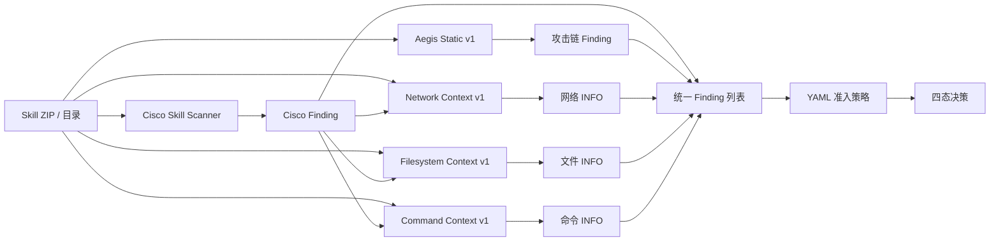

# M3 Aegis Command Context v1 实现与开发诊断报告

## 1. 本轮结论

本轮已实现 `aegis-command-context-v1` 并接入真实 Skill 扫描链。它把 Skill 的命令能力说明与源代码中的进程 API、shell/非 shell 调用、固定可执行文件、stdin、参数来源、安全测试夹具和危险命令类别关联起来。新增 Finding 全部固定为 `INFO`，不修改、删除、替换或降低 Cisco 与 Aegis Static Finding，也不改变 `ALLOW/REVIEW/BLOCK/UNKNOWN`。

最终接受结果为 `2026-08-18-aegis-command-context-dev-v2`：

- 6/6 条 `fp_command_context` 获得结构化上下文，五类关键机制检查 5/5；
- 4 条存在命令能力声明，1 条为只导入进程 API 而没有调用，3 条被识别为安全测试夹具；
- 3 条使用参数数组调用，1 条使用 shell 字符串，1 条包含 shell 脚本；
- 4 条固定可执行文件，2 条通过 stdin 向子进程供数；
- 用户输入/文件来源与进程调用近邻共现分别为 3/2 条，均明确标注“数据流未证明”；
- 2 条包含只读系统命令，6 条包含可识别的业务/工作流工具；
- 26/26 条样本加入命令上下文前后决策一致，20/20 条正确对照不变；
- Aegis Static v4 逐案等价 26/26，样本前后树哈希一致 26/26；
- 平均耗时 20.58 ms/条，最大 91 ms/条；
- 命令专项测试 14/14、后端完整测试 126/126；600 条封存回归集打开数为 0。

这些结果证明命令解释层在选定开发样本上可用，但不等于 Cisco 误报已经被自动消除，也不能证明 6 条样本安全或参数不存在注入风险。

## 2. 接入结构

分析器只读取 Skill 根目录内有界的文本源文件和顶层 `SKILL.md`，接收已归一化的 Cisco Finding 作为被解释规则的引用。它不执行、导入、安装样本，不解析或访问样本中的网络地址，也不保留原始正文。

## 3. 已实现规则

| 规则组 | 代表规则 | 解释 | 策略影响 |
|---|---|---|---|
| 能力声明 | `AEGIS_CONTEXT_COMMAND_CAPABILITY_DECLARED` | 文档声明命令/进程能力，源代码存在直接原语 | INFO |
| 封装能力 | `...DECLARED_NO_DIRECT_PRIMITIVE` | 文档/Cisco 指向命令能力，但未识别直接原语 | INFO |
| 未声明行为 | `AEGIS_CONTEXT_COMMAND_BEHAVIOR_UNDECLARED` | 存在调用，但顶层文档未明确说明 | INFO |
| 仅导入 | `AEGIS_CONTEXT_PROCESS_API_IMPORTED_WITHOUT_CALL` | 导入进程 API，但没有识别到调用 | INFO |
| 测试上下文 | `AEGIS_CONTEXT_SECURITY_TEST_FIXTURE` | 命令或注入指示器位于安全测试夹具 | INFO |
| 测试危险文本 | `...DANGEROUS_COMMAND_TEXT_IN_TEST_FIXTURE` | 测试文件含危险命令字符串，不冒充真实执行 | INFO |
| 调用方式 | `...ARGUMENT_VECTOR_PROCESS_CALL` / `...SHELL_STRING_PROCESS_CALL` | 区分 argv/非 shell 与 shell/命令字符串解释 | INFO |
| shell 工作流 | `AEGIS_CONTEXT_SHELL_SCRIPT_WORKFLOW` | 源文件为 shell 脚本工作流 | INFO |
| 可执行文件 | `...FIXED_EXECUTABLE_PROCESS_CALL` / `...DYNAMIC_EXECUTABLE_PROCESS_CALL` | 区分固定名称与动态选择 | INFO |
| stdin | `AEGIS_CONTEXT_COMMAND_INPUT_VIA_STDIN` | 通过标准输入向子进程供数 | INFO |
| 参数来源 | `...USER_INPUT_NEAR_PROCESS_CALL`、`...ENVIRONMENT_INPUT_NEAR_PROCESS_CALL`、`...FILE_INPUT_NEAR_PROCESS_CALL` | 来源与进程调用在同文件 80 行窗口内共现 | INFO |
| 防护线索 | `AEGIS_CONTEXT_COMMAND_SANITIZATION_GUARD` | 识别 allowlist、拒绝 shell、引号等语法 | INFO |
| 只读业务 | `AEGIS_CONTEXT_READ_ONLY_SYSTEM_COMMAND` / `...NAMED_BUSINESS_TOOL_COMMAND` | 识别监控命令和具名业务工具 | INFO |
| shell 引号 | `AEGIS_CONTEXT_QUOTED_SHELL_VARIABLE` | 仅在 shell 调用/脚本上下文中识别被引号包裹的变量 | INFO |
| 危险类别 | `...DOWNLOAD_COMMAND_PRESENT`、`...DESTRUCTIVE_COMMAND_PRESENT`、`...PRIVILEGED_COMMAND_PRESENT`、`...PERSISTENCE_COMMAND_PRESENT`、`...PACKAGE_INSTALL_COMMAND_PRESENT` | 对测试文件外的高副作用命令分类 | INFO |

所有“来源—进程”规则都写入 `data_flow_not_proven`；stdin 规则写入 `exact_data_flow_not_proven`；固定工具、只读命令、校验和引号也分别注明二进制解析、实际副作用或防护正确性尚未证明。

## 4. 为什么当前只提供 INFO 解释

这是有意的安全边界，不是分析器只能识别低风险。

第一，Context 层回答的是“Cisco 为什么命中、代码处于什么上下文”，而不是独立裁决样本安全。文档声明可能虚假；字符串、来源和进程调用在静态窗口内共现，不代表变量真的流入可执行文件或参数；固定命令仍可能被 PATH 劫持；argv 调用避免 shell 分词，但子程序可能继续解释表达式或脚本。

第二，若看到“测试夹具”“只读命令”就自动降低 Cisco `HIGH/CRITICAL`，可能把伪装成测试代码、动态拼接、条件可达或依赖劫持的恶意逻辑放行。当前没有独立回归结果和受控运行时证据支持这种策略变化。

第三，本轮已与用户冻结“暂不改变最终决策”。因此危险命令类别同样先作为 INFO 证据提供给审核员；真正的风险升级继续由 Cisco、Aegis Static 和 YAML 策略承担，避免一个解释模块重复计分。

后续只有在以下证据同时成熟后，才适合设计独立策略覆盖层：

1. 来源到 executable/arguments/stdin 的精确数据流；
2. shell 是否启用、实际可执行文件解析结果和可达性；
3. 受控动态 fixture 对子进程、参数、环境、文件和网络副作用的观测；
4. 600 条封存回归上的配对指标证明不会显著增加误报或漏报；
5. 升降级条件、例外和失败闭锁均可审计、可回滚。

## 5. 分析方法与安全边界

### 5.1 文档声明与实际行为分离

命令、shell、只读、危险/管理和安全测试意图只从顶层 `SKILL.md` 读取；实际进程行为只从 Python、JavaScript/TypeScript、PowerShell、shell 等源文件提取，避免把 Markdown 使用示例当成已实现行为。

### 5.2 机制分类

- Python：`subprocess.run/Popen/call/check_*`、`os.system/popen`；
- Node.js：`child_process.spawn/exec/execFile/fork` 及同步形式；
- PowerShell：`Start-Process`、调用运算符和相关进程语法；
- shell：将脚本工作流与普通源文件分开记录；
- 来源：用户输入、环境变量、文件读取只做同文件 80 行近邻关联；
- 危险行为：下载、破坏、提权、持久化、包安装按类别分别记录，测试文件中的字符串不计为实际危险命令。

### 5.3 资源限制

- 最多访问 500 个文件；
- 单文件最多 1 MB，累计最多 5 MB；
- 最多保留 2,048 个特征命中，每类最多 128 个；
- 相关性窗口为同一文件内 80 行；
- 跳过符号链接和二进制文件，解析后的路径必须位于 Skill 根目录。

## 6. 两轮开发过程

### 6.1 v1：指标通过，人工复核发现解释噪声

v1 已达到 6/6 覆盖、5/5 机制、26/26 决策不变和样本哈希变化 0。但逐案复核 `case_00458` 时发现：该文件只导入 `child_process.spawn` 而没有调用，普通 JavaScript 模板字符串 `"${...}"` 被错误解释成“shell 变量已加引号”。这不会改变策略，却会误导人工审核，因此 v1 保留为校准父实验，不作为最终冻结结果。

### 6.2 v2：收紧 shell 引号上下文

v2 只修改一个通用条件：`AEGIS_CONTEXT_QUOTED_SHELL_VARIABLE` 必须与同一源文件中的 shell 字符串调用或 shell 脚本共现。目标集该规则由 2 条降为 1 条，`case_00458` 只保留“进程 API 仅导入未调用”等正确解释；其余关键指标、逐案决策和基线均不变。没有按 case ID、产品名或标签硬编码。

## 7. 最终开发诊断结果

| 指标 | v2 结果 |
|---|---:|
| 目标上下文覆盖 | 6/6 |
| 关键机制检查 | 5/5 |
| 命令能力已声明 | 4 |
| 仅导入进程 API、未识别调用 | 1 |
| 安全测试夹具 / 测试危险文本 | 3 / 2 |
| argv / shell 字符串 / shell 脚本 | 3 / 1 / 1 |
| 固定 / 动态可执行文件 | 4 / 0 |
| stdin 通道 | 2 |
| 用户 / 环境 / 文件来源近邻 | 3 / 0 / 2 |
| 校验或净化防护线索 | 3 |
| 只读系统命令 / 具名业务工具 | 2 / 6 |
| shell 引号变量 | 1 |
| 非 INFO Finding | 0 |
| 决策不变 | 26/26 |
| 正确对照不变 | 20/20 |
| Static v4 等价 | 26/26 |
| 样本树哈希不变 | 26/26 |
| 回归样本打开数 | 0 |

动态可执行文件和环境变量来源在 6 条目标中均为 0，不能据此声称真实数据覆盖了这两种机制；它们目前只有合成单元测试或对照样本线索。后续需要在安全动态 fixture 和封存回归中验证，而不是为凑数改写统计。

## 8. 工程验证

- 命令上下文专项测试：14/14；
- 后端完整测试：126/126；
- 特征洪泛保护测试通过；
- 实际调用 Cisco 扫描 BLOCK 演示样本：最终仍为 BLOCK，Analyzer 列表包含 Cisco、Aegis Static、Network、Filesystem 和 Command Context；样本哈希不变；
- 演示样本没有命令行为，Command Context 正确返回 0 条 Finding，证明空结果路径正常；
- 实际 Cisco 端到端耗时约 4.4 秒，Command Context 在 26 条评测中的平均独立耗时约 20.58 ms，因此当前总耗时主要来自 Cisco 子进程启动和扫描，而非新增解释层；
- 未使用 GPU、Docker、云服务器或网络抓取；未执行、导入或安装数据集样本。

## 9. 政企平台价值、限制与下一步

通用政企智能体经常调用办公转换、媒体处理、数据库、版本控制、监控和运维 CLI。只要看到 `child_process/subprocess` 就高危阻断，会误伤正常自动化；只凭“业务需要”就放行，又可能掩盖命令注入、PATH 劫持、提权、持久化和供应链安装风险。

本模块把审核问题结构化为：是否声明、是否真正调用、shell 是否启用、可执行文件是否固定、输入来自哪里、是否只是测试夹具、是否有校验、命令是否具备高副作用。接入方可用 `findings[].analyzer == "aegis-command-context-v1"` 单独展示证据，但不能把 INFO 文案渲染成“已证明安全”。

下一步建议先实现不执行数据集样本的最小安全动态 fixture：只运行自建的良性/可控程序，记录子进程可执行文件、参数、stdin、环境变量、文件和网络副作用，建立观测契约与超时/失败闭锁。该链稳定后，再冻结全部静态规则和语义提示词，对 600 条封存回归做一次聚合配对评测；在此之前继续保持最终决策不变。

关键证据：

- 分析器：`backend/analyzers/command_context.py`；
- 测试：`backend/tests/test_command_context.py`；
- 评测器：`tools/evaluation/run_command_context_development.py` 与 v2 包装器；
- 最终证据：`artifacts/experiment/2026-08-18-aegis-command-context-dev-v2/`；
- v1 校准证据：`artifacts/experiment/2026-08-18-aegis-command-context-dev-v1/`。
