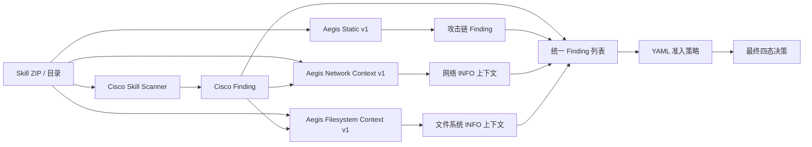

# M3 Aegis Filesystem Context v1 实现与开发诊断报告

## 1. 本轮结论

本轮已实现 `aegis-filesystem-context-v1`，并接入真实 Skill 扫描、统一 Finding、API、历史结果和健康检查。它把顶层 `SKILL.md` 的文件能力描述与源代码中的读写行为、路径类型和高风险修改关联起来，但所有新增 Finding 固定为 `INFO`，不会修改、删除或降级 Cisco Finding，也不会改变 `ALLOW/REVIEW/BLOCK/UNKNOWN`。

最终接受结果为 `2026-08-18-aegis-filesystem-context-dev-v2`：

- 8/8 条 `fp_filesystem_context` 获得结构化上下文；
- 7/8 明确描述文件系统能力，1/8 未明确描述，与冻结人工特征分析一致；
- 1 条只读，7 条存在写入；其中 4 条明确描述写入，3 条没有明确写入声明；
- 7 条关联工作区、数据目录、输出目录或临时路径；
- 5 条关联凭据、钱包、Cookie、认证数据、用户资料等敏感路径；
- 2 条关联系统路径，2 条存在删除/移除操作，1 条存在递归修改，1 条识别到路径边界保护；
- 28/28 条样本加入上下文前后决策一致，20/20 条正确对照不变；
- Aegis Static v4 逐案等价 28/28，样本前后树哈希一致 28/28；
- 平均耗时 15.32 ms/条，最大 53 ms/条；
- 后端完整测试 `112 passed`；600 条回归集打开数为 0。

这些结果证明文件系统解释层已经可用，但不能解释为误报率下降，也不能证明 8 条样本安全，因为本轮按约束没有改变最终门禁。

## 2. 接入结构



分析器只读取 Skill 根目录内的有界文本文件，并接收已归一化 Cisco Finding，用于在 `evidence` 中记录正在解释的 Cisco 文件系统规则。它不执行、导入或安装样本，不访问样本中的 URL，也不保存正文或代码片段。

## 3. 已实现规则

| 规则 ID | 解释 | 策略影响 |
|---|---|---|
| `AEGIS_CONTEXT_FILESYSTEM_CAPABILITY_DECLARED` | 文档描述文件能力，源代码存在文件行为 | INFO |
| `AEGIS_CONTEXT_FILESYSTEM_CAPABILITY_DECLARED_NO_DIRECT_PRIMITIVE` | 文档和 Cisco 均指出文件能力，但未识别直接原语，可能使用 SDK/封装 | INFO |
| `AEGIS_CONTEXT_FILESYSTEM_BEHAVIOR_UNDECLARED` | 源代码存在文件行为，顶层文档未明确描述 | INFO |
| `AEGIS_CONTEXT_READ_ONLY_FILESYSTEM_BEHAVIOR` | 只识别读取或元数据探测，未识别写入/删除 | INFO |
| `AEGIS_CONTEXT_FILE_WRITE_BEHAVIOR_DECLARED` | 写入行为与文档写入说明一致 | INFO |
| `AEGIS_CONTEXT_FILE_WRITE_BEHAVIOR_NOT_EXPLICITLY_DECLARED` | 识别写入，但文档没有明确写入说明 | INFO |
| `AEGIS_CONTEXT_WORKSPACE_OR_TEMP_PATH` | 关联工作区、数据、输出或临时路径，实际绑定未证明 | INFO |
| `AEGIS_CONTEXT_SENSITIVE_PATH_ACCESS` | 敏感路径和文件操作在同一文件的 80 行窗口内共现 | INFO |
| `AEGIS_CONTEXT_SYSTEM_PATH_ACCESS` | 系统路径和文件操作在同一文件的 80 行窗口内共现 | INFO |
| `AEGIS_CONTEXT_OVERWRITE_CAPABLE_FILE_WRITE` | 使用可覆盖目标内容的写入 API，实际目标未证明 | INFO |
| `AEGIS_CONTEXT_DESTRUCTIVE_FILE_MUTATION_DECLARED` | 删除/移除行为已明确声明 | INFO |
| `AEGIS_CONTEXT_DESTRUCTIVE_FILE_MUTATION_NOT_EXPLICITLY_DECLARED` | 删除/移除行为未明确声明 | INFO |
| `AEGIS_CONTEXT_RECURSIVE_FILESYSTEM_MUTATION` | 存在递归删除或权限/所有权修改原语 | INFO |
| `AEGIS_CONTEXT_PATH_CONTAINMENT_GUARD` | 识别到 resolved path 必须位于允许根目录内的防护语法 | INFO |

“敏感路径共现”“系统路径共现”和“覆盖能力”都是审阅线索，不是已经证明的运行时路径绑定或数据流。Finding 明确写入 `path_binding_not_proven`、`target_binding_not_proven` 或 `guard_correctness_not_proven`，防止把静态模式夸大为确定结论。

## 4. 分析方法与安全边界

### 4.1 声明

只从顶层 `SKILL.md` 提取：

- file、folder、directory、path、filesystem、workspace、数据目录、输出目录等能力描述；
- read/load/import/upload 与 write/save/export/generate/store 等读写词形；
- delete/remove/overwrite 等破坏性修改说明；
- credential、private key、wallet、cookie、auth data、resume、用户资料等敏感文件说明。

### 4.2 实际行为

“实际行为”只从源代码与脚本文件提取，不把 Markdown 中的命令示例冒充实现行为。当前覆盖：

- `fs.readFile*`、`Path.read_text/read_bytes`、PowerShell `Get-Content` 等读取；
- `fs.writeFile/appendFile`、`Path.write_text/write_bytes`、`Set-Content` 等写入；
- exists/stat/readdir、目录创建；
- unlink/rm/rmdir、`shutil.rmtree`、`Remove-Item` 等删除；
- 递归删除或递归权限修改；
- `startsWith(path.resolve(root) + path.sep)`、`commonpath`、`is_relative_to` 等路径边界校验。

### 4.3 资源限制

- 最多访问 500 个文件；
- 单文件最多 1 MB，累计最多 5 MB；
- 最多保留 2,048 个特征命中；
- 相关性窗口为同一文件内 80 行；
- 跳过符号链接和二进制文件；解析后的路径必须位于 Skill 根目录。

## 5. 两轮开发过程

### 5.1 v1：可执行性通过，但解释质量未接受

v1 达到目标覆盖 8/8、决策变化 0、样本哈希变化 0，但声明识别只有 2/8，与冻结人工特征分析的 7/8 不一致。原因包括未覆盖 `writes`、`saved` 等自然语言词形和业务数据目录表达；同时 Markdown 示例被计为实际行为，敏感/系统路径按文件重复生成 Finding。

因此 v1 虽完成运行，但被标记为校准父实验，不作为最终冻结结果。原始产物及问题说明保留在 `artifacts/experiment/2026-08-18-aegis-filesystem-context-dev-v1/`。

### 5.2 v2：只修正解释层

v2 没有改变数据、Cisco、Static v4、Network Context、策略或 INFO-only 边界，只做三项一般化修正：

1. 扩展常见文件能力和读写词形；
2. 声明读取文档，实际行为只读取源代码；
3. 敏感/系统路径按 Skill 聚合，避免同一结论因多个文件重复刷屏。

修正后声明/未声明达到 7/1，删除/递归行为不再受文档示例干扰，平均耗时从 v1 的 25.50 ms 降至 15.32 ms。没有按 case ID、产品名或标签硬编码。

## 6. 最终开发诊断结果

| 指标 | 结果 |
|---|---:|
| 目标上下文覆盖 | 8/8 |
| 明确描述文件能力 / 未描述 | 7 / 1 |
| 只读 / 存在写入 | 1 / 7 |
| 写入已声明 / 未明确声明 | 4 / 3 |
| 工作区、数据、输出或临时路径 | 7 |
| 敏感路径 | 5 |
| 系统路径 | 2 |
| 可覆盖写入 | 7 |
| 删除或移除 | 2 |
| 递归修改 | 1 |
| 路径边界保护 | 1 |
| 非 INFO Finding | 0 |
| 决策不变 | 28/28 |
| 正确对照不变 | 20/20 |
| Static v4 等价 | 28/28 |
| 样本树哈希不变 | 28/28 |
| 回归样本打开数 | 0 |

测试和工程验证：

- 文件系统上下文专项测试 12/12；
- 后端完整测试 112/112；
- 3,000 个重复读取特征的复杂度保护测试通过；
- 实际调用 Cisco 扫描 BLOCK 演示样本，最终仍为 BLOCK；Analyzer 列表包含 Cisco、Aegis Static、Network Context 和 Filesystem Context，样本哈希不变；
- v2 artifact manifest 中 12 个证据文件的 SHA-256 和大小全部复核一致，分析器源码哈希与 run manifest 一致。

## 7. 政企平台价值与限制

政企智能体常需要读取知识库文件、导出报告、写入临时产物、保存业务状态，也可能接触凭据、Cookie、用户资料和配置文件。若仅凭 `readFile/writeFile` 就高危阻断，会造成大量业务误报；若仅凭文档声明就自动放行，又可能掩盖越权读取、覆盖配置、跨租户路径和递归删除。

因此 v1 的价值是把审核问题结构化：

- 是否事先声明文件能力和写入方式；
- 是否限制在租户工作区或批准目录；
- 是否接触凭据、身份信息或系统路径；
- 是否可覆盖、删除或递归修改；
- 是否存在路径规范化和边界校验。

当前仍不能自动降低 Cisco HIGH：声明可能虚假，静态共现不证明运行时路径，路径保护也可能被符号链接、junction、大小写、竞态或不存在目标绕过。未来若要修改门禁，必须先增加精确路径解析、来源—目标数据流、租户根目录策略与封存回归验证。

## 8. 复现与证据

```powershell
..\.runtime_skill\Scripts\python.exe tools\evaluation\run_filesystem_context_development_v2.py
powershell.exe -NoProfile -ExecutionPolicy Bypass -File ".\run_tests.ps1"
```

关键位置：

- 分析器：`backend/analyzers/filesystem_context.py`；
- 测试：`backend/tests/test_filesystem_context.py`；
- 评测器：`tools/evaluation/run_filesystem_context_development.py` 与 v2 包装器；
- 最终证据：`artifacts/experiment/2026-08-18-aegis-filesystem-context-dev-v2/`；
- v1 校准证据：`artifacts/experiment/2026-08-18-aegis-filesystem-context-dev-v1/`。

## 9. 下一步

按相同 INFO-only 原则实现 `fp_command_context` 的命令声明—实际进程行为—参数来源—shell/非 shell—危险操作上下文。命令上下文冻结后，再决定是否建立策略覆盖层；600 条回归集继续封存，待规则与语义提示词整体冻结后只做一次聚合配对评测。
