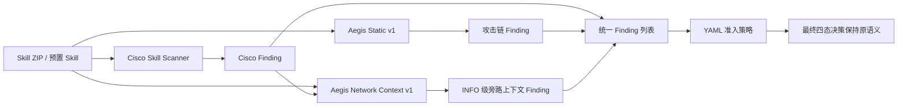

# M3 Aegis Network Context v1 实现与开发诊断报告

## 1. 本轮结论

本轮已实现 `aegis-network-context-v1` 网络上下文旁路证据层，并接入真实 Skill 扫描、统一 Finding、API、历史记录和导出链路。

该层严格遵守本轮约束：

- 不修改、删除或降级 Cisco Finding；
- 所有上下文 Finding 固定为 `INFO`；
- 不改变 `ALLOW/REVIEW/BLOCK/UNKNOWN`；
- 只为人工复核提供声明、行为、敏感来源和外发 sink 的关联证据。

最终开发诊断结果：

- 16/16 条网络误报样本获得结构化上下文，覆盖率 100%；
- 其中 15/16 在 `SKILL.md` 明确声明网络能力，1/16 未明确声明；
- 12 条识别到直接网络原语，3 条属于 SDK/封装调用，1 条明确声明 mock/localhost/no-external-network；
- 11 条表现为只读网络行为；2 条存在外发 sink 但未明确声明传输数据；
- 36/36 条样本加入上下文前后决策完全一致；
- 20/20 条正确对照决策完全一致；
- 与已接受的 Aegis Static v4 决策及静态规则集合 36/36 等价；
- 上下文平均耗时 12.78 ms/条，最大 35 ms/条；
- 后端完整自动测试 `100 passed`；
- 600 条回归集打开数为 0。

该结果证明旁路机制和解释覆盖已经可用，但不能解释为误报率已经下降：本轮按用户要求没有改变任何最终决策。

## 2. 接入结构

网络上下文分析器接收两类输入：

1. Skill 目录中的 `SKILL.md` 和有界文本文件；
2. 已归一化的 Cisco Finding，用于记录它正在解释哪些 Cisco 网络规则。

它不会改写 Cisco Finding，而是生成独立 Finding，并在 `evidence` 中保存相关 Cisco rule ID、规范化上下文特征和相对文件路径。

## 3. 已实现的上下文规则

| 规则 ID | 含义 | 策略影响 |
|---|---|---|
| `AEGIS_CONTEXT_NETWORK_CAPABILITY_DECLARED` | 文档声明网络能力，且实现中识别到网络行为 | `INFO`，无影响 |
| `AEGIS_CONTEXT_NETWORK_CAPABILITY_DECLARED_NO_DIRECT_PRIMITIVE` | 文档声明网络能力、Cisco 有网络 Finding，但未识别直接 HTTP 原语，可能使用 SDK/封装 | `INFO`，无影响 |
| `AEGIS_CONTEXT_NETWORK_BEHAVIOR_UNDECLARED` | 实现存在网络行为，但文档未明确声明 | `INFO`，无影响 |
| `AEGIS_CONTEXT_NETWORK_MOCK_OR_LOCAL_ONLY_DECLARED` | 文档说明 mock、localhost、回环或无外部网络 | `INFO`，无影响 |
| `AEGIS_CONTEXT_READ_ONLY_NETWORK_BEHAVIOR` | 识别到 GET/HEAD/下载类行为，未识别 POST/upload/webhook/socket send | `INFO`，无影响 |
| `AEGIS_CONTEXT_OUTBOUND_BEHAVIOR_DECLARED` | 文档声明上传、发送、同步或 webhook，代码存在外发 sink | `INFO`，无影响 |
| `AEGIS_CONTEXT_OUTBOUND_BEHAVIOR_NOT_EXPLICITLY_DECLARED` | 代码存在外发 sink，但文档未明确说明数据传输 | `INFO`，无影响 |
| `AEGIS_CONTEXT_SENSITIVE_SOURCE_WITH_OUTBOUND_SINK` | 敏感来源与外发 sink 在同一文件的 80 行窗口内共现，数据流尚未证明 | `INFO`，无影响 |
| `AEGIS_CONTEXT_CREDENTIAL_USED_FOR_NETWORK_AUTH` | 鉴权语法与外发请求相邻，可能是正常 API 认证而非数据外传 | `INFO`，无影响 |

这里同时保留“支持正常业务解释”和“需要进一步复核”两种证据。旁路层不会因为存在 API 声明就判定安全，也不会因为凭据和 POST 共现就直接认定外传。

## 4. 声明、行为与敏感数据的关联方法

### 4.1 网络声明

只从 `SKILL.md` 提取：

- API、HTTP、REST、联网、在线、URL、抓取、下载和远程数据；
- 上传、发送、同步、发布、webhook 和回调；
- API Key、Token、OAuth、认证和凭据；
- mock HTTP、localhost、127.0.0.1、offline-only 和 no external network。

### 4.2 代码行为

识别的网络读取包括 `requests/httpx/urllib/aiohttp/axios/fetch/curl/wget`，以及常见 `session.get`、`client.get` 封装形式。

识别的外发 sink 包括 POST/PUT/PATCH/DELETE、带 data 的 urllib Request、curl `--data/-d`、webhook、upload 和 socket send。

### 4.3 敏感来源

当前只建立咨询证据，来源包括：

- 环境变量读取；
- `.ssh`、`.aws`、`.kube`、credentials、id_rsa、cookies、wallet 和 keychain 等路径；
- API Key、Access Token、Client Secret、Password 等敏感标识符。

只有敏感来源和外发 sink 位于同一非文档文件、80 行窗口内时，才产生相关 Finding。其描述明确标注 `data_flow_not_proven`，不能作为自动外传结论。

## 5. 为什么不自动降低风险

“文档声明了网络能力”只能证明开发者进行了声明，不能证明：

- 实际访问目标和声明一致；
- URL 不可被不可信输入替换；
- GET 请求没有把敏感数据放入查询参数或请求头；
- API Key 只用于鉴权，没有进入 payload 或日志；
- SDK/封装内部不存在额外网络行为。

因此第一版只把上下文交给人工复核。后续若要自动降级，至少需要端点 allowlist、HTTP 方法、敏感字段数据流、用户授权和目的约束等多项证据，并在封存回归集上证明不会掩盖恶意样本。

## 6. 三轮开发过程

### 6.1 v1：机制验证

- 36/36 决策不变；
- 网络误报上下文覆盖 10/16；
- 缺失 6 条主要使用 SDK、业务封装或 mock/local-only 描述。

### 6.2 v2：通用覆盖补强

增加：

- `session/client.get|post` 等常见封装；
- “网络能力已声明，但没有识别到直接原语”的审慎证据；
- mock、localhost 和 no-external-network 声明证据。

补强没有使用 case ID、数据标签或具体产品名。结果达到 16/16 覆盖，决策变化仍为 0。

### 6.3 v3：指标口径修正

v2 的逐案 Finding 正确，但汇总中的“已声明网络”漏计 3 条 SDK/封装分支。v3 只修正统计口径，不修改检测规则和 Finding。

v2 与 v3 逐案 Finding 集合、最终决策比较差异为 0。最终口径为 15 条已声明、1 条未声明，其中 12 条有直接原语、3 条为声明加 SDK/封装证据。

## 7. 开发诊断结果

### 7.1 16 条网络误报

| 指标 | 结果 |
|---|---:|
| 有上下文证据 | 16/16 |
| 明确声明网络能力 | 15/16 |
| 未明确声明网络能力 | 1/16 |
| 声明且识别直接网络原语 | 12 |
| 声明但只识别到 SDK/封装语境 | 3 |
| mock/local-only 声明 | 1 |
| 只读网络行为 | 11 |
| 外发 sink 已声明 | 0 |
| 外发 sink 未明确声明 | 2 |

这些结果说明 Cisco 的 `TOOL_ABUSE_UNDECLARED_NETWORK` 在多数样本中与文档声明存在明显冲突，旁路证据可以帮助老师或平台审核员快速定位这一冲突。但由于本轮不修改策略，这些样本仍保持原来的 `REVIEW/BLOCK`。

### 7.2 36 条样本中的敏感流咨询证据

| 指标 | 结果 |
|---|---:|
| 敏感来源与外发 sink 共现 | 3 |
| 凭据可能用于网络鉴权 | 10 |
| 非 INFO 上下文 Finding | 0 |

10 条鉴权语境中包含正常 API Key 使用，也包含需要复核的情况。它的意义是防止把所有 Token + POST 简单等同于外传，而不是自动证明安全。

### 7.3 决策不变性

| 检查 | 结果 |
|---|---:|
| 全部选择样本决策不变 | 36/36 |
| 正确对照决策不变 | 20/20 |
| Aegis Static v4 等价 | 36/36 |
| 回归集打开数 | 0 |

## 8. 性能、安全与工程验证

- 上下文平均耗时：12.78 ms/条；
- 最大耗时：35 ms/条；
- 3,000 组重复网络特征洪泛测试通过；
- 单文件 1 MB、累计 5 MB、最多 500 文件、单特征 2,048 命中上限；
- 跳过二进制与符号链接，路径必须位于 Skill 根目录；
- 不执行、不导入、不安装样本，不访问样本 URL，不保存原始正文；
- 后端完整测试：`100 passed`。

真实预置 Skill 端到端验证：

- 安全预置保持 `ALLOW`，没有上下文 Finding；
- 数据外传风险预置保持 `BLOCK`；
- 风险预置新增“网络已声明”“外发未明确声明”“敏感来源与外发 sink 共现”三条 `INFO` 证据；
- 两者 analyzer 列表均包含 `aegis-network-context-v1`。

## 9. 已完成文件

- `backend/analyzers/network_context.py`：旁路上下文分析器；
- `backend/analyzers/__init__.py`：分析器导出；
- `backend/app.py`：真实 Skill 扫描链接入；
- `backend/tests/test_network_context.py`：11 项新增测试；
- `tools/evaluation/run_network_context_development.py`：36 条开发诊断与证据固化；
- `artifacts/experiment/2026-08-18-aegis-network-context-dev-v1/`：首轮机制结果；
- `artifacts/experiment/2026-08-18-aegis-network-context-dev-v2/`：覆盖补强结果；
- `artifacts/experiment/2026-08-18-aegis-network-context-dev-v3/`：最终接受结果。

## 10. 局限与下一步

当前旁路证据仍有以下局限：

- 正则窗口只证明共现，不能证明精确变量数据流；
- `client.get/post` 可能是非网络业务对象，因此只作为 INFO；
- 无法解析任意第三方 SDK 的内部行为；
- 文档声明可能不真实或已经过时；
- 没有自动验证域名 allowlist、DNS、重定向和运行时实际目标；
- 本轮没有降低误报决策，因此不能宣称 normal FPR 已下降。

建议下一步采用同样的 INFO-only 方式实现“文件系统声明—实际读写—敏感路径”上下文，覆盖 `fp_filesystem_context`。待网络、文件和命令三个上下文族稳定后，再决定是否设计独立的策略覆盖层，并在 600 条封存回归集上做一次正式配对验证。

## 11. 可用于汇报的正式表述

> 我们在 Cisco 结果之后增加了一个独立的网络上下文旁路证据层，不删除厂商告警，也不直接改变门禁。该层把 Skill 文档中的网络声明与实际 GET、POST、SDK 封装、凭据来源和外发 sink 关联起来。16 条网络误报开发样本全部获得结构化解释，其中 15 条明确声明网络能力，1 条未声明；36 条样本和 20 条正确对照的最终决策均保持不变。该层平均增加约 13 毫秒，所有 Finding 固定为 INFO。现阶段它解决的是可解释性和复核效率，不宣称已经降低误报率。
