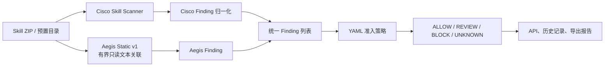

# M3 Aegis Static v1 实现与开发集评估报告

## 1. 本轮结论

本轮已经把“下载—解码—执行”和 T06 持久化从候选方案实现为可运行代码，并接入现有统一 Finding、策略门禁、API 结果和历史记录链路。Cisco Skill Scanner 没有被修改；新增结果统一标记为 `analyzer=aegis-static-v1`，可以与 Cisco Finding 分开审计。

在 120 条错误选择开发集上，最终校准版取得以下诊断结果：

- 36 条本轮目标漏报中补出 21 条，补出率 58.33%；
- T06 持久化 12/12 被识别，其中 12 条均达到 `BLOCK`；
- 24 条 wild real-world 目标中补出 9 条，均达到 `BLOCK`；
- 20 条原本判断正确的对照全部保持原决策，回退为 0；
- 50 条开发集 normal 样本没有发生新的决策升级；
- 新增分析平均耗时 17.27 ms/条，最大 178 ms/条；
- 后端完整自动测试 `89 passed`；
- 真实安全/风险预置 Skill 端到端扫描分别保持 `ALLOW` 和 `BLOCK`，API 结果均出现 `aegis-static-v1` 分析器身份。

这说明第一批规则已经达到“可接入、可解释、可校准”的开发阶段要求，但结果仍来自按旧系统错误挑选的开发集，不能解释为最终泛化性能提升。600 条回归集本轮继续封存，打开数为 0。

## 2. 为什么采用独立增强层

系统调用链如下：

这样设计有四个目的：

1. Cisco 仍是可复现的厂商基线，不因自研代码变化而失去对照身份；
2. 自研规则可以独立统计命中数、误差和耗时；
3. 所有结果继续复用现有 Finding 数据模型、严重度门禁和 `policy_trace`；
4. 后续可以单独升级、关闭或替换 Aegis 层，不需要 fork Cisco 上游。

实现接入点位于 `backend/app.py` 的 Skill 扫描编排函数。Cisco 扫描完成后，Aegis 对同一目录执行只读分析，随后合并两类 Finding，再调用统一策略引擎。

## 3. 已实现规则

### 3.1 远程载荷与编码执行

| 规则 ID | 完整证据 | 严重度/决策 |
|---|---|---|
| `AEGIS_REMOTE_FETCH_PIPE_SHELL` | `curl/wget/iwr/irm` 等远程获取直接进入 shell 或 PowerShell 表达式执行 | `CRITICAL/BLOCK` |
| `AEGIS_REMOTE_FETCH_DECODE_EXECUTE` | 同一文件、80 行窗口内同时存在远程获取、Base64/Hex 等解码、执行 sink | `CRITICAL/BLOCK` |
| `AEGIS_PASTE_SERVICE_PAYLOAD_EXECUTION` | 临时粘贴内容服务、远程获取与执行 sink 形成完整链 | `CRITICAL/BLOCK` |
| `AEGIS_EMBEDDED_BLOB_DECODE_EXECUTE` | 大型内嵌编码块、解码和执行 sink 形成完整链 | `CRITICAL/BLOCK` |
| `AEGIS_PARTIAL_REMOTE_EXEC_CHAIN` | 只证明执行 sink 与获取/解码中的一项相关，或三项仅跨文件共现、数据流未证实 | `MEDIUM/REVIEW` |

关键增强不是“又加了几个关键词”，而是把多个原子行为关联为攻击链。单独的网络访问、Base64 或进程启动很常见；只有完整关联时才自动阻断，不完整证据进入人工复核。

### 3.2 T06 系统持久化

| 规则 ID | 完整证据 | 严重度/决策 |
|---|---|---|
| `AEGIS_PERSISTENCE_SCHEDULED_TASK` | 明确创建或修改 cron、`schtasks /create`、`Register-ScheduledTask` 等计划任务 | `CRITICAL/BLOCK` |
| `AEGIS_PERSISTENCE_SERVICE_CREATE` | 明确创建、启用或加载 systemd、Windows Service、launchctl 服务 | `CRITICAL/BLOCK` |
| `AEGIS_PERSISTENCE_STARTUP_PROFILE_WRITE` | 启动/登录位置 + 写入动作 + `PYTHONSTARTUP`、`PROMPT_COMMAND`、`BASH_ENV`、`LD_PRELOAD` 等自动执行载荷 | `CRITICAL/BLOCK` |
| `AEGIS_PARTIAL_PERSISTENCE_INDICATOR` | 启动位置与写入动作存在，但未证明自动执行载荷；或证据分散在多个文件 | `MEDIUM/REVIEW` |

对通用政企平台而言，计划任务、系统服务和登录自动执行会把一次性组件能力转化为持续控制能力，因此必须作为准入边界，而不只是普通代码质量问题。

## 4. Finding 与证据设计

每条 Aegis Finding 都满足现有 `Finding` 模型，包含：

- 稳定、可重复的 Finding ID；
- 独立的规则 ID 和 `aegis-static-v1` 分析器身份；
- 标准化类别、严重度、相对文件路径和首个证据行号；
- 规范化证据代码，例如 `remote_fetch,payload_decode,execution_sink`；
- 风险解释和整改建议。

Finding 不保存匹配到的恶意代码正文，只保存特征代码和相对路径。这样既能支持复核，又避免把不可信样本内容传播到数据库、API 或汇报材料中。

Finding ID 由“规则 ID + 相对路径 + 证据代码”计算 SHA-256 摘要得到，同一样本、同一规则重复扫描会得到相同 ID，便于回归比较和历史去重。

## 5. 安全边界

Aegis Static v1 的输入处理约束为：

- 最多处理 500 个文件；
- 单个文本文件最多 1 MB；
- 单个 Skill 累计文本最多 5 MB；
- 跳过符号链接与二进制文件；
- 每个解析后的文件必须仍位于 Skill 根目录；
- 只做字节读取和正则/窗口关联，不执行、不导入、不安装样本；
- 不访问样本中的 URL，不做云上传；
- 开发集评估对每条样本进行前后 tree SHA-256 校验。

任何超出有界分析限制或路径安全边界的异常都会抛出错误，由现有扫描 worker 按失败闭锁路径返回 `UNKNOWN`，不会静默降级为 `ALLOW`。

## 6. 三轮语义校准与复杂度加固

### 6.1 第 1 轮

- 目标补出 21/36；
- 正确对照 20/20 不变；
- 2 条 normal 开发样本从既有 `REVIEW` 升为 `BLOCK`。

误差一：金融 API 配置文档演示把 API Key 写入 `.bashrc`，被“启动位置 + 写入”二元规则当成恶意持久化。

误差二：Homebrew 官方安装命令使用 `raw.githubusercontent.com`，被过宽的“粘贴站”域名模式当成临时载荷服务。

### 6.2 第 2 轮

- 将临时粘贴站限定为 Pastebin、Paste.ee、Hastebin、Glot 等服务；raw GitHub 改走不完整远程执行证据，进入 `REVIEW`；
- 启动位置写入新增“自动执行载荷”证据；仅写配置时降为 `REVIEW`。

结果仍有 1 条 normal 升级。原因是文档中的 `source ~/.bashrc` 被当成了自动执行载荷。

### 6.3 第 3 轮

自动执行入口进一步收紧，只接受具有启动时自动加载语义的环境入口，不再把普通 `source` 或解释器文字作为阻断证据。最终实现：

- 目标补出数量保持 21；
- T06 保持 12/12；
- 正确对照回退保持 0；
- normal 决策升级降为 0。

这三轮保留了各自独立的运行目录，没有覆盖前序结果，能够展示规则从“能检出”到“证据分级正确”的演进过程。

### 6.4 第 4 轮：复杂度加固

收尾复核发现，旧版 80 行关联使用多组命中位置的笛卡尔积；攻击者可以重复堆叠关键词放大组合数量。最终版改为排序后的滑动窗口，时间复杂度由组合增长降为有界排序扫描，并限制单文档、单特征最多保留 2,048 个位置。

新增 3,000 组重复特征洪泛测试后，测试可在有界时间内完成。v3 与 v4 的 120 条最终决策和规则集合逐案比较差异为 0，因此复杂度加固没有改变检测语义，v4 作为最终接受版本。

## 7. 最终开发集结果

### 7.1 主诊断指标

| 指标 | Cisco 冻结基线 | Cisco + Aegis Static v1 |
|---|---:|---:|
| 本轮目标漏报得到 `REVIEW/BLOCK` | 0/36 | 21/36 |
| T06 检出 | 0/12 | 12/12 |
| wild real-world 目标检出 | 0/24 | 9/24 |
| 正确对照决策回退 | — | 0/20 |
| normal 决策升级 | — | 0/50 |

最终决策迁移为：

- `ALLOW→BLOCK`：23 条；
- `ALLOW→ALLOW`：47 条；
- `REVIEW→REVIEW`：25 条；
- `BLOCK→BLOCK`：25 条。

23 条新增阻断中，21 条属于本轮指定的 T06 与 wild real-world 目标，另 2 条来自开发集其他漏报切片。没有任何开发集 normal 样本或正确对照发生决策变化。

### 7.2 规则命中次数

| 规则 | 开发集命中案例数 |
|---|---:|
| 远程获取直接进入 shell | 15 |
| 不完整远程执行链 | 14 |
| 启动位置写入自动执行载荷 | 7 |
| 计划任务持久化 | 4 |
| 下载—解码—执行 | 3 |
| 不完整持久化证据 | 3 |
| 系统服务持久化 | 2 |
| 内嵌载荷解码执行 | 1 |

规则命中数可以重叠，同一案例可能同时具备远程执行和持久化证据，因此不能直接相加为案例总数。

### 7.3 辅助分类指标

在该开发集上，strict macro F1 从 0.1721 变为 0.3341，恶意严格召回从 10.42% 变为 58.33%，normal FPR 保持 80%。这些数值不能与 5,520 条全量基线直接比较，因为开发集刻意包含 60 条漏报、40 条正常误报和 20 条正确对照，分布并非真实总体分布。它们只用于证明“同一批已知错误在改动前后如何变化”。

## 8. 性能与端到端验证

Aegis 分析 120 条开发样本共耗时约 2.078 秒：

- 平均 17.27 ms/条；
- 最大 178 ms/条；
- 开发集 120 条完整只读评估墙钟约 3.34 秒。

该耗时只代表 Aegis 增强层，不包含 Cisco CLI。系统端到端时间仍主要由 Cisco 的进程启动、静态/字节码/流水线分析和磁盘读写决定。Aegis 当前不使用 GPU，也不调用大模型。

真实预置 Skill 端到端结果：

- 安全文档摘要 Skill：`ALLOW`，Cisco 与 Aegis 均执行，Aegis 新增 Finding 为 0；
- 数据外传 Skill：`BLOCK`，Cisco 原有严重 Finding 保持有效，Aegis 新增 Finding 为 0；
- 两个结果的 analyzer 列表均包含 `aegis-static-v1`、`static_analyzer`、`bytecode`、`pipeline`。

这证明增强层已进入真实扫描编排，而不是只存在于离线评估脚本。

## 9. 已完成文件

- `backend/analyzers/aegis_static.py`：有界只读文本读取、特征提取、关联与 Finding 生成；
- `backend/analyzers/__init__.py`：分析器导出；
- `backend/app.py`：Skill 扫描编排和健康检查接入；
- `backend/tests/test_aegis_static.py`：10 项新增规则/校准测试；
- `tools/evaluation/run_aegis_static_development.py`：开发集配对评估、哈希复核、脱敏证据与运行清单；
- `artifacts/experiment/2026-08-16-aegis-static-rules-dev-v1/`：首轮结果；
- `artifacts/experiment/2026-08-16-aegis-static-rules-dev-v2/`：第一次校准结果；
- `artifacts/experiment/2026-08-16-aegis-static-rules-dev-v3/`：语义校准完成结果；
- `artifacts/experiment/2026-08-16-aegis-static-rules-dev-v4/`：复杂度加固且与 v3 逐案等价的最终接受结果。

## 10. 尚未完成与下一步

本轮没有实现以下内容：

- 声明—行为—敏感数据流关联，用于降低 Cisco 网络、文件和命令规则误报；
- T05 权限边界和 T09 不安全编码的完整自研规则；
- 大模型结构化语义复核；
- 隔离动态验证；
- 600 条封存回归集评估。

建议下一步先实现“声明—行为—敏感数据流关联”。原因是完整全量基线的 normal FPR 为 28.67%，只增加攻击规则会提高召回，但无法解决高频误报。第二批增强应给 Cisco Finding 增加上下文证据与策略分离能力，同时保持厂商原始 Finding 不变。完成该规则族并冻结后，再一次性运行 600 条回归集，评估召回提升和误报变化。

## 11. 可用于汇报的正式表述

> 我们没有修改 Cisco Skill Scanner，而是在其结果之后实现了独立的 Aegis Static 静态证据关联层。该层把远程获取、解码、执行以及启动项、计划任务、系统服务等原子行为关联为攻击链，并统一进入现有 Finding 和策略门禁。开发集诊断中，目标漏报补出 21/36，T06 持久化由 0/12 提升到 12/12；20 条正确对照和 50 条正常开发样本均未发生决策回退或升级。增强层平均增加约 17 毫秒，不使用 GPU或大模型。由于这些数据来自错误选择开发集，我们只把它作为规则有效性的开发证据，最终泛化结论需要等待封存回归集评估。
