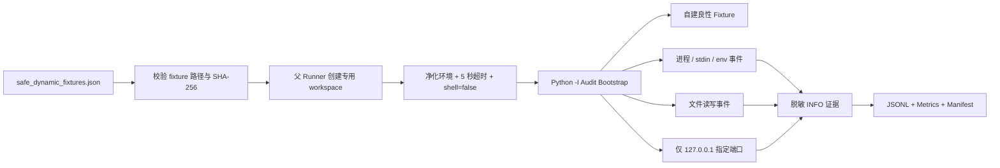

# M3 最小安全动态 Fixture v1 实现与验证报告

## 1. 本轮结论

本轮已完成独立命令行的最小安全动态审计器。它只运行三份由本项目自建、SHA-256 锁定的良性 Python fixture，不运行 SkillTrustBench、600 条封存回归或任何第三方 Skill。网络仅允许父进程在 `127.0.0.1` 创建的随机端口；所有动态证据固定为 `INFO`，不接入或改变现有准入决策。

最终接受结果为 `2026-08-18-safe-dynamic-fixture-dev-v2`：

- 3/3 fixture 完成，7/7 预期机制检查通过；
- 观测到子进程 1 次、stdin 读取 1 次、环境变量读取 3 次；
- 观测到工作区文件写入 1 次、读取 1 次；
- 观测到回环连接 1 次，父进程服务端接收并核对载荷 1/1；
- 策略违规、超时、事件解析错误、非 INFO 证据、原始 token 泄露均为 0；
- 受保护样本读取/执行、互联网连接和最终决策变化均为 0；
- fixture 平均耗时 219.33 ms，最大 289 ms；
- 动态审计专项测试 10/10，后端完整测试 136/136。

该结果证明“自建、哈希锁定 Python fixture 的协作式动态证据契约”可用，但不能表述为已经构建了恶意样本沙箱。

## 2. 为什么先做 fixture，而不直接运行数据集样本

当前机器没有 Docker、虚拟机或专用云沙箱。直接执行第三方 Skill 会让样本获得当前用户权限，可能读取个人文件、启动程序、访问网络或改变系统状态。Windows Defender 能阻止一部分已知行为，但不是可复现的实验隔离边界。

因此本轮先验证五件基础能力：

1. 动态事件能否形成稳定、机器可读的 JSON；
2. 进程、输入、环境、文件和网络证据能否被区分；
3. 结果是否能脱敏，不保存原始输入和载荷；
4. 运行是否能超时闭锁并限制在批准路径、程序和回环端口；
5. 这条动态链能否与现有 INFO-only、决策不变原则兼容。

这一步相当于先验证仪表盘和安全带，再考虑更强隔离环境，而不是把“不执行危险样本”当作动态能力缺失。

## 3. 架构与执行流程



主要组件：

| 组件 | 作用 |
|---|---|
| `backend/dynamic_audit/policy.py` | 校验工作区路径、cwd、链接、回环地址和批准进程 |
| `backend/dynamic_audit/bootstrap.py` | 安装 Python audit hook，观测并在动作前闭锁越界行为 |
| `backend/dynamic_audit/runner.py` | 校验配置/fixture 哈希、净化环境、启动回环服务、超时执行和聚合证据 |
| `config/safe_dynamic_fixtures.json` | 冻结 fixture 集、SHA-256、输入、允许参数和预期事件 |
| `tools/dynamic/run_safe_fixture_audit.py` | 独立 CLI，导出逐事件、逐 fixture、指标、日志和 manifest |

## 4. 三份安全 Fixture

### 4.1 `process_stdio`

fixture 从 stdin 读取固定测试 token，通过 `os.getenv` 读取固定环境变量，再使用当前 Python 执行唯一批准的短子程序。动态证据只记录输入长度与 SHA-256、环境变量名称/存在性/长度/哈希，以及子进程命令行哈希，不记录原始值。

Windows 的 CPython audit 事件只提供完整命令行字符串，而不是原始 argv 数组。因此最终证据明确写为 `argument_form=windows_command_line`、`argv_count=null`，并要求该完整命令行 SHA-256 与父 Runner 生成值完全一致。

### 4.2 `file_io`

fixture 只在本次专用 workspace 写入并读取 `fixture_output.txt`。结果记录相对路径、读写模式、大小和文件 SHA-256，不把内容写入事件流。

### 4.3 `loopback_network`

父 Runner 先绑定 `127.0.0.1` 随机端口，fixture 只能连接这个精确端口。客户端和服务端分别记录载荷长度与 SHA-256，服务端额外验证来源为回环地址、载荷匹配。没有域名解析或互联网连接。

## 5. Fail-closed 安全边界

### 5.1 执行入口

- fixture 根目录固定为 `tools/dynamic/fixtures/`；
- 拒绝路径逃逸和符号链接 fixture；
- 执行前同时校验配置中的 SHA-256；
- 只允许当前 Python；POSIX 使用规范化 argv 哈希，Windows 使用父 Runner 生成的完整命令行哈希；
- `shell=False`，Python 使用 `-I` 隔离模式；
- 每个 fixture 最长 5 秒，stdout/stderr 只保存长度与哈希。

### 5.2 文件边界

- 写路径按进程实际 cwd 解析后必须位于本次 workspace；
- `chdir` 目标必须仍位于 workspace；
- `os.symlink` 和 `os.link` 一律拒绝；
- 文件证据只保留 workspace 相对路径，不保存用户绝对路径或正文。

### 5.3 网络边界

- 只接受数字形式的 loopback IP，不接受主机名；
- 只允许父 Runner 创建的单个随机端口；
- 非回环地址、主机名和错误端口由纯策略测试拒绝，不发起真实连接；
- 主运行只产生一次 `127.0.0.1` TCP 连接。

## 6. 开发与校准过程

### 6.1 Smoke 1：`executable=None`

首轮为 7 passed、1 failed。Windows/CPython 在未显式设置 `executable=` 时将 audit 事件第一字段报告为 `None`，防护以 `PROCESS_EXECUTABLE_INVALID` 闭锁。文件和网络 fixture 已通过，未启动未批准子进程。

### 6.2 Smoke 2：Windows 命令行字符串

只从 `argv[0]` 推导仍不够，因为 Windows audit 的第二字段是完整命令行字符串，不是数组。最终没有解析或放宽字符串，而是由父 Runner 使用 `subprocess.list2cmdline` 生成唯一命令行并传入 SHA-256，bootstrap 只接受完全匹配。

### 6.3 v1 主运行与封口审计

v1 达到 3/3 和 7/7，但封口审查发现相对路径使用固定 workspace 拼接、链接操作未显式拒绝，且 `argv_count=1` 容易误导。当前 fixture 均未利用这些路径，因此 v1 没有越界；但不能把未触发的缺口包装成完整安全边界。

### 6.4 v2 安全收紧

v2 保持 fixture、哈希、预期事件和指标合同不变，只做三项收紧：相对路径按实际 cwd 解析；chdir/链接明确闭锁；Windows 命令行字段准确标注。专项测试从 8 项增至 10 项，主运行仍为 3/3、7/7，最终接受 v2。v1 及两轮 smoke 证据均保留。

## 7. 结果与指标解释

| 指标 | v2 结果 |
|---|---:|
| fixture 完成 | 3/3 |
| 预期机制 | 7/7 |
| 子进程 / stdin / 环境读取 | 1 / 1 / 3 |
| 文件读 / 写 | 1 / 1 |
| 回环连接 / 服务端接收匹配 | 1 / 1 |
| 策略违规 / 超时 / 解析错误 | 0 / 0 / 0 |
| 非 INFO / 原始 token 泄露 | 0 / 0 |
| 受保护样本读取 / 执行 | 0 / 0 |
| 互联网连接 / 决策变化 | 0 / 0 |
| 平均 / 最大耗时 | 219.33 / 289 ms |

v1 与 v2 的耗时差异只有数百毫秒且样本数为 3，不应解释为性能退化或优化。当前目的只是确认确定性机制和安全边界。

## 8. 当前不能做什么

本系统目前不是不可信代码沙箱，原因包括：

- Python audit hook 属于当前解释器内的协作式观测；
- 只观测由 bootstrap 加载的 Python fixture，未注入的后代进程内部文件/网络行为不可见；
- 原生扩展、系统调用绕过和内核级行为不在本轮证明范围；
- 没有 Windows Sandbox、Hyper-V/虚拟机、容器、低权限临时账户、Job Object、网络过滤或系统快照回滚；
- 没有执行任何恶意、可疑或第三方样本，因此不能给出动态恶意检出率。

如果未来要执行第三方 Skill，至少需要独立虚拟机或等价隔离、默认断网、只读输入、临时低权限身份、进程树/文件/注册表/网络系统级遥测、资源限制、快照回滚和失败闭锁。本项目当前不应绕过这些条件。

## 9. 复现与证据

```powershell
..\.runtime_mcp313\Scripts\python.exe tools\dynamic\run_safe_fixture_audit.py `
  --run-id 2026-08-18-safe-dynamic-fixture-dev-v2 `
  --output artifacts\experiment\2026-08-18-safe-dynamic-fixture-dev-v2

.\run_tests.ps1
```

关键证据：

- 最终运行：`artifacts/experiment/2026-08-18-safe-dynamic-fixture-dev-v2/`；
- v1 校准父运行：`artifacts/experiment/2026-08-18-safe-dynamic-fixture-dev-v1/`；
- 两轮 smoke：v1 目录中的 `SMOKE_LOG.md`；
- v1 封口审计：v1 目录中的 `POST_RUN_AUDIT.md`；
- 配置：`config/safe_dynamic_fixtures.json`；
- 测试：`backend/tests/test_safe_dynamic_audit.py`。

## 10. 下一步

建议下一阶段将“运行内置安全 fixture 集并查看动态证据”接入平台管理员接口，但接口不得接收任意脚本路径或上传代码，只能触发固定 `fixture_set_id`。接入后继续保持 INFO-only，并增加任务状态、超时、事件导出和前端边界提示。第三方样本动态执行仍不进入当前范围。
