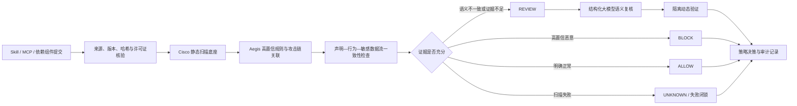

# 通用政企智能体平台供应链安全规则补强必要性说明

版本：v1.0  
日期：2026-08-15  
适用范围：通用政企智能体平台的 Skill、MCP、依赖组件准入与后续运行审计  
证据基线：SkillTrustBench v1.0 全量 5,520 条 Cisco Skill Scanner 静态扫描

## 1. 文档目的

本文档从通用政企智能体平台的业务和安全要求出发，说明现有静态扫描能力为什么仍需补强、具体缺少哪些规则、每类规则解决什么政企风险，以及当前项目已经完成和尚未完成的工作。

需要首先明确：截至本文档形成时，项目已经完成全量基线冻结、开发集与回归集划分和缺口分析，但尚未将新增规则、大模型语义复核或动态验证接入正式扫描链路。因此，当前检测指标仍是 Cisco 静态基线，不能声称补强后的性能已经提高。

## 2. 核心结论

通用政企智能体平台通常连接统一身份、OA、公文、知识库、数据库、邮件、工单、代码仓库和运维工具。Skill 一旦被安装，可能同时获得数据访问、工具调用和系统操作能力。与普通个人应用相比，政企场景具有以下特点：

- 数据敏感度高，可能包含公文、合同、组织信息、业务数据库和访问凭据；
- 组件影响面大，一次安装或升级可能服务多个部门和大量用户；
- 权限链路长，智能体可能通过工具间接获得主机、数据库和云资源权限；
- 运行周期长，恶意持久化行为可能跨任务、跨会话持续存在；
- 强调可审计，必须回答“哪个版本、哪条规则、依据什么证据作出决定”；
- 强调业务可用性，过高误报会导致人工审核拥堵和安全机制被绕过。

因此，政企供应链安全不能只识别单个危险关键词，而需要建立以下证据链：

```text
组件声明 → 静态行为 → 敏感数据流 → 语义意图 → 动态事件 → 准入决策
```

现有 Cisco 能力适合作为静态扫描底座，但当前全量结果同时存在较明显的漏报和误报，不能独立承担政企平台最终安全裁决。

## 3. 当前扫描证据

### 3.1 全量基线

| 指标 | 结果 | 政企含义 |
|---|---:|---|
| 样本总数 | 5,520 | 已覆盖完整固定数据版本 |
| completed | 5,372 | 成功完成 Cisco 静态扫描 |
| abstain / UNKNOWN | 148 | 必须失败闭锁，不能按正常处理 |
| coverage | 97.32% | 仍有 2.68% 无有效分类结果 |
| strict macro F1 | 0.5090 | 三分类边界能力有限 |
| malicious recall | 71.11% | 约 28.89% 恶意样本未被严格识别为恶意 |
| non-normal recall | 77.38% | 风险筛查仍存在 877 条漏报 |
| normal FPR | 28.67% | 471 条正常样本被 REVIEW/BLOCK |
| 策略层 loose F1 | 81.65% | 可作为准入筛查参考，但不等于官方 Cisco 指标 |

### 3.2 关键薄弱类型

| 类型 | 召回情况 | 判断 |
|---|---:|---|
| `wild_real_world` | 38 / 242，15.70% | 真实世界下载执行和诱导模式覆盖不足 |
| T06 系统持久化 | 42 / 96，43.75% | 启动项、计划任务和服务持久化需重点补强 |
| T09 不安全编码 | 752 / 1,120，67.14% | 敏感上下文、破坏操作和权限配置仍有缺口 |
| T05 越权访问与提权 | 757 / 1,077，70.29% | 仅靠显式提权关键词不足以识别权限边界风险 |

### 3.3 开发集缺口分析

项目从全量结果中建立了 120 条开发集，包括 60 条漏报、40 条正常误报和 20 条正确对照。只读分析后的工程路线为：

| 增强路线 | Skill 数量 | 状态 |
|---|---:|---|
| 新增确定性静态规则 | 39 | 已确定候选，尚未接入正式检测 |
| 声明—行为—数据流证据关联 | 41 | 已完成分析原型，尚未接入策略 |
| 大模型语义复核 | 9 | 已确定候选，尚未调用模型 |
| 现有规则校准 | 8 | 已确定方向，尚未改变阈值 |
| 元数据策略分离 | 2 | 已确定方向，尚未修改门禁 |
| 后续动态验证 | 1 | 尚未实现动态沙箱 |
| 正确对照 | 20 | 用于保护已有正确行为 |

## 4. 通用政企平台中的安全准入位置



规则补强的目标不是替换 Cisco，而是在统一准入链路中增加政企场景需要的能力边界、证据关联和失败处置。

## 5. 下载—解码—执行规则的必要性

### 5.1 政企风险

政企平台往往在组件上架时进行一次静态审查。如果 Skill 包内只包含下载逻辑，真正载荷在运行时从外部地址获取，攻击者便可以在审查通过后替换远程内容。

典型链路如下：

```text
正常用途说明
    ↓
访问外部域名或 paste 服务
    ↓
下载脚本或编码载荷
    ↓
Base64 / Hex 解码
    ↓
Shell、PowerShell、eval 或子进程执行
```

这会绕过上架审批、版本管理、代码签名和变更审计，并可能同时影响所有安装该组件的业务部门。

### 5.2 当前缺口

开发集 24 条 `wild_real_world` 漏报中包含：

| 模式 | 数量 |
|---|---:|
| `installer_dropper_base64` | 11 |
| `installer_dropper_curl_bash` | 5 |
| `glot_io_paste_dropper` | 5 |
| `cross_platform_installer_lure` | 2 |
| `embedded_base64_blob` | 1 |

现有扫描器可能分别看到网络、Base64 和进程调用，但缺少稳定的跨步骤攻击链判断。

### 5.3 建议新增规则

| 候选规则 | 识别目标 | 建议处置 |
|---|---|---|
| `REMOTE_FETCH_PIPE_SHELL` | 远程内容直接进入 shell 或 PowerShell | `BLOCK` |
| `REMOTE_FETCH_DECODE_EXECUTE` | 下载、解码和执行形成完整链路 | `BLOCK` |
| `PASTE_SERVICE_PAYLOAD_EXECUTION` | paste/在线代码服务载荷进入执行汇点 | `BLOCK` |
| `EMBEDDED_BLOB_DECODE_EXECUTE` | 内嵌编码数据解码后动态执行 | `BLOCK` |
| `UNAPPROVED_REMOTE_CODE_SOURCE` | 从未批准域名获取可执行内容 | `REVIEW/BLOCK` |

单独的业务数据下载不能直接判恶，应结合域名白名单、内容类型、完整性哈希、组件声明和后续执行行为判断。

## 6. 系统持久化规则的必要性

### 6.1 政企风险

普通 Skill 应只在智能体任务期间生效，不应越过任务生命周期修改主机启动行为。恶意持久化可能导致：

- 删除或停用 Skill 后后门仍存在；
- 通过计划任务持续收集文件、令牌和数据库凭据；
- 通过系统服务获得更高权限并长期运行；
- 在共享终端或服务器上影响其他用户；
- 破坏账号注销、资产下线和应急处置流程。

### 6.2 当前缺口

T06 全量召回只有 43.75%。开发集选出的 12 条 T06 漏报全部属于 `PY_PYTHON_PERSIST`，其中 11 条具有可用于静态规则的持久化特征。

### 6.3 建议新增规则

| 候选规则 | 识别目标 | 建议处置 |
|---|---|---|
| `PERSISTENCE_STARTUP_PROFILE_WRITE` | 写入 shell profile、Startup、注册表 Run、authorized_keys | `BLOCK` |
| `PERSISTENCE_SCHEDULED_TASK` | 创建 cron、schtasks、ScheduledTask | `BLOCK` |
| `PERSISTENCE_SERVICE_CREATE` | 创建 systemd、launchd、Windows Service | `BLOCK` |
| `UNDECLARED_PERSISTENCE_CAPABILITY` | 未声明系统管理能力却修改持久化位置 | `BLOCK` |

规则应要求同时存在“持久化目标”和“写入、创建或注册动作”，避免仅在说明文档中出现 `service`、`cron` 等词就触发高风险告警。

## 7. 权限边界规则的必要性

### 7.1 政企风险

政企智能体可能通过统一身份、数据库账号、云凭据或运维工具获得间接权限。如果只检查 `sudo`、`root` 等显式关键词，会漏掉没有直接提权命令但访问范围明显过大的行为。

典型问题包括：

- 文档助手读取整个用户目录；
- 邮件助手读取环境变量中的云服务密钥；
- 数据分析 Skill 获得数据库通配符权限；
- 普通办公组件修改系统配置；
- 只需要读取的组件获得删除和写入能力。

### 7.2 建议新增规则

| 候选规则 | 判断逻辑 | 建议处置 |
|---|---|---|
| `EXCESSIVE_PERMISSION_SCOPE` | 实际权限明显超过任务最小需要 | `REVIEW/BLOCK` |
| `UNDECLARED_PRIVILEGED_OPERATION` | 未声明系统管理能力却执行高权限操作 | `BLOCK` |
| `WILDCARD_OR_WORLD_WRITABLE_PERMISSION` | 通配符授权、`chmod 777` 等过宽权限 | `REVIEW/BLOCK` |
| `PERSISTENT_PRIVILEGED_SERVICE` | 高权限操作与服务持久化组合 | `BLOCK` |

政企平台需要比较“声明任务—最小必要能力—实际权限”，不能只判断代码是否包含显式提权命令。

## 8. 敏感数据流和不安全编码规则的必要性

### 8.1 政企敏感数据源

- 公文、合同、会议纪要和内部知识库；
- 用户身份、组织架构和通讯录；
- 数据库查询结果和业务报表；
- 环境变量、API Token、SSH 和云服务凭据；
- 智能体上下文、系统提示词和工具调用结果。

### 8.2 危险汇点

- 未批准外部域名、webhook 和 paste 服务；
- 外部邮件、即时通信和网盘接口；
- 日志、临时文件和共享目录；
- HTTP POST、文件上传和子进程参数。

### 8.3 当前缺口

T09 开发集漏报主要包含上下文泄漏、破坏操作无确认、通配符权限、描述误导和持久化服务。现有单点规则对文件访问或网络请求容易误报，但对“敏感源进入危险汇点”的完整链路识别不足。

### 8.4 建议新增规则

| 候选规则 | 识别目标 | 建议处置 |
|---|---|---|
| `SENSITIVE_SOURCE_TO_EXTERNAL_SINK` | 凭据、环境变量或敏感文件进入外部网络 | `BLOCK` |
| `SENSITIVE_CONTEXT_LEAK` | 智能体上下文、系统提示或业务数据进入日志/非授权存储 | `REVIEW/BLOCK` |
| `DESTRUCTIVE_ACTION_WITHOUT_CONFIRMATION` | 删除、覆盖或权限修改前没有确认门禁 | `REVIEW/BLOCK` |
| `UNSAFE_TEMP_FILE_USAGE` | 使用可预测或权限不安全的临时文件 | `REVIEW` |
| `PLAINTEXT_SENSITIVE_TRANSPORT` | 敏感信息通过明文协议传输 | `BLOCK` |

核心判断链应为：

```text
敏感数据源 → 读取/转换/编码 → 网络、文件或进程危险汇点
```

普通文件访问和业务 API 请求本身不应直接等价为泄露。

## 9. 描述—行为一致性与大模型语义复核的必要性

### 9.1 政企风险

政企组件上架通常依赖名称、用途、权限和数据范围说明。若 Skill 描述为“文档格式化”，实际却读取凭据、连接外部网络或创建系统服务，审批人员可能被误导，而传统关键词规则也可能只看到若干孤立的合法 API。

### 9.2 建议增强

建议建立 `DESCRIPTION_BEHAVIOR_MISMATCH` 检查，并使用大模型处理跨文件、意图和上下文问题。模型输入应优先使用：

- `SKILL.md` 声明用途；
- 文件清单和能力声明；
- 脱敏后的网络、文件、权限和执行特征；
- 静态规则已定位的文件级证据；
- 不包含真实密钥和不必要的恶意代码正文。

模型输出应使用固定 JSON 契约：

```json
{
  "declared_purpose": "",
  "observed_capabilities": [],
  "undeclared_sensitive_behaviors": [],
  "description_behavior_mismatches": [],
  "risk_labels": [],
  "confidence": 0.0,
  "evidence_files": []
}
```

### 9.3 决策边界

- 仅有模型语义怀疑：进入 `REVIEW`；
- 模型判断与确定性危险证据一致：可以升级为 `BLOCK`；
- 模型超时、格式错误或无法判断：进入 `UNKNOWN`，失败闭锁；
- 不允许大模型仅凭主观描述直接自动放行或阻断。

首批 9 条语义复核开发样本为：

`case_03461`、`case_05381`、`case_05539`、`case_05621`、`case_05623`、`case_05637`、`case_05696`、`case_05698`、`case_05731`。

## 10. 正常误报治理的必要性

### 10.1 当前问题

当前 normal FPR 为 28.67%。全量正常误报中的高频规则包括：

- `TOOL_ABUSE_UNDECLARED_NETWORK`：164 条；
- `DATA_EXFIL_NETWORK_REQUESTS`：95 条；
- `DATA_EXFIL_JS_FS_ACCESS`：77 条；
- `FILE_MAGIC_MISMATCH`：42 条；
- GitHub、Stripe 密钥样式：各 31 条。

开发集分析发现：

- 16 条网络误报中，15 条在 `SKILL.md` 声明了网络能力；
- 8 条文件访问误报中，7 条声明了文件能力；
- 6 条进程/命令误报中，5 条声明了进程或开发工具能力；
- 4 条密钥样式误报均具有安全工具语境。

### 10.2 政企影响

过高误报会导致：

- 人工审核队列拥堵；
- 安全人员产生告警疲劳；
- 业务部门认为系统不可用；
- 管理员通过白名单或绕过方式关闭安全控制；
- 真正高风险事件被普通 API 告警淹没。

因此，降低误报不是降低安全标准，而是使安全机制能够持续执行。

### 10.3 建议增强

| 增强项 | 作用 |
|---|---|
| `DECLARED_CAPABILITY_MATCH` | 判断网络、文件和进程行为是否属于 Skill 声明功能 |
| `SENSITIVE_SOURCE_SINK_CORRELATION` | 只有敏感源进入危险汇点时才升级为外泄 |
| `PLACEHOLDER_SECRET_CONTEXT` | 识别测试密钥、占位符和安全检测夹具 |
| `FILE_TYPE_USAGE_CONTEXT` | 文件 magic 不一致先进入完整性复核 |
| 允许域名和目标约束 | 区分批准业务 API 与任意外部连接 |

建议采用加权证据而非硬性全局降级：

```text
已声明能力 + 批准目标 + 无敏感数据流 → 低风险或 ALLOW
未声明能力 / 未批准目标 → REVIEW
敏感源 → 外部汇点，或远程载荷 → 执行汇点 → BLOCK
```

## 11. 元数据、合规和安全策略分离

描述过长、缺少许可证、命名不规范和文件类型异常在政企平台中需要治理，但不应全部等价为恶意。

| 问题类型 | 示例 | 建议处置 |
|---|---|---|
| 安全风险 | 下载执行、泄露、持久化、越权 | `BLOCK/REVIEW` |
| 合规风险 | 缺少许可证、来源不明、版本不可追溯 | 禁止上架或补充材料 |
| 质量风险 | 描述过长、命名不规范、格式异常 | 整改后重新提交 |

这类分离能够让审计报告准确说明“为什么没有上架”：是恶意风险、合规缺失，还是制品质量问题，而不是输出一个无法解释的统一风险分数。

## 12. 动态验证的必要性

静态分析无法可靠确定所有条件分支和运行结果。对于无法仅凭文本定性的组件，后续应进入一次性隔离环境，观察：

- 创建了哪些子进程；
- 读取和写入了哪些文件；
- 访问了哪些环境变量；
- 连接了哪些网络目标；
- 是否创建服务、计划任务或启动项；
- 是否越过规定工作目录；
- 是否超时、异常退出或尝试规避分析。

动态环境不得包含真实政企凭据和业务数据，默认断网或只允许经过代理的白名单访问。当前项目尚未实现动态沙箱，因此本项只能作为后续计划，不能写成已完成功能。

## 13. 当前已完成与未完成工作

| 能力 | 当前状态 | 是否改变检测结果 |
|---|---|---|
| 5,520 条全量 Cisco 基线冻结 | 已完成 | 否 |
| 120 条开发集 | 已完成 | 否 |
| 600 条封存回归集 | 已完成 | 否 |
| 开发集只读特征分析 | 已完成 | 否 |
| Skill 声明能力提取原型 | 已完成分析原型 | 尚未接入正式检测 |
| 规则缺口自动分类 | 已完成 | 否 |
| 正式 Aegis 检测规则 | 未实现 | — |
| 证据关联层 | 未接入 | — |
| 大模型语义复核 | 未接入 | — |
| 动态行为验证 | 未实现 | — |
| 600 条增强后回归评测 | 尚未运行 | — |

已经完成的工程增强包括：

1. 冻结基线一旦存在，只允许校验；任何受保护文件的大小或 SHA-256 改变都会失败；
2. 开发集和回归集零重叠，回归集没有打开样本正文；
3. 只读特征分析前后复核全部开发样本 tree hash，不保存原始代码片段；
4. 建立网络、文件、进程、权限、持久化和敏感数据等规范化特征；
5. 建立新增规则、证据关联、语义复核、规则校准和动态验证的自动路由；
6. 后端自动测试达到 `78 passed`。

## 14. 实现优先级

| 优先级 | 开发任务 | 政企价值 | 验证范围 |
|---|---|---|---|
| P0 | 下载—解码—执行攻击链 | 防止上架后替换远程载荷 | 对应开发漏报 + 正确对照 |
| P0 | T06 持久化规则 | 防止组件跨任务长期驻留 | 12 条 T06 漏报 + 系统管理对照 |
| P0 | 声明—行为—敏感数据流关联 | 同时提升泄露识别和降低误报 | 30 条网络/文件/命令误报 + 相关漏报 |
| P1 | T05 权限范围与 T09 不安全编码 | 落实最小权限和安全编码要求 | 对应 24 条开发漏报 |
| P1 | 结构化大模型语义复核 | 识别描述—行为不一致和诱导 | 9 条语义候选 + 对照样本 |
| P2 | 文件、密钥和元数据规则校准 | 降低治理问题对恶意判定的干扰 | 10 条校准/策略分离样本 |
| P2 | 最小动态验证 | 为静态不确定样本补充运行证据 | 无害 fixture，禁止直接执行恶意样本 |

## 15. 回归验收原则

规则、阈值和语义提示词只允许在 120 条开发集上设计和调试。冻结后，再对 600 条回归集进行一次聚合配对评测。

验收时必须同时报告：

- strict macro F1；
- malicious recall 和 FNR；
- non-normal recall；
- normal FPR；
- coverage、failure rate 和 abstention；
- T01—T09 每类召回；
- Cisco 基线与 Aegis 增量的新增/消失 Finding；
- 新增规则造成的正常样本退化情况。

不能只报告“多检出了多少恶意样本”。如果 recall 上升但 normal FPR 明显扩大，仍不具备政企落地价值。

600 条回归集用于工程退化检查，不是新的独立权威测试集。最终对外性能主张仍应使用没有参与规则设计的外部数据或比赛方隐藏测试。

## 16. 面向老师的正式汇报表述

> 政企智能体通常连接公文、知识库、数据库、邮件和运维系统，Skill 一旦被安装，就可能同时获得数据访问、工具调用和系统操作能力。现有 Cisco 扫描器适合作为静态底座，但全量 5,520 条评测显示，其对真实世界下载执行、系统持久化、权限边界和不安全编码仍有稳定漏报，同时普通网络和文件操作又带来较高误报。因此，本项目的补强重点不是简单增加关键词，而是建立“组件声明、静态行为、敏感数据流、语义意图和动态事件”之间的证据关联。通过高置信攻击链规则、声明—行为一致性检查、结构化大模型复核和失败闭锁门禁，系统才能从厂商工具接入原型提升为面向通用政企智能体平台的供应链安全准入模块。

## 17. 结论边界

当前可以表述：

- 已完成 Cisco Skill Scanner、MCP Scanner 和依赖审计的本地接入；
- 已完成 SkillTrustBench 5,520 条全量静态评测与独立验收；
- 已冻结当前 Cisco 比较基线；
- 已建立开发集、回归集和逐 Skill 缺口清单；
- 已明确政企场景需要补充的规则、证据关联和语义复核方向。

当前不能表述：

- 已经提高全量召回率或降低误报率；
- 已经完成正式大模型语义检测；
- 已经实现动态沙箱；
- 能够发现所有智能体供应链攻击；
- 当前 600 条回归集是独立权威盲测集。

## 18. 证据索引

| 证据 | 路径 |
|---|---|
| 全量扫描报告 | `docs/M2_SKILLTRUSTBENCH_FULL_REPORT.md` |
| 开发/回归与规则缺口报告 | `docs/M3_SKILLTRUSTBENCH_DEV_REGRESSION_AND_RULE_GAPS.md` |
| 全量逐样本结果与指标 | `artifacts/analysis/2026-08-14-skilltrustbench-full-cisco-parallel-v1/` |
| 开发/回归清单与脱敏分析 | `artifacts/analysis/2026-08-15-skilltrustbench-dev120-regression600-v1/` |
| 冻结基线 | `baseline/skilltrustbench_v1_0/full_cisco_static_v1/` |
| 冻结与划分工具 | `tools/evaluation/freeze_skilltrustbench_development.py` |
| 开发集只读分析工具 | `tools/evaluation/analyze_skilltrustbench_development.py` |

风险标签含义以 SkillTrustBench v1.0 固定数据版本为准：T05 为越权访问与提权，T06 为系统持久化，T09 为不安全编码；T07/T08 分别为工具劫持和不安全依赖。官方参考：[SkillTrustBench 数据集概览](https://matrix.tencent.com/skilltrustbench/dataset)、[Hugging Face 数据仓库 README](https://huggingface.co/datasets/cuhk-zhuque/SkillTrustBench/blob/main/README.md)。
