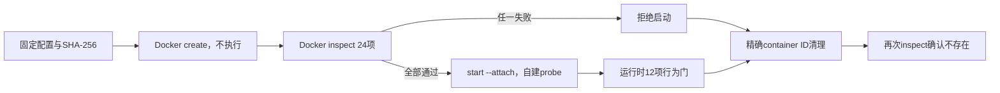

# M4 D2 Docker 安全执行后端 v1 实现报告

> 日期：2026-08-22  
> 分支：`dynamic-audit-v1`  
> 最终接受运行：`2026-08-22-docker-safety-backend-dev-v2`  
> 父动态基线：`2026-08-22-dynamic-marker-flow-dev-v2`  
> 静态基线：`2026-08-22-static-audit-regression600-v1`（只读）

## 1. 本轮结论

本轮完成了第三方动态审计之前的 Docker 安全执行底座。系统不再直接在 Windows 宿主机启动脚本，而是使用固定 digest 的本地 Python 镜像，先创建容器、读取真实 inspect 配置并检查全部安全门，只有全部通过才启动自建 probe；无论成功、失败或超时，最后都用本轮精确 container ID 清理并验证容器不存在。

最终 v2 结果：

- Docker Desktop 4.86.0，Linux Engine 29.7.2，API 1.55；
- 固定镜像身份门 4/4；
- 容器 inspect 配置门 24/24；
- 容器内运行时行为门 12/12；
- 合计 40/40；
- 自建 probe 1/1 完成；
- 策略违规、超时和容器残留均为 0；
- 第三方样本读取/执行、互联网、镜像拉取、GPU、云和最终决策变化均为 0；
- Docker 专项测试 `26 passed`；后端完整测试 `296 passed`。

这说明“当前固定镜像和自建 probe 的 Docker 配置、运行行为与清理安全门”成立，但不能证明不存在 Docker/WSL2/Linux 内核逃逸，也不能直接执行真实恶意样本。

## 2. Docker 环境恢复过程

最初系统 PATH、标准 Docker 安装路径、Windows 服务和运行进程均未发现 Docker。进一步检查发现开始菜单和桌面存在 Docker Desktop 快捷方式，但快捷方式不暴露普通 TargetPath。通过用户授权启动快捷方式后，程序实际安装位置被激活，Docker Desktop 和 `com.docker.backend` 进程正常出现。

最终确认环境：

| 项目 | 结果 |
|---|---|
| Docker Desktop | 4.86.0 |
| Engine | 29.7.2 |
| API | 1.55 |
| 容器 OS/架构 | Linux/amd64 |
| Docker Context | `desktop-linux` |
| 内核 | WSL2 6.18.33.2 |
| 默认安全选项 | builtin seccomp、cgroup namespace |

本机已经存在 Python 3.12-slim 镜像，因此没有联网下载。

## 3. 固定供应链身份

镜像只能使用不可变引用：

`public.ecr.aws/docker/library/python@sha256:dd29372629eeba2dd003fd9e9d35a5b8236c44727875a0364254b5127af88e65`

运行前同时验证：

1. 镜像 ID 与配置完全一致；
2. RepoDigest 包含固定引用；
3. OS 为 Linux；
4. 架构为 amd64；
5. Docker 参数强制 `--pull=never`。

配置会拒绝 `python:latest`、pull policy 放宽、fixture 哈希变化以及任何安全字段变化。

自建 probe 的 SHA-256 为：

`1a2335f575e2d7270f970531c1c603155a9b8fbd4991e6c0711b4433391dbca4`

## 4. create→inspect→start→cleanup

“先 create 再 inspect”非常重要：命令行看起来安全，不代表 Docker Engine 最终保存的配置一定安全。系统检查真实容器对象后才允许运行。

## 5. 24 项配置门

配置检查覆盖：

- Aegis 后端与运行标签准确；
- 镜像、entrypoint、命令和工作目录固定；
- UID/GID 固定为 `65532:65532`；
- 容器环境变量名处于允许集合；
- `network=none`；
- 根文件系统只读；
- `privileged=false`；
- 非 host PID、`ipc=none`；
- `cap-drop=ALL`，无 CapAdd；
- `no-new-privileges=true`；
- PID 上限 64；
- 内存上限 256 MiB；
- CPU 上限 0.5 核；
- init 开启，restart 关闭，log driver 为 none；
- `/tmp` 16 MiB、`/workspace` 64 MiB，均为 `noexec,nosuid,nodev` tmpfs；
- 只有一个 fixture 文件只读 bind mount；
- 没有 Docker Socket、用户目录、项目根目录或宿主根挂载。

## 6. 12 项运行时行为门

自建 probe 在容器内部读取 `/proc/self/status` 并执行无害写入反例：

| 行为 | 实测结果 |
|---|---|
| UID/GID | 65532/65532 |
| Effective capabilities | `0000000000000000` |
| NoNewPrivs | 1 |
| Seccomp | 2（过滤模式） |
| 根目录写入 | 被拒绝 |
| fixture 文件写入 | 被拒绝 |
| `/workspace` tmpfs 写入 | 成功 |
| `/tmp` tmpfs 写入 | 成功 |
| 网络接口 | 仅 `lo` |
| cwd | `/workspace` |

这些结果证明 Docker 保存的安全配置在当前 probe 中确实产生预期行为，不只是命令字符串存在相应参数。

## 7. 清理与失败闭锁

容器名称由固定前缀和随机十六进制组成。Docker create 返回后，系统只接受 64 位十六进制 container ID。清理时不使用模糊名称、标签批量删除或通配符，只删除本轮 create 返回的精确 ID，然后再次 inspect：只有“删除成功且对象不存在”才通过。

测试覆盖：

- 成功运行后清理；
- 非法 container ID 不执行删除；
- 容器启动超时后仍进入 finally 清理；
- 清理后再次 inspect 验证不存在。

真实 v2 运行后又独立按 Aegis 标签查询，容器残留为 0。

## 8. v1 到 v2 的校准

v1 的 40/40 安全门和容器清理真实通过，但环境清单把 API 版本记录为字符串 `None`。原因是 Docker JSON 使用 `ApiVersion`，代码只读取 `APIVersion`。该问题不影响隔离机制，但会损害报告准确性。

因此 v1 原样保留。v2 兼容两种字段名，实际记录 API 1.55，并新增成功、非法 ID 和启动超时清理测试。镜像、fixture、40 个安全门和指标合同保持不变。

## 9. 当前没有完成的部分

本轮还没有：

- 执行第三方 Skill、MCP Server 或公开恶意样本；
- 实现 MCP 初始化、工具枚举、Schema 合法调用；
- 实现 Skill 全目录运行闭包提升；
- 安装和使用 strace/eBPF/inotify；
- 建立内部网络 sinkhole 容器网络；
- 把 Docker 动态结论接入 ALLOW/REVIEW/BLOCK；
- 使用本地大模型。

所以本轮应称为“Docker 安全执行底座”，不是完整动态恶意分析系统。

## 10. 下一步

下一阶段优先实现一个完全自建的 MCP 协议 fixture：

1. 在同一 Docker 安全合同下启动自建 MCP Server；
2. 通过协议完成 initialize、tools/list 和 Schema 合法 tools/call；
3. 用现有 Trigger Plan 选择工具和政企 Marker；
4. 把 MCP 返回内容接入 Marker witness；
5. 验证未调用工具时无证据、真实调用后才 confirmed；
6. 仍保持网络 none、无第三方样本、最终决策不变。

该受控协议闭环通过后，再考虑导入 Vulnerable MCP Servers Lab，而不是直接运行真实恶意项目。
