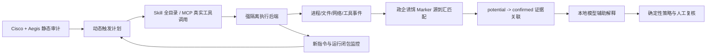

# M4 动态审计论文调研、技术选型与实施计划

> 项目：Aegis Chain——面向通用政企智能体平台的供应链安全审计  
> 日期：2026-08-22  
> 开发分支：`dynamic-audit-v1`  
> 静态基线：`2026-08-22-static-audit-regression600-v1`（冻结，只读）  
> 当前阶段：动态审计证据核心 v1 开发

## 1. 一句话结论

动态审计不应简单拼接一个开源扫描器，也不应让大模型直接判定恶意。当前最适合本项目的路线是：以 Cisco+Aegis 静态结果生成有针对性的动态测试计划，在强隔离执行环境中进行 Skill 全目录和 MCP 真实工具调用，使用政企诱饵标记建立“敏感源—进程/工具—输出或网络汇点”的可复核证据链，再由本地小模型辅助生成测试输入和解释证据，最终裁决仍由确定性证据和政企策略完成。

## 2. 当前基础与问题边界

### 2.1 已完成的静态基础

静态审计 v1 已完成并冻结。在 600 条三类均衡密封工程回归样本上：

- 严格宏平均 F1：`0.4661 -> 0.5629`；
- 恶意样本召回率：`73.5% -> 82.0%`；
- 正常样本误报率：`32.0% -> 35.5%`；
- 结论：`supported_with_tradeoff`，即增强有效，但存在人工复核量上升的权衡；
- 回归集已开封，不能继续用于调规则或作为新的无偏测试集。

现有动态模块只运行 3 个自建、SHA-256 锁定的良性 Python fixture，能够采集进程、标准输入、环境变量、文件和回环网络事件。它证明了“协作式动态观测和脱敏证据合同”可运行，但不是第三方代码沙箱，不能执行恶意 Skill，也没有动态恶意检出率。

### 2.2 本阶段要解决的问题

1. 静态发现如何转换为具体的动态触发任务，而不是盲目运行一次；
2. 如何证明敏感数据确实从受保护源到达输出、文件、MCP 返回或网络汇点；
3. Skill 在运行时释放或读取新的指令/代码后，如何继续覆盖完整运行闭包；
4. MCP Server 如何通过真实工具枚举、Schema 合法输入和多轮调用触发危险路径；
5. 如何在本地 CPU、无云服务器的条件下，保留可演示、可复核和可扩展的实现；
6. 如何明确区分“机制已验证”“受控样本检出有效”和“真实第三方样本可安全执行”。

## 3. 两个候选开源项目的取舍

### 3.1 `bawbel/scanner`

结论：只考虑作为可选 Skill 补充适配器，不作为动态审计核心。

可借鉴内容：

- Docker 隔离参数、JSON/SARIF 输出和单文件挂载方式；
- 可作为 Cisco Skill Scanner 之外的异构对照信号；
- Apache-2.0 许可证便于工程借鉴。

不直接依赖的原因：

- 文档同时出现“不会执行代码”和“行为沙箱”两种表述，能力边界需要进一步核验；
- 以单文件挂载为主，不能覆盖 Skill 全目录、运行时释放文件和跨文件指令闭包；
- 不应使用未固定的 `latest` 镜像，也不应把可选云端/LLM 结论接入最终准入裁决。

### 3.2 `BhaveshThapar/mcp-audit`

结论：不直接集成代码，只借鉴 `strace + 行为清单 + 诱饵数据` 的思路。

主要问题：

- 项目规模极小，核心是启动 MCP Server 后短时间观察 `openat/connect`；
- 没有工具枚举、Schema 合法输入、真实工具调用和多轮触发；
- `npx -y` 会临时下载未固定版本，不满足政企供应链可复现要求；
- 只能观察启动/空闲行为，容易漏掉工具调用后才出现的危险路径。

## 4. 论文方法与本项目采用方式

| 方法/项目 | 关键贡献 | 本项目采用内容 | 暂不照搬的部分 |
|---|---|---|---|
| SkillDetonate / *Cloak and Detonate* | On-Demand Closure Lift；Marker-Based Taint | 监控 Skill 全目录；发现新指令文件后加入后续触发；用诱饵标记形成源到汇证据 | eBPF/FUSE 完整实现成本高，第一阶段先用事件和汇点匹配复现核心机制 |
| MalSkillBench | 3,944 恶意+4,000 良性完整 Skill；Docker、strace、inotify、LLM 二级判定 | 作为后续受控动态开发/测试数据候选；借鉴行为标签和两级评估 | 当前未建立强隔离前不执行样本；LLM 不作唯一裁决 |
| MaliciousAgentSkillsBench | 大规模生态测量和行为确认；USENIX Artifact | 借鉴分类、元数据和复现实验组织 | 不挂载真实 Claude 凭据；不使用跳过权限检查的执行方式 |
| MCP-SandboxScan / SandScope | Schema 引导调用；多形态 marker 源到汇匹配 | 对 MCP 工具做枚举和合法输入生成；匹配原文、Base64、Hex、分片等传播形态 | WASM/WASI 对真实 MCP 兼容率有限，不作为唯一执行后端 |
| `mcp-sec-audit` | AST、轻量污点、静动态关联、结构化 JSONL | 借鉴结果 Schema、静动态关联和受控漏洞实验室 | 其动态后端需要 `--privileged --pid=host`，不用于执行未知代码 |
| VIPER-MCP | 静态锚点指导工具选择与反馈式输入演化 | 让静态规则选择优先工具、参数和诱饵类型；失败后有限调整输入 | 不复现依赖大型闭源模型的大规模自动挖掘 |

## 5. 选定架构

### 5.1 静态引导动态

静态 Finding 不直接等于动态恶意行为。系统根据规则类别生成触发计划，例如：

- 敏感文件/凭据读取：注入假公文、假身份证号、假数据库凭据和假运维令牌；
- 网络/外传：启用本地 sinkhole，不连接互联网，检查标记是否到达汇点；
- 命令执行：使用固定、无害、可识别的参数，观察真实进程树；
- MCP 工具投毒：枚举 Tool Schema，生成结构合法输入并调用相关工具；
- 隐藏/释放载荷：监控 Skill 根目录中新增的 Markdown、脚本和配置，再生成后续触发。

### 5.2 政企诱饵标记

第一批 marker profile：

1. `official_document`：模拟内部公文正文；
2. `personal_identity`：模拟姓名、证件号等个人信息；
3. `database_credential`：模拟数据库账号口令；
4. `internal_endpoint`：模拟内部系统地址；
5. `ops_token`：模拟运维/API 令牌。

Marker 不是实际秘密。原始 marker 不写入最终报告，只保存 marker ID、源类别、源位置、变换方式、汇点类别、事件序列和 SHA-256。匹配至少覆盖原文、Base64、Hex、URL 编码和有界分片重组。

### 5.3 静动态结论分层

| 状态 | 含义 | 可否改变静态最终决策 |
|---|---|---|
| `potential` | 静态发现存在，但动态尚未触发或未覆盖 | 当前不改变 |
| `observed` | 观察到文件/进程/网络等行为，但没有敏感源到汇证据 | 当前不改变 |
| `confirmed` | Marker 从指定敏感源到达受控汇点，形成完整证据链 | v1 只输出独立动态结论，待策略评审后再决定是否接入门禁 |
| `inconclusive` | 运行失败、触发不足或观测不完整 | 失败闭锁，不能判定安全 |

本阶段明确保持静态审计的 `ALLOW/REVIEW/BLOCK/UNKNOWN` 结果不变，避免在动态证据尚未完成独立评测前改变最终裁决。

## 6. 本地小模型的角色

推荐使用 Qwen3 4B 级别模型，通过 Ollama 或 llama.cpp 在 CPU 上运行。模型只做：

- 根据 MCP Tool Schema 生成合法、覆盖边界的测试输入；
- 根据静态 Finding 选择更可能触发风险路径的自然语言任务；
- 对脱敏事件链生成中文解释和汇报摘要；
- 在固定最大轮次内对“参数校验失败/路径未覆盖”进行输入调整。

模型不做：

- 不直接给出最终 `ALLOW/BLOCK`；
- 不把模型的自然语言判断当成源到汇证据；
- 不向云端发送样本源码、政企数据或运行日志；
- 不在没有对照实验时宣称提高检测效果。

后续必须单独比较“确定性触发”和“确定性触发+本地模型”的动态激活率、召回、误报、耗时和失败率，才能说明模型是否真正提高检测效果。

## 7. 数据集与实验分层

### 7.1 第一层：自建无害机制集

目的：证明隔离、采集、Marker、触发计划、静动态关联和报告链路正确。允许立即执行。

### 7.2 第二层：受控漏洞实验室

优先候选：

- [Vulnerable MCP Servers Lab](https://github.com/appsecco/vulnerable-mcp-servers-lab)：用于 MCP 数据暴露、注入、供应链和代码执行场景；
- `mcp-sec-audit` 的 vulnerable lab：只借用固定漏洞服务和标签，不使用高权限动态提供器。

执行条件：Docker 安全配置门全部通过，镜像和依赖版本固定，无互联网、无真实凭据、无 Docker Socket、无主机敏感目录挂载。

### 7.3 第三层：公开研究基准

- [MalSkillBench](https://github.com/lxyeternal/MalSkillBench)：Skill 完整包动态评测候选；
- [MCPTox](https://ojs.aaai.org/index.php/AAAI/article/view/40895)：45 个真实 Server、353 个工具、1,348 个工具投毒案例；
- [MSB](https://github.com/dongsenzhang/MSB)：405 个工具、2,000 个攻击实例；
- [MCP-SafetyBench](https://github.com/xjzzzzzzzz/MCPSafety)：20 类攻击、5 个领域和多轮场景；
- [MaliciousAgentSkillsBench](https://github.com/protectskills/MaliciousAgentSkillsBench)：用于生态分类和独立对照。

第三层数据先做来源、许可证、哈希、结构和样本风险审计，再创建动态开发集与独立回归集。不能直接把已有静态 600 条回归集改造成动态调参集。

## 8. 评测合同

### 8.1 核心指标

- 动态检出召回率、Precision、F1 和正常样本 FPR；
- 动态激活率：样本被成功启动且至少一个目标路径被触发的比例；
- 源到汇证据率：生成完整 marker witness 的样本比例；
- 静态绕过恢复率：静态未报、动态确认的恶意样本比例；
- 静动态一致/冲突比例；
- 平均、P95 和最大运行时间；
- 超时、崩溃、协议不兼容和观测不完整比例；
- 本地模型增益及其额外耗时。

### 8.2 研究假设

- 零假设：Marker 与静态引导不能显著提高可复核动态证据率，或会引入不可接受的正常误报和运行失败；
- 备择假设：相较于“只启动一次/盲目调用”，静态引导、闭包提升和 Marker 匹配能提高恶意样本的源到汇证据率，且正常样本 FPR 保持在预注册阈值内。

### 8.3 结论边界

自建 fixture 只能支持机制结论；受控漏洞实验室可以支持已知场景检出结论；只有独立公开基准和冻结测试集才能支持泛化效果结论。任何阶段都不能把“未触发”解释为“安全”。

## 9. 安全执行门

在执行任何第三方或可疑代码前，必须同时满足：

- Docker/VM 执行后端可用且版本被记录；
- 默认断网；需要网络证据时只连接内部 sinkhole；
- 只读根文件系统、`cap-drop=ALL`、`no-new-privileges`；
- 非 root 用户、进程/内存/CPU/时间限制；
- 不挂载真实凭据、用户目录、项目根目录或 Docker Socket；
- 输入制品只读，输出目录临时且运行后可回收；
- 镜像、工具、模型和数据均固定版本与 SHA-256；
- 原始事件和报告脱敏，仍保留可校验的哈希证据；
- 安全门失败时停止运行，不降级到宿主机直接执行。

D1 开发时 `docker` 命令不可用，因此当时只执行仓库内自建、哈希锁定的良性 fixture。D2 已经用户授权启动 Docker Desktop，并完成 40/40 安全门；第三方样本仍未执行。

## 10. 分阶段实施计划

### 阶段 D1：动态证据核心 v1（当前）

- [x] Marker profile 与脱敏标识；
- [x] 原文/Base64/Hex/URL 编码/分片匹配；
- [x] 自建“文件源→回环汇点”无害 fixture；
- [x] 静态 Finding→动态 Trigger Plan；
- [x] `potential/observed/confirmed/inconclusive` 独立关联结果；
- [x] 测试、运行 manifest 和实现报告；
- [x] 静态最终决策变化保持为 0。

### 阶段 D2：Docker 安全执行后端

- [x] 安装/发现 Docker Desktop；
- [x] 固定基础镜像与依赖；
- [x] 实现只读输入、临时输出、默认断网、资源限制和清理；
- [ ] 加入 `strace`、文件差分/inotify 和本地 sinkhole；
- [x] 只运行自建反例验证越界动作被阻断。

D2-A 安全底座已由 `2026-08-22-docker-safety-backend-dev-v2` 通过：固定镜像 4/4、真实 inspect 24/24、运行时行为 12/12，总计 40/40；容器残留、第三方样本、互联网、镜像拉取和决策变化均为 0，完整后端测试 `296 passed`。D2-B 系统调用/文件/内部 sinkhole 遥测仍待完成。

### 阶段 D3：Skill 与 MCP 真实触发

- [ ] Skill 全目录闭包监控和新指令提升；
- [ ] MCP 初始化、工具枚举和 Schema 合法调用；
- [ ] 静态规则指导工具/参数/诱饵选择；
- [ ] 失败分类与有界重试；
- [ ] 统一动态报告和管理员页面。

### 阶段 D4：本地模型和公开基准评测

- [ ] 固定 Qwen3 小模型、量化版本和推理参数；
- [ ] 建立无模型/有模型配对实验；
- [ ] 导入并审计公开数据；
- [ ] 冻结动态开发集与独立回归集；
- [ ] 报告召回、FPR、源到汇证据率、激活率和开销。

## 11. 本项目可表述的创新点

1. 面向通用政企智能体平台，统一 Skill、MCP 和依赖供应链的静态—动态证据模型；
2. 使用静态风险锚点生成有针对性的动态工具调用和诱饵类型，减少盲目执行；
3. 将 Skill 运行闭包提升与 MCP Schema 引导调用放入同一动态审计流程；
4. 设计公文、个人信息、数据库凭据、内部端点和运维令牌五类政企 Marker；
5. 以源到汇 witness 区分“潜在风险”和“运行时确认”，大模型只辅助触发与解释；
6. 所有动态结果保留制品、配置、事件、模型和环境哈希，满足汇报和复核要求。

这些创新属于“论文方法复现、工程组合和政企策略适配”，不应表述为相关技术的全球首次提出。

## 12. 主要参考资料

- [Cloak and Detonate: Scanner Evasion and Dynamic Detection of Agent Skill Malware](https://arxiv.org/abs/2607.02357)
- [MalSkillBench](https://arxiv.org/abs/2606.07131) / [代码与数据](https://github.com/lxyeternal/MalSkillBench)
- [MaliciousAgentSkillsBench](https://arxiv.org/abs/2602.06547) / [USENIX Security 2026 页面](https://www.usenix.org/conference/usenixsecurity26/presentation/liu-yi)
- [MCP-SandboxScan](https://arxiv.org/abs/2601.01241)
- [`mcp-sec-audit`](https://arxiv.org/abs/2603.21641) / [代码](https://github.com/nyit-vancouver/mcp-sec-audit)
- [VIPER-MCP](https://arxiv.org/abs/2605.21392)
- [MCPTox](https://ojs.aaai.org/index.php/AAAI/article/view/40895)
- [MSB](https://github.com/dongsenzhang/MSB)
- [MCP-SafetyBench](https://github.com/xjzzzzzzzz/MCPSafety)
- [Vulnerable MCP Servers Lab](https://github.com/appsecco/vulnerable-mcp-servers-lab)
- [Qwen3](https://github.com/QwenLM/Qwen3)

## 13. 当前立即行动

D1 已由 `2026-08-22-dynamic-marker-flow-dev-v2` 完成受控机制验证。D2-A 已由 `2026-08-22-docker-safety-backend-dev-v2` 完成 Docker 安全底座：40/40 门、容器残留 0、完整后端 `296 passed`。下一步是在该底座上完成自建 MCP 协议与 Marker witness，并补充 D2-B 的系统调用/文件/内部 sinkhole 遥测；在这些受控验证完成前仍不执行第三方样本。
