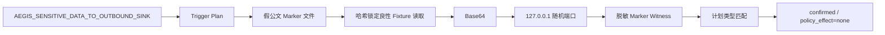

# M4 动态 Marker 源到汇证据核心 v1 实现报告

> 日期：2026-08-22  
> 分支：`dynamic-audit-v1`  
> 最终接受运行：`2026-08-22-dynamic-marker-flow-dev-v2`  
> 静态基线：`2026-08-22-static-audit-regression600-v1`（只读）

## 1. 本轮结论

本轮完成动态审计证据核心的第一个真实闭环：现有 Aegis 静态 Finding 先生成有界 Trigger Plan；运行器在专用工作区放入一份“假内部公文”Marker；自建且 SHA-256 锁定的良性 fixture 读取该文件，将 Marker 转为 Base64 后只发送到父进程创建的 `127.0.0.1` 随机端口；汇点检测到 Marker 并生成脱敏的源到汇 witness；关联层确认 witness 类型属于静态计划后，给出独立动态状态 `confirmed`。

最终 v2 结果：

- 1/1 受控 fixture 完成；
- 文件读取、环境读取、回环连接 3/3 预期事件通过；
- 1 条 `official_document` Marker 源到汇 witness；
- 传播变换为 `base64`，源和汇点均有 SHA-256；
- 静动态关联为 `confirmed`；
- 策略违规、超时、事件解析错误、原始 Marker 泄露均为 0；
- 受保护样本读取/执行、互联网连接、静态最终决策变化均为 0；
- 动态专项测试 `22 passed`，后端完整测试 `270 passed`。

该结果证明“自建哈希锁定 fixture 上的 Marker 源到汇证据与静态引导关联机制”可用；不证明第三方 Skill 可安全执行，也不形成恶意检出率结论。

## 2. 本轮做了什么

### 2.1 Marker 证据层

新增 `backend/dynamic_audit/markers.py`：

- 定义 `official_document`、`personal_identity`、`database_credential`、`internal_endpoint`、`ops_token` 五类政企 Marker profile；
- Marker 是确定性生成的假数据，不是真实秘密；
- 支持原文、Base64、Hex、URL 编码和有界分片重组；
- 限制单块、总字节和块数，避免证据匹配自身成为资源耗尽入口；
- 报告只保存 marker ID、profile、源/汇点、变换方式和 SHA-256，不保存 Marker 原文。

### 2.2 静态 Finding 到动态 Trigger Plan

新增 `backend/dynamic_audit/planning.py`：

- 从静态 Finding 的规则 ID、类别和标题选择 Marker 类型；
- Skill 计划包含资源限制启动、全目录运行闭包、敏感文件读取和本地汇点观察；
- MCP 计划预留工具枚举和 Schema 合法调用；
- 最大触发次数限制为 1—5；本实验固定 1 次；
- 计划和关联结果均为 `policy_effect=none`，不改变静态门禁。

关联状态分为：

| 状态 | 解释 |
|---|---|
| `potential` | 只有静态风险，尚未观察到运行行为 |
| `observed` | 有运行行为，或 witness 类型不属于当前静态计划 |
| `confirmed` | 运行完整，且计划内 Marker 到达受控汇点 |
| `inconclusive` | 运行失败或不完整，不能解释为安全 |

### 2.3 真实受控运行

新增 `marker_file_to_loopback.py` 良性 fixture，文件 SHA-256 固定为：

`706bcd68731b2e4844cedd6e04095fd1a48ea26d3832df14a1f2463bd9f968a0`

执行流程：



运行工作区在证据生成后自动删除，报告中只保留相对源路径、文件哈希、事件和汇点证据。

## 3. v1 到 v2 的校准

首轮 v1 实际运行已经得到 1 条真实 Base64 witness，所有安全负面指标为 0。但运行后设计复核发现：关联函数只检查“是否存在 witness”，没有要求 witness profile 属于静态 Trigger Plan。这不会造成代码越界或改变准入结果，但可能把计划外动态证据错误描述为“静动态确认”。

因此 v1 原样保留为校准父运行。v2 只收紧关联条件：

- 计划内 witness：`confirmed`；
- 计划外 witness：`observed`；
- 运行失败：`inconclusive`；
- 新增一般化反例，不根据样本 ID 或 marker ID 特判。

v2 保持 fixture、SHA-256、网络边界、静态基线和指标合同不变，重新运行后仍得到 1 条计划内 witness 和 `confirmed`。

## 4. 指标解释

| 指标 | v2 结果 | 含义 |
|---|---:|---|
| fixture 完成 | 1/1 | 受控执行链完整结束 |
| 预期事件 | 3/3 | 文件、环境、网络观测均出现 |
| Marker witness | 1 | 发现指定源到受控汇点传播 |
| 源到汇 witness rate | 100% | 仅针对这 1 个机制 fixture，不是总体检出率 |
| 传播变换 | Base64 | 编码后仍可识别 |
| 关联状态 | confirmed | witness profile 属于静态计划 |
| 原始 Marker 泄露 | 0 | 证据文件未出现 Marker 原文 |
| 策略违规/超时/解析错误 | 0/0/0 | 本次受控运行未触发失败 |
| 外网连接 | 0 | 只有 `127.0.0.1` |
| 静态决策变化 | 0 | 现有 ALLOW/REVIEW/BLOCK/UNKNOWN 未改变 |
| fixture 运行耗时 | 175 ms | 单个受控样本，不用于总体性能结论 |

## 5. 与论文方法的关系

本轮复现的是 SandScope/SkillDetonate 中 Marker-Based Taint 的最小工程核心：给敏感源放入唯一假标记，在受控汇点识别其原文或编码形态，并输出可复核 witness。当前没有实现 FUSE、eBPF/inode 图或进程内完整污点，因此应称为“Marker 源到汇匹配”，不能称为完整动态污点分析。

Trigger Plan 借鉴 VIPER-MCP 的静态锚点思想，但当前只生成确定性步骤，没有接入本地模型或真实 MCP Tool 调用。

## 6. 安全边界

本轮仍只允许：

- 仓库内自建、固定路径、SHA-256 锁定脚本；
- 当前 Python 解释器；
- 专用临时工作区；
- `127.0.0.1` 父进程随机端口；
- 脱敏事件和哈希证据。

本轮没有：

- 执行 SkillTrustBench、MalSkillBench 或任何第三方样本；
- 使用 Docker、GPU、云服务器、互联网或本地大模型；
- 建立系统调用级、内核级或原生代码隔离；
- 改变静态审计最终决策。

当前主机执行 `docker version` 返回命令不可用。因此在安装并验证 Docker 安全门之前，系统不得扩大到第三方代码执行。

## 7. 证据与复现

最终证据目录：`artifacts/experiment/2026-08-22-dynamic-marker-flow-dev-v2/`

复现命令：

```powershell
..\.runtime_mcp313\Scripts\python.exe tools\dynamic\run_marker_flow_audit.py `
  --run-id <新的run-id> `
  --output artifacts\experiment\<新的run-id>
```

同一个输出目录不会被覆盖。正式复现应使用新的 run id，并保存对应源码与输出哈希。

## 8. 下一步

下一阶段是 D2 Docker 安全执行后端，而不是立即下载恶意数据：

1. 安装或恢复 Docker Desktop 命令行；
2. 用自建反例验证只读根文件系统、非 root、默认断网、无 Docker Socket、CPU/内存/PID/超时限制；
3. 加入文件差分、进程/系统调用证据和本地 sinkhole；
4. 安全门全部通过后，再导入 Vulnerable MCP Servers Lab 等受控漏洞服务；
5. 最后才进入 MalSkillBench/MCPTox/MSB 等公开基准和本地模型配对评测。
