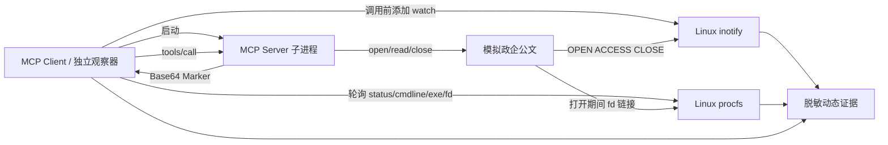

# M4 D3-B MCP 内核辅助遥测 v1 实现报告

> 日期：2026-08-23
> 分支：`dynamic-audit-v1`
> 接受运行：`2026-08-23-mcp-kernel-telemetry-dev-v1`
> 父运行：`2026-08-23-mcp-protocol-marker-dev-v1`
> 父提交：`531bcdf`

## 1. 本轮结论

本轮在 D3-A 的真实 MCP stdio 调用与 Marker 证据之外，增加了两类由客户端侧独立采集的 Linux 内核/进程证据：

1. 通过 libc 调用 inotify，观察模拟公文文件的 `OPEN`、`ACCESS` 和 `CLOSE_NOWRITE`；
2. 通过 procfs 验证 MCP Server 是客户端的直接子进程，并在工具调用期间持有指向该公文文件的 fd。

真实 Docker 结果：

- 镜像门 4/4；
- inspect 配置门 24/24；
- 运行时隔离门 12/12；
- MCP 协议与 Marker 门 26/26；
- 内核辅助遥测门 16/16；
- 总计 82/82；
- inotify OPEN/ACCESS/CLOSE 3/3；
- procfs 父子关系与目标 fd 2/2；
- 独立文件读取确认 1；
- 调用前 witness 0、调用后 witness 1、静动态关联 `confirmed`；
- 遥测错误、原始 PID 泄漏、原始命令行泄漏、原始 Marker 泄漏、策略违规、超时和容器残留均为 0；
- 第三方样本、互联网、镜像拉取、GPU、云和静态决策变化均为 0；
- 动态专项 51 passed；完整后端 309 passed。

该结果支持“在当前受控 fixture 中，MCP Server 确实执行了目标公文文件读取，而不是只在自己的输出中声称读取”这一机制结论。

## 2. 为什么没有直接使用 strace

本轮对固定本地 Python 镜像进行了只读能力检查，结果为 `strace=False`。项目安全合同同时禁止：

- 联网执行 apt/pip 安装；
- 使用浮动镜像或临时下载工具；
- 为追踪增加 `SYS_PTRACE` capability；
- 使用 privileged、host PID 或 Docker Socket。

因此，本轮没有为了“看起来功能完整”而放宽隔离，而是使用当前镜像已有的 Linux inotify 与 procfs。`strace_available=0` 被如实记录为补充指标，不作为本轮失败条件。

## 3. 观测链路

服务端在合法 `tools/call` 中以只读方式打开文件，并保持打开约 250 ms。这个时间窗口只为让轮询型 procfs 观察器稳定采样，不改变工具输出、Marker 内容或静动态关联定义。

## 4. 16 项遥测门

遥测接受门覆盖：

- 遥测实现 ID 固定；
- 观察器角色必须是 MCP 客户端父进程；
- 观察器必须在工具调用前启动；
- inotify 必须可用；
- 观察源相对路径必须与 Trigger Plan 的公文源一致；
- `OPEN`、`ACCESS`、`CLOSE_NOWRITE` 三类事件齐全；
- procfs 必须观察到目标 fd，且采样数大于 0；
- MCP Server 的 PPid 必须等于客户端 PID；
- PID 和命令行只允许保存 SHA-256；
- 可执行文件只保留有界 basename，参数只保留数量；
- `raw_pid_retained=false`、`raw_cmdline_retained=false`；
- 遥测错误列表为空。

真实运行中，三类 inotify 事件均出现，procfs 在目标文件打开窗口内观察到 fd 47 次。

## 5. 与 Marker 证据的关系

两类证据互补：

| 证据 | 回答的问题 | 局限 |
|---|---|---|
| Marker witness | 指定模拟敏感内容是否到达工具输出 | 单独依赖捕获内容与变换匹配 |
| inotify | 指定文件是否发生打开、访问和关闭 | 不给出 Python 调用栈或完整 syscall 参数 |
| procfs fd | 哪个受控服务进程在窗口内持有目标文件 | 轮询可能漏掉极短事件，本轮用有界打开窗口稳定采样 |

只有 Marker、inotify 和 procfs 同时成立，指标 `independent_file_read_confirmed` 才为 1。这样比单独相信工具响应里的 `sourceSha256` 更强。

## 6. 脱敏与证据完整性

最终报告不保存：

- 原始 PID；
- 完整 `/proc/<pid>/cmdline`；
- `/proc/<pid>/exe` 完整路径；
- 原始 Marker；
- 原始 MCP 捕获内容。

只保存 PID SHA-256、命令行 SHA-256、参数数量、可执行文件 basename、事件名、相对诱饵路径、fd 命中次数和布尔结论。

独立复核：

- artifact manifest 初始 9 项哈希不一致 0；
- run manifest 5 个源/配置文件哈希不一致 0；
- 原始 Marker 格式前缀命中 0；
- 原始 PID 字段命中 0；
- 原始 cmdline 字段命中 0；
- 项目标签容器残留 0。

## 7. 失败闭锁

单元反例主动移除 inotify `ACCESS` 事件：其余 OPEN、CLOSE 和 procfs fd 仍成立，但 `inotify_access_observed` 必须为 false，整体遥测门不能通过。

另外继续继承：未知工具、非法参数、调用前 Marker 泄漏、配置放宽、fixture 哈希改变、启动超时和精确清理测试。任何一类门失败都不会降级为“已确认安全”。

## 8. 当前声明边界

本轮不是 strace、eBPF 或完整系统调用审计，不能回答：

- 读取由哪一行 Python 代码触发；
- 完整 `openat/read/close` 参数、返回值和调用栈；
- 所有极短生命周期文件描述符是否都能被 procfs 轮询捕获；
- 任意第三方 MCP Server 是否会采用相同时间行为；
- 容器逃逸是否绝对不可能。

inotify 是内核事件证据，procfs 是独立进程状态证据，但当前自建 fixture 仍主动维持 250 ms 的观察窗口。因此结论是“内核辅助遥测机制成立”，不是“已完成通用恶意行为追踪”。

## 9. 下一步

内核文件与进程证据已经达到当前固定镜像、不新增权限条件下的 solid 级机制验证。下一步优先转向 Skill 运行时闭包：

1. 只在受控自建 Skill fixture 上启动；
2. 记录运行前后目录清单和哈希；
3. 发现新增脚本、配置或指令文件；
4. 将新增内容提升回静态扫描；
5. 验证“运行时才释放的指令/脚本”不会逃出审计范围。

第三方样本、strace 镜像和动态最终门禁继续延后，待来源审计和独立评测合同完成后再启用。
