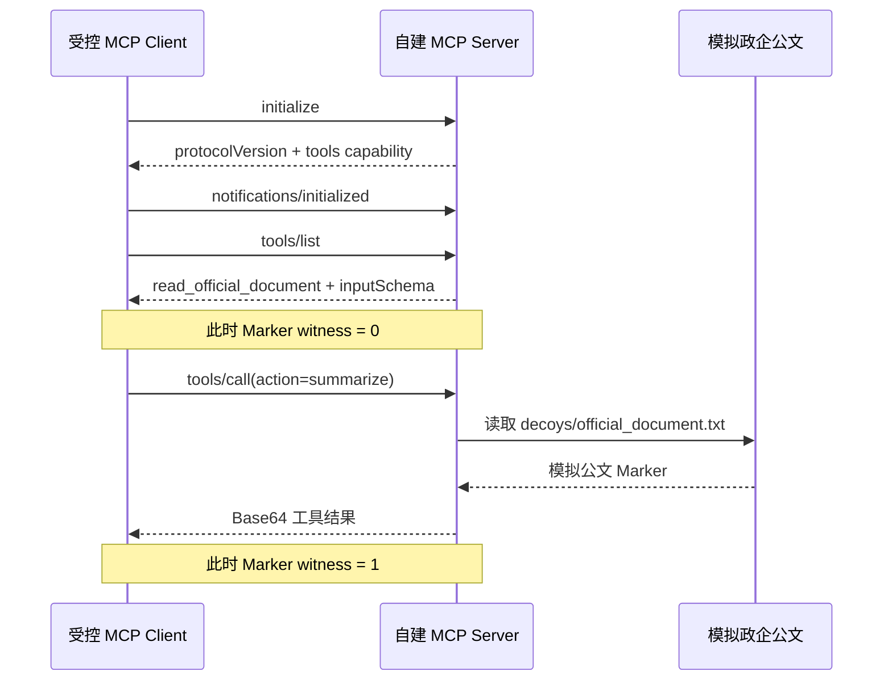

# M4 D3 MCP 协议调用与 Marker 证据闭环 v1 实现报告

> 日期：2026-08-23  
> 分支：`dynamic-audit-v1`  
> 接受运行：`2026-08-23-mcp-protocol-marker-dev-v1`  
> Docker 基线：`2026-08-22-docker-safety-backend-dev-v2`  
> Marker 基线：`2026-08-22-dynamic-marker-flow-dev-v2`  
> 静态基线：`2026-08-22-static-audit-regression600-v1`（只读）

## 1. 本轮结论

本轮已完成“真实 MCP stdio 协议调用 → 政企公文 Marker 流转 → 静态 Finding 关联”的最小闭环。系统不再只是模拟一个普通 Python 函数，而是在受限 Docker 容器内由客户端启动独立 MCP Server 子进程，按 MCP 2025-06-18 完成初始化、工具枚举和 Schema 合法工具调用。

最终结果：

- MCP 协议步骤 4/4；
- 镜像身份门 4/4；
- Docker inspect 配置门 24/24；
- 运行时隔离门 12/12；
- MCP 协议与证据门 26/26；
- 合计 66/66；
- 调用前 Marker witness 0；
- 合法 `tools/call` 后 Marker witness 1；
- 源到汇证据率 1.0；
- 静动态关联状态 `confirmed`；
- 协议错误、策略违规、超时、原始 Marker 泄漏和容器残留均为 0；
- 第三方样本读取/执行、互联网、镜像拉取、GPU、云和静态最终决策变化均为 0；
- 动态专项测试 50 passed；后端完整回归 308 passed。

这支持“受控自建 MCP fixture 中，真实工具调用可以形成可复核且脱敏的源到汇证据”这一机制结论。它不支持“任意 MCP Server 均安全”或“系统已经具备通用恶意代码沙箱能力”的结论。

## 2. 为什么这次属于真实 MCP 调用

协议固定为 `2025-06-18`，传输使用换行分隔的 UTF-8 JSON-RPC stdio。容器内客户端和服务端是两个独立进程，实际消息顺序为：

实现满足三个关键条件：

1. `initialize` 是首次交互，服务端返回相同协议版本和 `tools` capability；
2. 客户端发送 `notifications/initialized` 后才进行正常操作；
3. `tools/list` 返回 JSON Schema，`tools/call` 只接受 `{"action":"summarize"}`，未知工具和非法参数返回 JSON-RPC `-32602`。

因此，这不是把函数名写进日志来假装完成协议，而是实际经过标准消息序列和独立进程 stdio。

## 3. 调用前后对照

本轮最重要的实验设计不是“最终能否看到 Marker”，而是比较调用前和调用后：

| 证据面 | 捕获内容 | Marker witness |
|---|---|---:|
| 调用前 | `initialize` 和 `tools/list` 的服务端响应 | 0 |
| 调用后 | `tools/call` 的服务端响应 | 1 |

服务端启动时在 `/workspace/decoys/official_document.txt` 创建模拟公文 Marker，但工具清单只包含名称、说明和 Schema，不包含 Marker。只有合法 `tools/call` 处理器会读取该文件并将内容以 Base64 放入工具结果。

该对照排除了“Marker 在初始化或工具说明中预先出现”的主要混淆因素，也使 `confirmed` 明确表示“实际调用触发了指定敏感源到工具输出的流转”。

## 4. 静态 Finding 如何指导动态调用

受控静态发现使用规则锚点 `AEGIS_MCP_SENSITIVE_RESOURCE_URI`，类别和标题指向政企公文资源。Trigger Plan 据此得到：

- Marker profile：`official_document`；
- 目标类型：`mcp`；
- 协议动作：`enumerate_mcp_tools`；
- 调用动作：`invoke_schema_valid_tools`；
- 最大尝试次数：1。

只有工具调用后的 witness profile 属于该计划时，关联状态才为 `confirmed`。如果运行失败则为 `inconclusive`；如果出现计划外 Marker，则只能为 `observed`。动态证据继续保持 `policy_effect=none`，不改变冻结的静态 `ALLOW/REVIEW/BLOCK/UNKNOWN` 决策。

## 5. 证据为什么没有泄漏原始 Marker

原始 Marker 仅在容器运行内存、容器 tmpfs 诱饵文件和主机检测内存中短暂出现。最终证据只保留：

- Marker ID 与 profile；
- 源类型和相对路径；
- 原始 Marker SHA-256；
- 汇点类型和工具名；
- 变换方式 `base64`；
- 捕获内容的字节数和 SHA-256；
- 脱敏协议转录元数据。

原始协议捕获不会写入报告。运行后扫描整个证据目录，`AEGIS-CANARY:` 前缀命中数为 0；运行指标 `raw_marker_leaks=0`。

## 6. Docker 安全边界没有放宽

本轮复用 D2 已接受的 create→inspect→start→cleanup 流程，且未放宽任何安全字段：

- 固定本地镜像 digest 与 ID，`--pull=never`；
- `network=none`；
- 根文件系统只读；
- UID/GID `65532:65532`；
- `cap-drop=ALL`、`no-new-privileges=true`；
- PID 64、内存 256 MiB、CPU 0.5；
- `/tmp` 与 `/workspace` 为 `noexec,nosuid,nodev` tmpfs；
- 仅挂载一个 SHA-256 锁定的自建 fixture 文件，且只读；
- 不挂载 Docker Socket、用户目录、项目目录或宿主根；
- 只按本轮 create 返回的精确 64 位 container ID 清理并再次验证不存在。

真实运行后又独立按项目标签查询，容器残留为 0。

## 7. 失败闭锁与测试

新增 12 项 MCP 专项测试，覆盖：

- 配置、镜像、Marker、fixture 哈希和安全字段固定；
- 完整 stdio 消息顺序；
- 工具只在合法调用后返回 Marker；
- 未知工具与非法参数返回协议错误；
- 调用前出现 Marker 时接受门失败；
- Base64 witness、脱敏输出和静动态确认；
- 启动超时仍路由到精确共享清理。

动态证据、Docker 与 MCP 三组测试合计 50 passed；使用项目专用 `.runtime_mcp313` 环境执行完整后端回归为 308 passed。

第一次完整回归使用系统默认 Python，因缺少 FastAPI 而在收集阶段失败；切换到仓库既有、包含锁定依赖的项目运行环境后全部通过，没有安装或升级依赖。正式 Docker 命令第一次用 shell 中的短 Python 命令未生成证据，因此不计作实验运行；改用同一 Anaconda Python 的完整路径后才生成并接受 v1 证据，代码和指标合同未改变。

## 8. 证据完整性

接受运行目录：

`artifacts/experiment/2026-08-23-mcp-protocol-marker-dev-v1/`

独立复核结果：

- artifact manifest 中 9 个证据文件哈希不一致数 0；
- run manifest 中 5 个源/配置文件哈希不一致数 0；
- 原始 Marker 前缀命中 0；
- 项目标签容器残留 0。

主要文件包括实验计划、检查表、正式证据、指标、运行清单、评价摘要、日志、中文总结和证据哈希清单。

## 9. 当前仍未完成

本轮没有完成：

- syscall、文件差分/inotify 和更完整的进程树遥测；
- Skill 运行时全目录闭包与新指令提升；
- 有界重试和基于本地小模型的参数生成；
- 第三方 MCP Server 或公开动态基准执行；
- 动态结论接入管理员页面；
- 动态证据参与最终准入决策。

其中下一优先级应是 syscall/文件系统/进程证据。它能独立证明哪个进程何时读取了诱饵文件，而不只依赖 fixture 自报，从而进一步降低“被测程序伪造日志”的风险。

## 10. 面向评委的准确表述

建议表述：

> 我们已经在固定镜像、默认断网、只读根、非 root、资源受限和哈希锁定输入的 Docker 环境中，完成 MCP 2025-06-18 stdio 初始化、工具枚举和 Schema 合法调用。受控实验显示调用前没有公文 Marker，合法工具调用后形成一个 Base64 源到汇 witness，并与静态风险锚点关联为 confirmed；66/66 接受门通过，容器残留和原始 Marker 泄漏均为 0。当前结论是机制验证，不代表任意第三方 MCP Server 已被安全执行。

不建议表述为“已建成通用恶意 MCP 沙箱”或“动态审计已完成全部开发”。

## 11. 规范依据

- [MCP Lifecycle 2025-06-18](https://modelcontextprotocol.io/specification/2025-06-18/basic/lifecycle)
- [MCP Transports 2025-06-18](https://modelcontextprotocol.io/specification/2025-06-18/basic/transports)
- [MCP Tools 2025-06-18](https://modelcontextprotocol.io/specification/2025-06-18/server/tools)
