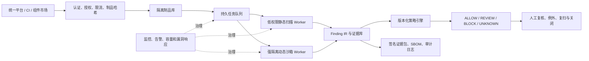

# M5：供应链安全系统真实可用性评委与工程审查

> 审查日期：2026-08-23  
> 审查分支：`dynamic-audit-v1`  
> 审查提交：`a5660904c47a40a07a534d6ea4863cab6536522b`  
> 审查身份：挑战杯“揭榜挂帅”模拟评委 + 资深工程师  
> 说明：本文是基于当前仓库、运行证据和权威安全标准形成的独立审查，不代表赛事官方评分或正式合规认证。

## 1. 一页结论

当前系统已经不是概念方案，也不是只有页面的演示壳。它具备真实的 Cisco Skill Scanner、Cisco MCP Scanner、`pip-audit` 接入，自研静态规则、统一 Finding IR、四态准入策略、失败闭锁、600 条密封工程回归，以及受控 Docker/MCP/Skill 运行时闭包证据链。最新复核中，后端 **324 passed**、前端 **10 passed**、前端生产构建通过。

但从真实可用性看，当前最准确的定位是：

> **一个证据较强、边界诚实、可在固定本机演示的受控研究原型；尚不是可交付到新电脑的一键产品，也不是可接收第三方不可信 Skill/MCP 的生产安全平台。**

成熟度判断：

| 维度 | 当前判断 | 原因 |
| --- | --- | --- |
| 比赛技术证据 | 较强 | 有真实工具、真实扫描、密封回归、统计检验和可复核实验产物 |
| 固定本机演示 | 基本就绪 | API、页面、SQLite、Docker 闭环均已跑通 |
| 换机交付 | 未通过 | 启动脚本写死本机路径，远端仓库不含 Cisco 运行时和重建 wheel |
| 受控试点 | 未通过 | 缺少统一身份、队列、恢复、监控、数据保留和扫描器隔离 |
| 生产部署 | 不具备 | 不接受第三方动态执行；静态扫描也仍在宿主机进程中处理不可信输入 |

因此，八月底前不应继续扩展大量新检测规则或仓促加入大模型。当前唯一收敛路线是：

1. 先修复换机复现；
2. 再完成动态任务互斥、排队和启动前检查；
3. 补齐项目自身的依赖锁定、许可证和第三方声明；
4. 用一台干净环境完成端到端验收后冻结版本。

## 2. 本轮审查依据

### 2.1 已核验的本地事实

- 静态评测：`M3_STATIC_AUDIT_REGRESSION_REPORT.md`；
- 动态执行底座：`M4_DOCKER_SAFETY_BACKEND_V1_REPORT.md`；
- MCP 协议和遥测：`M4_MCP_PROTOCOL_MARKER_V1_REPORT.md`、`M4_MCP_KERNEL_TELEMETRY_V1_REPORT.md`；
- Skill 运行时闭包：`M4_SKILL_RUNTIME_CLOSURE_V1_REPORT.md`；
- 平台闭环：`M4_SKILL_CLOSURE_PLATFORM_V1_REPORT.md`；
- 安全边界：仓库根目录 `SECURITY.md`；
- 启动与复现：仓库根目录 `QUICKSTART.md`、`demo_web/start_demo.ps1`；
- 当前测试：后端 324 项全部通过，前端 10 项全部通过，Vite 生产构建通过。

### 2.2 外部校准依据

- [NIST SP 800-218 SSDF 1.1](https://csrc.nist.gov/pubs/sp/800/218/final)：要求把安全实践纳入软件开发、发布和漏洞响应全过程；
- [SLSA 1.2](https://slsa.dev/spec/v1.2/)：强调制品来源、构建过程和可验证 provenance；
- [OWASP 第三方 MCP 安全使用指南](https://genai.owasp.org/resource/cheatsheet-a-practical-guide-for-securely-using-third-party-mcp-servers-1-0/)：强调认证、授权、客户端沙箱、安全发现、最小权限和人工参与；
- [OpenSSF Scorecard](https://securityscorecards.dev/)：覆盖依赖、构建、测试、维护和签名发布等开源供应链风险；
- [Sigstore Cosign 验签文档](https://docs.sigstore.dev/cosign/verifying/verify/)：提供制品、镜像和证明材料的签名验证路径；
- [GB/T 22239-2019《网络安全等级保护基本要求》](https://std.samr.gov.cn/gb/search/gbDetailed?id=88F4E6DA63434198E05397BE0A0ADE2D)：截至 2026 年仍为现行标准；
- [《中华人民共和国网络安全法》2025 年修改决定](https://www.npc.gov.cn/npc/c1773/c1848/c21114/wlaqfxz/wlaqfxz002/202511/t20251103_449242.html)、[《数据安全法》](https://www.miit.gov.cn/zwgk/zcwj/flfg/art/2022/art_284b390b84484f10b0e43eeafaad0f6d.html)、[《个人信息保护法》](https://www.npc.gov.cn/npc/c2/c30834/202108/t20210820_313088.html)：真实政企部署时需要由项目单位结合数据类别、系统定级和业务范围开展正式合规评估。

## 3. 已完成能力的评委判断

### 3.1 静态审计：比赛范围内基本完成，生产范围内部分完成

已完成：

- Skill ZIP、MCP JSON、Python 依赖三类入口；
- ZIP 路径穿越、压缩炸弹、特殊文件、文件数量和大小限制；
- Cisco Skill Scanner、Cisco MCP Scanner 和 `pip-audit` 真实适配；
- Aegis 敏感数据流、不可信输入执行、持久化、危险权限、破坏性操作、MCP 能力策略、静态覆盖和依赖完整性规则；
- 统一 Finding、证据位置、SHA-256、策略轨迹、SBOM 和 JSON/Markdown 导出；
- `ALLOW / REVIEW / BLOCK / UNKNOWN` 四态门禁，扫描失败不会静默放行；
- 600 条三类均衡密封工程回归和配对统计检验。

回归结果必须完整表述：

| 指标 | Cisco 基线 | Aegis 增强 | 变化 |
| --- | ---: | ---: | ---: |
| 严格宏平均 F1 | 0.4661 | 0.5629 | +0.0969 |
| 恶意样本召回率 | 73.5% | 82.0% | +8.5 个百分点 |
| 恶意样本漏报率 | 26.5% | 18.0% | -8.5 个百分点 |
| 非正常样本召回率 | 73.0% | 86.25% | +13.25 个百分点 |
| 正常样本误报率 | 32.0% | 35.5% | **+3.5 个百分点** |

评委结论：增强效果有统计证据，但不是“全面优于且无代价”。正常误报增加意味着真实政企平台需要人工复核队列、例外审批和进一步降噪。该 600 条集合来自已经使用过的 SkillTrustBench，属于密封工程回归，不是第二个独立外部盲测集。

### 3.2 动态审计：机制闭环完成，通用检测尚未完成

已完成：

- 固定 digest、本地镜像、`pull=never`；
- `create → inspect → start → cleanup`，安全门未通过则拒绝启动；
- `network=none`、只读根、非 root、`cap-drop=ALL`、`no-new-privileges`、CPU/内存/PID 限制；
- MCP 2025-06-18 stdio 真实初始化、工具枚举和 Schema 合法调用；
- Marker 源到汇、inotify、procfs 文件访问和进程关系证据；
- Skill 运行前后目录差分、运行时新增内容分类、哈希验证和 Cisco+Aegis 静态复审；
- 平台管理员触发、后台任务、SQLite 脱敏保存、列表/详情和页面展示。

当前不能宣称：

- 可以安全执行任意第三方 Skill；
- 已经对公开恶意动态数据集形成检出率；
- Docker Desktop 等价于强对抗恶意代码沙箱；
- 动态证据已经参与最终 `ALLOW/REVIEW/BLOCK` 决策；
- MCP 动态能力已覆盖多 Server、多工具、多轮调用和真实业务认证。

最关键的事实是：当前动态运行指标中的 `third_party_samples_executed` 为 0。它证明的是安全机制和证据闭环，不是通用恶意代码动态检测效果。

### 3.3 平台工程：单机演示可用，控制面仍是原型级

平台已有清晰的 API v1、统一错误契约、异步任务状态、前端轮询、历史查询、结果导出和管理员动态页面。页面数据来自后端真实状态，不是写死结果。

但任务使用 FastAPI 进程内 `BackgroundTasks`，结果保存在单机 SQLite。系统没有外部任务队列、任务租约、并发配额、取消、重试、进程重启恢复、数据库迁移、备份或多实例一致性。这种设计适合固定本机演示，不适合多人同时使用或服务长期运行。

## 4. 距离真实可用最关键的缺口

### 4.1 P0：比赛提交前必须完成

#### P0-1 换机复现和一键启动

当前问题：

- `demo_web/start_demo.ps1` 把 pnpm 写死为 `C:\Users\23684\...\pnpm.cmd`；
- GitHub 仓库不包含 `.runtime_skill`、`.runtime_mcp313`、`third_party` 和 `results/wheels`；
- `QUICKSTART.md` 使用本机已经存在的 wheel 和运行时重建，却没有从空机器自动获得这些文件的完整流程；
- 启动时只有部分文件存在性检查，没有完整核验 Docker Engine、固定镜像、扫描器版本、策略哈希和可写目录。

为什么是比赛 P0：评委或队友如果换账号、换电脑或重新克隆仓库，当前启动脚本会直接失败。即使本机演示成功，也不能证明作品可交付。

完成标准：

1. 不出现任何个人用户名或绝对运行时路径；
2. 自动发现 Node/pnpm/Python/Docker，缺失时给出明确中文处置；
3. 提供 `preflight`，逐项显示扫描器版本、策略、Docker、固定镜像和目录权限；
4. 网络重建方案能够按固定提交获取 Cisco 源码并构建 wheel；
5. 如许可证允许，另做带哈希的离线交付包；如不允许分发，明确由使用者自行获取；
6. 在另一 Windows 用户或全新虚拟机中完成一次 Skill、一次 MCP、一次依赖和一次管理员动态闭包验收。

#### P0-2 动态任务全局互斥、排队和重复提交保护

当前问题：每个管理员请求都会创建一个进程内后台任务。连续点击或多个请求可同时占用 Docker、Cisco Scanner、CPU 和内存；没有全局锁、队列长度或幂等保护。

完成标准：

1. 同一时刻最多一个动态任务进入 `running`；
2. 后续任务保持 `queued`，页面显示排队原因和位置；
3. 设定最大队列长度，超限明确拒绝；
4. 对相同 fixture 的快速重复点击执行去重或冷却；
5. 测试覆盖并发请求、异常退出和精确资源清理；
6. 服务重启后把遗留 `queued/running` 任务标记为可解释的失败或重新调度，不永久卡住。

#### P0-3 文档与当前实现同步

当前问题：仓库根 `README.md` 仍写 309 项后端和 9 项前端测试，实际为 324/10；`DEVELOPMENT_PLAN.md` 仍把已经完成的平台动态接入写成“下一步”。旧评委清单也保留了“600 条回归未运行”等历史结论。

完成标准：

- 设置一个“当前状态”真值文档，其他材料只引用它；
- 更新测试数、D3-C/D3-D 状态和最新运行 ID；
- 在首页显著写明：第三方动态执行为 0、动态不改变最终决策、不得公网部署；
- 历史文档增加“已过期/被哪份报告取代”，避免评委读到互相矛盾的结论；
- 演示口径始终同时呈现召回提升与正常误报上升。

#### P0-4 项目自身的供应链卫生

当前问题：

- 仓库没有 `LICENSE` 和 `THIRD_PARTY_NOTICES`；
- `python-multipart` 未锁定版本；
- 前端 `package.json` 使用 `latest`，启动脚本执行普通 `pnpm install`；
- 没有自动化 CI、安全依赖检查、Secret 扫描、签名发布和本系统自身 SBOM；
- Cisco 工具、数据集、基础镜像和借鉴项目的许可证/分发边界没有统一清单。

为什么是比赛 P0：作品研究的主题就是供应链安全。如果系统自身依赖、许可和来源不可追踪，会形成明显的“用供应链工具检查别人，却没有管理自己”的评审反差。

完成标准：

1. 固定全部直接依赖并使用 lockfile 的冻结安装；
2. 生成系统自身 CycloneDX SBOM；
3. 增加项目许可证、第三方组件与数据集来源/版本/提交/许可证/用途清单；
4. 扫描自身 Python 与前端依赖并记录当日结果；
5. 对固定 Docker 镜像记录 digest、来源和本地 image ID；
6. 最终 Release 记录提交、制品哈希、SBOM 和验证方法。

#### P0-5 干净环境端到端发布门

当前已有大量单元和受控实验测试，但还缺少“从新克隆到最终页面”的单一发布验收。

完成标准：

- 一条发布验收流程完成环境检查、启动、四类扫描、结果查询、导出、动态闭包、停止和残留检查；
- 记录总耗时、失败步骤、版本、提交和输出哈希；
- Docker 未启动、镜像缺失、扫描器缺失、依赖漏洞库离线等降级场景均有明确提示；
- 验收失败时不得打最终版本标签。

### 4.2 P1：建议在提交前完成，来不及可进入明确路线图

#### P1-1 把静态扫描器本身移入隔离执行环境

当前 Skill/MCP 扫描器以 Windows 宿主机子进程运行。上传制品虽然经过安全解压，但扫描器和解析器仍直接处理攻击者可控内容，并继承宿主进程的大部分环境变量；当前仅移除了少数明确命名的 API Key。

真实系统中，静态扫描器也可能成为攻击面。建议使用低权限、只读、断网容器运行 Cisco+Aegis，环境变量采用白名单而不是黑名单，并限制 CPU、内存、进程、文件和超时。扫描结果再通过受控目录传回主服务。

#### P1-2 建立 MCP 与动态能力的独立评测集

Skill 静态层已有 5,520 条基线和 600 条回归，但 MCP 仍主要依赖少量自建对象，动态层只使用固定自建 fixture。两者都没有足够的独立效果指标。

建议：

- MCP 先建立 30—50 条经过来源和许可审计的工程集，包含安全对照、提示注入、工具投毒、越权路径、任意 URL、任意命令、敏感 Resource 和描述—行为不一致；
- 动态先建立小型“受控漏洞实验室”，每个风险都有无害、可复核的触发条件，不直接导入未知恶意仓库；
- 分开开发集与封存回归集，报告激活率、源到汇证据率、召回、Precision、FPR、失败率和开销；
- 没有独立结果前，只称为“机制验证”，不称为“动态检测效果提升”。

#### P1-3 完善任务生命周期和操作体验

- 静态任务并发上限和队列；
- 取消、有限重试、超时原因、重启恢复；
- 历史分页、筛选、搜索和清理；
- 动态结果 JSON/Markdown 导出；
- 操作者、发起来源、人工复核意见、例外批准和过期时间；
- 相同制品+策略+扫描器版本的安全缓存和复用证明。

#### P1-4 建立最小 CI 和发布检查

至少在每次提交或发布前自动执行：

- 后端测试、前端测试和生产构建；
- Python/Node 依赖漏洞扫描；
- Secret 扫描；
- 许可证与 SBOM 生成；
- 关键配置、规则注册表、fixture 和镜像 digest 漂移检查；
- OpenSSF Scorecard 可适用检查。

#### P1-5 健康检查从“文件存在”提升为“能力可用”

当前健康状态主要检查本地文件和令牌是否存在。Skill 闭包健康状态没有实际探测 Docker Engine 和固定镜像，因此页面可能显示可用，真正执行才失败。

建议把健康检查拆为：

- `liveness`：服务进程是否存活；
- `readiness`：数据库、策略和必要目录是否可用；
- `capability`：Cisco 版本、Docker Engine、固定镜像、漏洞数据库时间和动态资源是否可用；
- 每项都提供错误码、最后成功时间和降级影响。

### 4.3 P2：真实生产化后再完成

#### P2-1 统一身份、权限和租户隔离

当前只有一个环境变量管理员令牌，静态扫描接口无身份控制。生产需要：

- 对接统一身份认证，支持 OIDC/SAML/LDAP 中的组织既有方案；
- RBAC：提交者、复核者、策略管理员、审计员和系统管理员分权；
- 所有扫描、查询、导出、策略变更和动态执行都进行授权；
- 多租户数据、缓存、文件、结果和密钥隔离；
- TLS/mTLS、凭据轮换、Secret Manager 和会话安全。

#### P2-2 持久任务平台和高可用数据层

- 外部消息队列和独立 worker，不依赖 Web 进程内后台任务；
- 任务租约、心跳、重试策略、死信队列、幂等键和优先级；
- PostgreSQL 等服务化数据库、正式迁移、事务和索引；
- 备份、恢复演练、保留期限、删除证明和容量治理；
- 多实例一致性、滚动升级和灾难恢复目标。

#### P2-3 第三方不可信代码动态沙箱

这是从“机制原型”跨到“真实动态审计”的核心工程，不应只把上传路径开放给现有 Docker runner。

至少需要：

- 每任务短生命周期虚拟机、microVM、gVisor/Kata 等更强隔离边界；
- 禁止 Docker Socket 和宿主敏感挂载，专用低权限 worker 节点；
- 默认断网；如需联网，只经 DNS/HTTP 出口代理和域名/IP/协议白名单；
- 系统调用、进程、文件、网络和凭据诱饵遥测；
- 制品来源、签名、许可证、哈希和人工审批前置门；
- 超时强杀、快照回滚、残留验证、沙箱逃逸监控和节点重建；
- 正常、已知风险、对抗逃逸和资源耗尽样本的独立评测。

#### P2-4 可审计治理闭环

- 追加写或 WORM 审计日志，记录谁在何时以何策略处理何制品；
- Finding 的人工确认、误报、例外、处置、复扫和关闭状态；
- 策略变更双人审批、版本回退和影响评估；
- 证据包数字签名和时间戳，避免仅依赖普通 JSON 哈希；
- 数据分类分级、最小化保存、保留期、删除和访问审计；
- 结合部署单位的等保定级、数据安全和个人信息处理范围完成正式合规评估。

#### P2-5 完整的软件供应链准入

当前系统主要判断内容风险、依赖漏洞和部分完整性问题。真实供应链平台还需覆盖：

- Git 提交、发布者和仓库身份；
- 构建 provenance 与 SLSA 验证；
- 制品、Release 和 OCI 镜像签名；
- 完整 SBOM、VEX、许可证和维护状态；
- OpenSSF Scorecard 或等价的上游项目健康度；
- 依赖仓库可信源、名称混淆、撤回版本和版本漂移；
- CI/CD、组件市场、智能体平台发布和运行时加载前的统一门禁。

#### P2-6 可观测性与运行承诺

- 结构化日志、指标和链路追踪；
- 队列长度、扫描时延、超时率、UNKNOWN 率、误报复核量、扫描器失败和沙箱残留告警；
- SLO/容量模型、并发压测、长时间稳定性测试；
- 漏洞响应、扫描器升级、规则灰度、回滚和值班手册。

## 5. 目标架构建议

现有代码可以保留的核心是：适配器、Finding IR、Aegis 规则、四态策略、失败闭锁、证据脱敏和 Docker 安全门。生产化的主要新增工作在其外层控制面和隔离面，不需要推翻当前确定性检测核心。

## 6. 评委最可能追问的问题与准确回答

### 6.1 “你们真的做了动态审计吗？”

准确回答：做了真实协议调用、文件/进程遥测、Marker 源到汇和 Skill 运行时闭包，但当前只运行自建哈希锁定 fixture。它证明动态机制闭环成立，不代表已经能安全运行第三方恶意组件。

### 6.2 “Aegis 是否确实提高了检测效果？”

准确回答：在 600 条密封工程回归上，严格宏平均 F1 提升 0.0969，恶意召回提升 8.5 个百分点，并有配对统计证据；同时正常误报增加 3.5 个百分点，所以结论是有效但有权衡，不是无代价提升。

### 6.3 “为什么动态结果不直接改变准入决策？”

准确回答：当前动态层还没有独立公开基准和稳定 FPR/召回证据。先作为补充证据并保持决策不变，是为了避免用未校准机制误阻断政企业务。完成独立评测和策略评审后再分阶段接入门禁。

### 6.4 “现在能否在评委电脑上直接运行？”

当前回答必须是：固定开发机可以，新电脑尚未通过。主要阻断是启动脚本本机绝对路径和 Cisco 运行时交付不完整。P0-1 完成并经过干净环境验收后，才能回答“可以”。

### 6.5 “Docker 是否足以执行未知恶意 Skill？”

准确回答：不够。当前 Docker 设置适合良性、受控 fixture 的机制验证；Docker Desktop/WSL2 仍共享宿主内核。第三方未知代码需要更强隔离、专用 worker、出口控制、系统调用遥测、审批和回滚。

### 6.6 “系统自身是否满足供应链安全？”

当前回答：已固定 Cisco 提交、依赖锁和 Docker digest，并保留大量哈希证据；但项目许可证、第三方声明、完整自身 SBOM、CI、签名发布和 provenance 仍未补齐。因此这是比赛前必须修复的自洽性问题。

## 7. 八月底前的建议执行顺序

不考虑 PPT 和视频，本阶段按以下顺序开发：

| 顺序 | 任务 | 建议时间 | 退出条件 |
| --- | --- | ---: | --- |
| 1 | 可移植启动、preflight、运行时重建/交付说明 | 1.5—2 天 | 新 Windows 用户路径下可启动 |
| 2 | 动态全局互斥、队列、重复提交保护、重启恢复 | 1—1.5 天 | 并发与异常测试通过 |
| 3 | 依赖完整锁定、LICENSE、THIRD_PARTY_NOTICES、自身 SBOM | 1 天 | 来源与许可清单可复核 |
| 4 | 同步 README、开发计划、边界和指标真值 | 0.5 天 | 文档无互相矛盾状态 |
| 5 | 干净环境全链路发布验收与故障降级 | 1 天 | 发布门全部通过 |
| 6 | 只修阻塞缺陷并冻结 Release | 剩余时间 | 提交、哈希、SBOM、证据固定 |

如果时间不足，应优先保证 1、2、4、5。不要在最后一周启动任意第三方代码执行、本地大模型判决、多租户或微服务重构。

## 8. 最终发布门

只有同时满足以下条件，才建议把版本称为“比赛提交候选”：

- [ ] 新用户/新电脑不修改源码即可启动；
- [ ] Cisco Skill/MCP 版本和策略身份可由 preflight 验证；
- [ ] 后端、前端测试和生产构建全部通过；
- [ ] Skill、MCP、依赖、动态闭包四条真实 E2E 通过；
- [ ] 同时提交召回提升和误报权衡；
- [ ] 连续/并发触发动态任务不会争抢资源；
- [ ] 服务重启后没有永久 `running` 任务；
- [ ] 上传临时目录、动态工作区和容器残留为 0；
- [ ] 项目依赖、许可证、数据集和第三方工具来源可复核；
- [ ] README、API、页面和最终报告对能力边界表述一致；
- [ ] 最终提交、制品、SBOM 和证据清单均有 SHA-256；
- [ ] 明确标注“当前不得执行第三方未知代码，不得直接部署公网”。

## 9. 最终评审意见

从比赛评委角度，当前系统最有价值的地方不是规则数量，而是已经形成了真实工具接入、失败闭锁、密封回归、统计证据、脱敏留痕和受控动态闭环。只要把换机复现、并发稳定性和项目自身供应链治理补齐，它会成为一个可信度较高的比赛作品。

从资深工程师角度，当前最大风险也很明确：系统的检测核心已经领先于交付和运维控制面。下一阶段应停止横向堆功能，优先完成可移植发布、资源调度、扫描器隔离、身份权限、数据治理和可观测性。生产化时应保留当前确定性核心，在外围增加持久队列、低权限扫描 worker、强隔离动态沙箱和可审计治理闭环。

最终判定：

> **比赛技术原型：有竞争力，但提交前仍有 P0。**  
> **固定本机演示：可用。**  
> **换机交付：当前不通过。**  
> **政企试点/生产：当前不通过，需按 P1/P2 分阶段建设。**
