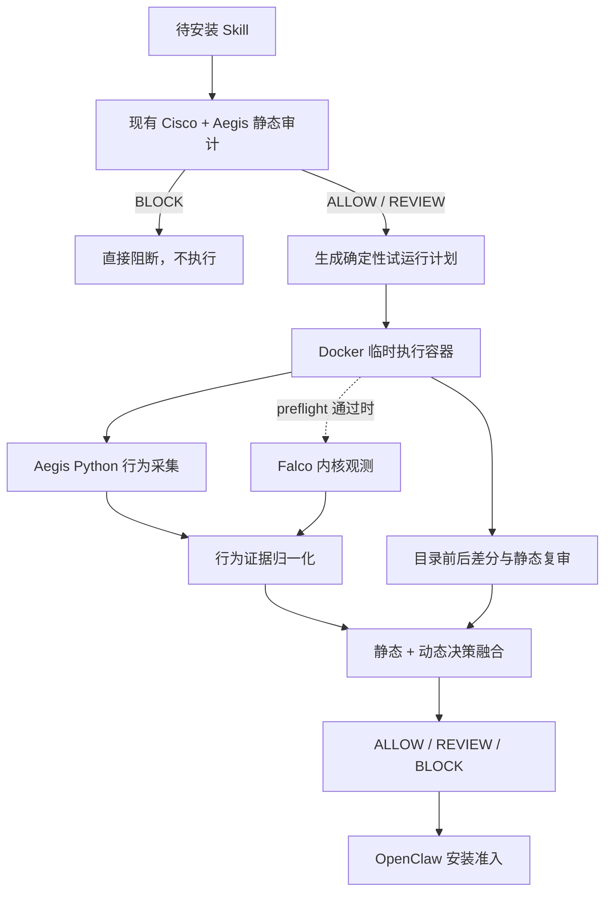

# M7：Skill 安装前隔离试运行与开源组件选型设计

> 日期：2026-08-27
> 分支：`skill-dynamic-sandbox-v1`
> 范围：只覆盖 Skill；不覆盖 MCP Server 和 OpenClaw Plugin
> 目标：静态 `ALLOW/REVIEW` 候选在安装前进入 60–120 秒 Docker 隔离试运行，动态高危证据能够升级最终结果为 `BLOCK`

## 1. 结论

采用“现有 Docker 安全底座 + Aegis 确定性行为采集 + 可选 Falco 内核观测”的双后端方案，不直接拼接完整恶意软件沙箱。

- **默认可用后端**：复用项目已经通过 40/40 Docker 安全门和 59/59 Skill 闭包门的执行底座，首期对 Python Skill 脚本采集进程、文件、联网尝试、诱饵访问、资源、超时和目录差分证据。
- **增强观测后端**：Falco 通过本机兼容性 preflight 后，作为只读观测器补充系统调用级证据；Falco 不负责隔离，也不单独决定准入。
- **失败闭锁**：静态 `BLOCK` 不运行；动态设施不可用、入口不明确或证据完整性失败时结果为 `REVIEW`，OpenClaw 稳定版因只支持允许/阻断而映射为阻断。
- **当前实测状态**：Docker Desktop 4.86.0 已安装，但本次开发会话中 Linux Engine 未能启动；因此 Falco 兼容性结论仍是 `inconclusive`，不得宣称已完成真实 Falco 集成。

## 2. 为什么不直接采用一个完整开源沙箱

现有项目已经具备镜像锁定、创建后 inspect、非 root、只读根、`cap-drop=ALL`、`no-new-privileges`、资源限制、默认断网、临时文件系统和失败清理。替换整套执行层会丢失已经完成的验证证据，并引入新的高权限组件。

本阶段真正缺少的是“第三方 Skill 脚本行为采集与准入联动”，不是再次实现容器生命周期。

## 3. 开源候选比较

| 候选 | 许可证 | 优点 | 关键限制 | 决策 |
|---|---|---|---|---|
| [Falco](https://github.com/falcosecurity/falco) | Apache-2.0 | CNCF 毕业项目；成熟规则引擎；容器元数据；逐行 JSON 输出；支持自定义规则 | 需要 Linux 内核事件源和 eBPF/内核权限；容器部署通常需要宿主 PID、`/proc`、tracefs 和额外 capability；Docker Desktop 必须实测 | **保留为可选增强后端** |
| [Tracee](https://github.com/aquasecurity/tracee) | Apache-2.0 | eBPF 事件丰富，适合取证和行为分析 | 官方 Docker 快速启动使用 `--privileged --pid=host`；组件和事件面较大；Windows 只可借助 Linux VM | 暂不集成 |
| [Inspektor Gadget](https://github.com/inspektor-gadget/inspektor-gadget) | 用户态 Apache-2.0；BPF 模板含 GPL-2.0 Linux-syscall-note | `trace_exec/trace_open/trace_tcp` 与 JSON 输出适合实验 | 容器运行需 `--privileged -v /:/host --pid=host`；许可证组成不满足“仅宽松许可证”的严格口径 | 不集成 |
| [nsjail](https://github.com/google/nsjail) | Apache-2.0 | namespace、rlimit、seccomp-bpf、cgroup；3.6 仍在维护 | Docker 内 namespace/mount 常需额外权限或 AppArmor 放宽；主要是隔离器，不是成熟行为判定器 | 不替换现有 Docker 底座 |

Falco 的官方文档明确支持 JSON 告警输出和自定义规则；现代 eBPF 容器部署仍需要内核观测权限。它适合作为可信观测器，而不是未知 Skill 的执行容器。

## 4. 总体架构

## 5. 执行对象与入口发现

首期只真实运行 Python 脚本：

1. 读取并校验 Skill 目录，不跟随软链接；
2. 从 `SKILL.md` 中提取明确引用的相对 `.py` 路径；
3. 若没有明确引用，只考虑 `scripts/` 下最多 3 个 Python 文件；
4. 路径歧义、超限或 Windows 专属脚本进入 `REVIEW`，不猜测执行；
5. 每个入口先使用 `--help`，再在无额外参数模式下运行；全部入口共享 60–120 秒总预算；
6. Shell、Node.js 和 PowerShell 记录为未覆盖类型，后续在独立镜像与规则成熟后扩展。

“没有观察到恶意行为”只有在入口成功启动且观测完整时才成立；入口未触发不得解释为安全。

## 6. Docker 安全合同

目标容器继续满足：

- 镜像使用不可变 digest，`pull=never`；
- 非 root 用户；只读根文件系统；丢弃全部 capability；禁止提权；
- 私有 PID/IPC namespace，不挂载 Docker Socket、用户目录、项目根或真实凭据；
- Skill 输入只读；工作区和 `/tmp` 使用限额 tmpfs；
- CPU 0.5 核、内存 256 MiB、最多 64 个进程；
- 默认 `network=none`；容器内仅启动 `127.0.0.1` 模拟 HTTP 汇点；
- 执行完成、超时或异常时强制删除容器并验证无残留。

Falco 观测器与目标容器分离。即使 Falco 需要较高观测权限，也不得把权限授予目标 Skill 容器。

OpenClaw 使用合成 profile 调用策略时，可信策略进程必须显式获得包含 `desktop-linux` 的 Docker CLI context 目录，否则 Docker CLI 会在合成 profile 下报告 context 不存在。该目录只供可信 Aegis 父进程定位本地 Engine：Cisco 扫描器继续使用独立合成 profile，目标 Skill 容器不挂载 Docker 配置、用户目录或 Docker Socket。

## 7. 确定性行为采集

首期在固定 Python 启动器中安装审计钩子，并由父进程通过专用管道收集子进程事件。采集范围：

- `open`、删除、重命名、权限修改等文件行为；
- `subprocess.Popen`、`os.system`、`exec` 等进程/命令行为；
- `socket.connect`、DNS 和 HTTP 请求尝试；
- `ctypes`、动态导入和原生库加载；
- 对假公文、假凭据、假运维令牌等诱饵文件的读取；
- 工作区文件清单、SHA-256 和运行前后差分；
- 退出码、信号、超时、OOM、耗时和输出长度。

不保存真实业务内容、完整标准输出、原始诱饵值或宿主绝对路径。报告保留事件类别、归一化目标、哈希、相对路径和证据计数。

Python 审计钩子用于可解释采集，不被描述为不可绕过的安全边界。真正的安全边界仍是 Docker/VM；Falco 只在兼容性通过后补充内核旁证。

## 8. 动态规则与决策

### 8.1 直接阻断

- 读取诱饵公文、凭据或令牌后尝试写入输出或网络汇点；
- 尝试连接非回环地址、解析外部域名或启动下载器；
- 启动交互 Shell、解释器链、远程执行或持久化命令；
- 访问容器内模拟的敏感路径；
- 资源滥用、进程炸弹、逃逸或提权尝试；
- 运行时生成的文件经静态复审得到 HIGH/CRITICAL。

### 8.2 人工复核

- 入口不明确或不受支持；
- 执行失败、超时但没有足够证据证明恶意；
- 原生库加载、动态代码生成或观测完整性下降；
- Falco 与语言级事件冲突；
- 中风险写文件、子进程或网络行为缺乏上下文。

### 8.3 融合原则

| 静态 | 动态 | 最终 |
|---|---|---|
| BLOCK | 不运行 | BLOCK |
| ALLOW | clean 且覆盖完整 | ALLOW |
| ALLOW | medium / inconclusive | REVIEW |
| ALLOW | high / critical | BLOCK |
| REVIEW | clean | REVIEW |
| REVIEW | high / critical | BLOCK |

动态结果只允许维持或提高风险等级，不允许降低静态结果。

## 9. Falco 集成边界

Falco preflight 必须验证：

1. Docker Linux Engine 可用；
2. 内核版本和 BTF/tracefs 满足现代 eBPF；
3. Falco 镜像固定版本、digest 和本地 image ID，禁止运行时拉取；
4. 自定义规则文件锁定 SHA-256；
5. JSON 输出可解析，能够按 Aegis 目标容器 ID/名称过滤；
6. 观测器启动失败不会降级为“安全”；
7. 观测器运行后无容器残留。

若任何条件失败，`falco_status=unavailable`。默认行为采集仍可运行，但最终不得声称具有系统调用级旁证。

## 10. 实施步骤

### M7-1：选型与合同

- [x] 明确只覆盖 Skill、Docker Desktop、60–120 秒和动态影响准入；
- [x] 比较 Falco、Tracee、Inspektor Gadget 和 nsjail；
- [x] 确定双后端与失败闭锁原则；
- [ ] 固定可用 Falco 镜像 digest并完成本机 preflight。

### M7-2：Python Skill 试运行 MVP

- [x] 入口发现、目录限额和软链接拒绝；
- [x] 固定 Python 审计启动器；
- [x] Docker 创建后 inspect 安全门；
- [x] 进程、文件、网络尝试、诱饵和资源证据；
- [x] 安全/恶意/超时/不兼容样本测试。

### M7-3：准入融合

- [x] 动态 Finding 归一化；
- [x] 静态 `BLOCK` 跳过动态；
- [x] 动态高危升级 `BLOCK`；
- [x] OpenClaw install policy 联动和审计链；
- [x] JSON/Markdown 报告。

### M7-4：Falco 增强与真实验收

- [ ] Falco 自定义 Skill 规则；
- [ ] 目标容器过滤与事件归一；
- [ ] 与 Python 行为采集交叉验证；
- [x] Docker Desktop 真实安全、恶意和失败样本验收；
- [ ] 冻结动态开发集和独立回归集。

## 11. 验收标准

- 安全样本成功运行、无高危动态 Finding、无容器残留；
- 外连、诱饵读取并外传、Shell 启动、运行时危险文件生成均被发现并阻断；
- 静态 `BLOCK` 样本的动态执行次数为 0；
- 超时和观测失败不能得到 `ALLOW`；
- 每个样本耗时不超过 120 秒；
- 报告能够给出“进程—动作—目标—证据—规则—最终决策”链；
- 所有镜像、配置、启动器、规则和样本均有不可变版本或 SHA-256；
- 不使用 GPU、云服务或真实政企数据。

## 12. 可对外表述

完成 M7-2/M7-3 真实验收后，可以表述为：

> 系统在 Skill 安装前对静态未阻断候选执行受限 Docker 试运行，采集文件、进程、联网尝试、诱饵访问、资源和运行时生成内容证据，并通过确定性策略将动态高危行为升级为阻断。

在 Falco preflight 和真实实验完成前，不得表述为“已实现 eBPF 系统调用级审计”或“可安全执行任意恶意代码”。

## 13. 权威来源

- [Falco 官方仓库与 Apache-2.0 许可证](https://github.com/falcosecurity/falco)
- [Falco 容器部署和 modern eBPF 权限要求](https://falco.org/docs/setup/container/)
- [Falco JSON 输出](https://falco.org/docs/concepts/outputs/channels/)
- [Tracee 官方仓库](https://github.com/aquasecurity/tracee)
- [Inspektor Gadget 官方仓库](https://github.com/inspektor-gadget/inspektor-gadget)
- [Inspektor Gadget 容器过滤与 JSON 输出](https://inspektor-gadget.io/docs/latest/reference/run/)
- [nsjail 官方仓库](https://github.com/google/nsjail)
- [Docker Desktop 容器安全边界](https://docs.docker.com/security/faqs/containers/)
